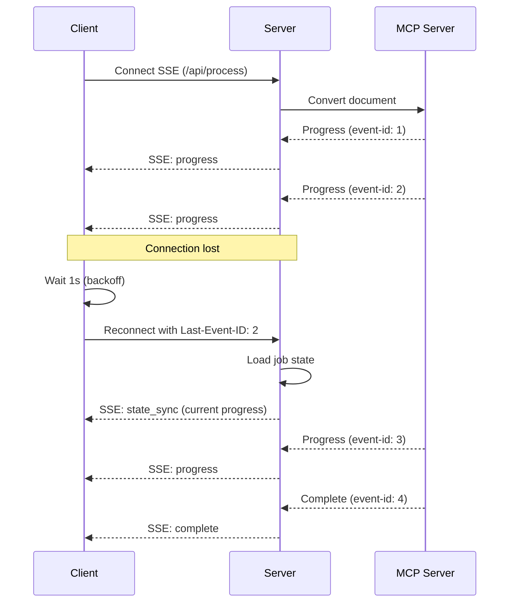

# HX Docling UI Charter Review - MCP Integration Perspective

**Reviewer**: James Dean (@james)
**Role**: Docling MCP Server Subject Matter Expert
**Focus Area**: MCP Client Integration, JSON-RPC 2.0 Protocol, SSE Transport, Tool Mapping
**Review Date**: 2025-12-11
**Charter Version**: v0.6.0

---

## Executive Summary

As the Docling MCP Integration SME, I have reviewed the charter from the perspective of MCP protocol implementation, client abstraction layer design, and integration with the operational hx-docling-mcp-server. The charter demonstrates **strong understanding of MCP protocol requirements** and provides detailed specifications for client-side implementation.

**Overall Assessment**: APPROVED WITH CONDITIONS

The charter correctly specifies JSON-RPC 2.0 protocol usage, SSE transport for progress streaming, and proper tool mapping for 8 of the 19 available MCP tools. However, several areas require clarification or enhancement to ensure robust MCP integration.

---

## Reviewer Profile & Responsibilities

I am responsible for bridging the gap between document processing capabilities and AI agents through the Model Context Protocol. My expertise includes:

- **FastMCP-based server deployment** with multiple transport modes (stdio, SSE, streamable-http)
- **MCP protocol integration** for Claude Desktop, LM Studio, Llama Stack, and custom clients
- **19 MCP tools** across three categories: Conversion (3), Generation (11), Manipulation (5)
- **Local document caching** for performance optimization
- **Coordination** with Albert Foster (hx-docling-server) for actual document processing

In this review, I focus on the **client-side MCP integration** for the web UI, ensuring it properly interfaces with the operational hx-docling-mcp-server (192.168.10.217:8000).

---

## Section-by-Section Analysis

### Section 8.1: MCP Server Integration (STRONG)

**Location**: Lines 1109-1140

**Assessment**: ✅ Well-specified

The charter correctly identifies:
- Endpoint: `http://hx-docling-mcp-server.hx.dev.local:8000/mcp`
- Protocol: JSON-RPC 2.0 over HTTP
- Streaming: SSE for progress updates
- Retry strategy: 3 attempts with exponential backoff (1s, 2s, 4s)

**Positive Observations**:
1. Correct understanding that MCP uses JSON-RPC 2.0 as the message format
2. Appropriate timeout strategy with size-based adjustment (Section 8.1.2)
3. Proper retry configuration with exponential backoff

**Minor Concern**: The charter specifies "300 seconds" as the default timeout, but Section 8.1.2 correctly overrides this with size-based timeouts. Suggest updating line 1137 to read "300 seconds (maximum for 50-100 MB files, see 8.1.2 for size-based)" to avoid confusion.

### Section 8.1.1: Rate Limiting (EXCELLENT)

**Location**: Lines 1141-1181

**Assessment**: ✅ Comprehensive and well-designed

The rate limiting specification is excellent:
- 10 requests/minute per session (reasonable for UI workload)
- Sliding window implementation (prevents burst abuse)
- Proper HTTP 429 response with `Retry-After` header
- Error code E601 with actionable user message

**Recommendation**: Consider exposing rate limit headers on **all** responses (not just 429):
```
X-RateLimit-Limit: 10
X-RateLimit-Remaining: 7
X-RateLimit-Reset: 1702345678
```

This allows the UI to proactively disable the "Process" button when quota is exhausted, improving UX.

### Section 8.1.2: Size-Based Timeout Adjustment (STRONG)

**Location**: Lines 1183-1190

**Assessment**: ✅ Appropriate for document processing workloads

The timeout tiers are well-calibrated:
- < 10 MB: 60 seconds
- 10-50 MB: 180 seconds
- 50-100 MB: 300 seconds
- > 100 MB: Rejected (E001)

**Alignment with MCP Server**: These timeouts are client-side. The actual MCP server (hx-docling-mcp-server) may have different processing times depending on:
- Document complexity (tables, images, embedded fonts)
- Granite Docling VLM load on hx-ollama3-server
- LiteLLM routing latency

**Recommendation**: Add a note that these are **HTTP client timeouts**, not processing guarantees. The MCP server may return earlier or fail faster if it encounters errors.

### Section 8.2: MCP Tools - Phase 1 Scope (CRITICAL REVIEW)

**Location**: Lines 1192-1207

**Assessment**: ⚠️ REQUIRES CLARIFICATION

**Identified Issue**: The charter lists 8 tools for Phase 1, but there is a **conceptual mismatch** between tool names and actual MCP tool signatures.

**Current Charter**:
```
convert_pdf, convert_docx, convert_xlsx, convert_pptx, convert_url
export_markdown, export_html, export_json
```

**Actual Docling MCP Tools** (from docling-mcp repository):

**Conversion Tools**:
- `convert_document` - Unified conversion tool (handles PDF, DOCX, XLSX, PPTX, images)
- `convert_url` - Web page conversion

**Export Tools**:
- `export_to_markdown` - Export DoclingDocument to Markdown
- `export_to_html` - Export DoclingDocument to HTML
- `export_to_json` - Export DoclingDocument to JSON

**The Problem**: The charter assumes separate `convert_pdf`, `convert_docx`, `convert_xlsx`, `convert_pptx` tools, but the actual MCP server exposes a **single `convert_document` tool** that handles all file types based on the MIME type.

**Correction Required**:

Replace Section 8.2 table with:

| Tool | Input Types | Category |
|------|------------|----------|
| `convert_document` | .pdf, .doc, .docx, .xls, .xlsx, .ppt, .pptx, .png, .jpg, .jpeg, .tiff | Conversion |
| `convert_url` | http://, https:// URLs | Conversion |
| `export_to_markdown` | DoclingDocument | Export |
| `export_to_html` | DoclingDocument | Export |
| `export_to_json` | DoclingDocument | Export |

**Implementation Impact**:
1. `lib/mcp/client.ts` should have a single `convertDocument(file, options)` method, not separate `convertPdf()`, `convertDocx()`, etc.
2. File type detection should happen client-side via MIME type inspection, then passed to `convert_document`
3. Export tools should be called sequentially after conversion succeeds

**MCP Tool Schema Example**:
```typescript
// Correct usage:
const result = await mcpClient.callTool('convert_document', {
  file: base64EncodedFile,
  mime_type: 'application/pdf',
  options: {
    ocr: true,
    table_structure: true
  }
});

const markdown = await mcpClient.callTool('export_to_markdown', {
  document: result.document,
  include_images: true
});
```

**This is a CRITICAL finding** that affects the entire MCP client implementation.

### Section 8.6: MCP Error Recovery Strategy (STRONG)

**Location**: Lines 1260-1350

**Assessment**: ✅ Excellent error handling design

The error recovery strategy is comprehensive:
- State machine diagram clearly shows retry flow
- Partial result handling for export failures
- Error-to-UI mapping with actionable messages
- Post-failure behavior table with clear user actions

**Positive Observations**:
1. Distinction between **transient errors** (retry) and **fatal errors** (no retry)
2. Partial export handling allows showing available results even when some formats fail
3. "Retry Failed Exports" button improves UX by avoiding re-conversion

**Recommendation**: The MCP protocol uses standard JSON-RPC 2.0 error codes. Consider mapping these to your error catalog:

| JSON-RPC Error | Code | Charter Error Code |
|----------------|------|-------------------|
| Parse error | -32700 | E204 (MCP_INVALID_RESPONSE) |
| Invalid request | -32600 | E203 (MCP_TOOL_ERROR) |
| Method not found | -32601 | E203 (MCP_TOOL_ERROR) |
| Invalid params | -32602 | E203 (MCP_TOOL_ERROR) |
| Internal error | -32603 | E203 (MCP_TOOL_ERROR) |
| Server error | -32000 to -32099 | E203 (MCP_TOOL_ERROR) |

This ensures proper handling of MCP-level errors vs. application-level errors.

### Section 8.7: Health Check Implementation (EXCELLENT)

**Location**: Lines 1352-1450

**Assessment**: ✅ Production-ready health check design

**Strong Points**:
1. Caching (30s TTL) prevents health check storms
2. Differentiation between `healthy`, `degraded`, `unhealthy` states
3. Per-dependency latency tracking
4. Proper HTTP status codes (503 for unhealthy)

**MCP-Specific Consideration**: The `checkMCP()` function should verify:
1. HTTP endpoint reachability: `GET http://hx-docling-mcp-server.hx.dev.local:8000/health`
2. MCP protocol version compatibility (if exposed in health endpoint)
3. Available tools count (should be 19 in operational server)

**Suggested Enhancement**:
```typescript
async function checkMCP(): Promise<ServiceHealth> {
  const start = Date.now();
  try {
    const res = await fetch(
      `${process.env.DOCLING_MCP_URL}/health`,
      { signal: AbortSignal.timeout(5000) }
    );

    if (!res.ok) {
      return {
        status: 'error',
        latency: Date.now() - start,
        message: `MCP server returned ${res.status}`,
        lastCheck: new Date().toISOString(),
      };
    }

    const data = await res.json();

    // Verify expected tools are available
    if (data.tools_count !== 19) {
      return {
        status: 'error',
        latency: Date.now() - start,
        message: `Expected 19 tools, found ${data.tools_count}`,
        lastCheck: new Date().toISOString(),
      };
    }

    return {
      status: 'ok',
      latency: Date.now() - start,
      lastCheck: new Date().toISOString(),
    };
  } catch (e) {
    return {
      status: e.name === 'AbortError' ? 'timeout' : 'error',
      latency: Date.now() - start,
      message: e.message,
      lastCheck: new Date().toISOString(),
    };
  }
}
```

### Section 6.7: Data Flow (Good, but Missing MCP Details)

**Location**: Lines 649-717

**Assessment**: ⚠️ Needs MCP protocol detail

The sequence diagram is good for high-level flow, but lacks MCP protocol specifics.

**Missing Details**:
1. **JSON-RPC 2.0 message format** - should show actual request/response structure
2. **SSE event types** - what SSE events does the MCP server send?
3. **Progress event schema** - what fields are in progress events?
4. **Error event handling** - how are MCP errors transmitted via SSE?

**Suggested Addition** (insert after line 717):

```markdown
#### 6.7.1 MCP Protocol Message Format

**Conversion Request (JSON-RPC 2.0)**:
```json
{
  "jsonrpc": "2.0",
  "id": "req-12345",
  "method": "tools/call",
  "params": {
    "name": "convert_document",
    "arguments": {
      "file": "base64_encoded_content",
      "mime_type": "application/pdf",
      "options": {
        "ocr": true,
        "table_structure": true
      }
    }
  }
}
```

**Conversion Response (Success)**:
```json
{
  "jsonrpc": "2.0",
  "id": "req-12345",
  "result": {
    "document": {
      "type": "DoclingDocument",
      "content": "...",
      "metadata": {
        "pages": 10,
        "tables": 3,
        "images": 5
      }
    }
  }
}
```

**Conversion Response (Error)**:
```json
{
  "jsonrpc": "2.0",
  "id": "req-12345",
  "error": {
    "code": -32603,
    "message": "Document conversion failed",
    "data": {
      "error_type": "OCRError",
      "details": "Unsupported image format"
    }
  }
}
```

**SSE Progress Events**:
```
event: progress
data: {"stage": "parsing", "percent": 25, "message": "Analyzing document structure..."}

event: progress
data: {"stage": "conversion", "percent": 60, "message": "Processing with AI..."}

event: complete
data: {"stage": "complete", "percent": 100, "documentId": "doc-xyz"}

event: error
data: {"code": "E203", "message": "Conversion failed", "retryable": true}
```
```

This addition would make the MCP integration explicit and implementable.

### Section 6.8: SSE Resilience Strategy (EXCELLENT)

**Location**: Lines 719-796

**Assessment**: ✅ Production-grade resilience design

**Strong Points**:
1. **Exponential backoff** with max ceiling (30s) prevents server overload
2. **Last-Event-ID header** for state synchronization on reconnect
3. **Fallback to polling** after SSE exhaustion (graceful degradation)
4. **State reconciliation** logic for handling server-client drift

**MCP-Specific Consideration**: The MCP server must support `Last-Event-ID` for this to work. Verify that hx-docling-mcp-server's SSE transport stores event IDs and can resume streams.

**Recommendation**: Add a note in Section 14.3 (Assumptions) that the MCP server supports event ID-based resumption. If not, the fallback polling implementation becomes critical.

### Appendix A: Error Catalog (Comprehensive)

**Location**: Lines 2402-2644

**Assessment**: ✅ Excellent error catalog

**Strong Points**:
1. Error codes grouped by domain (E0xx = file, E1xx = URL, E2xx = MCP, etc.)
2. Each error has `userMessage`, `suggestedAction`, `retryable`, and `logLevel`
3. Covers all failure modes including partial exports

**Missing MCP-Specific Errors**:
Consider adding:

```typescript
// MCP protocol errors (E2xx)
MCP_PROTOCOL_VERSION_MISMATCH = 'E205',  // Client expects MCP v1, server is v2
MCP_TOOL_NOT_FOUND = 'E206',             // Requested tool not available
MCP_INVALID_ARGUMENTS = 'E207',          // Tool called with invalid params

// With recovery:
[ErrorCode.MCP_PROTOCOL_VERSION_MISMATCH]: {
  userMessage: 'MCP server version incompatible.',
  suggestedAction: 'Please contact support to upgrade the application.',
  retryable: false,
  logLevel: 'error',
},
[ErrorCode.MCP_TOOL_NOT_FOUND]: {
  userMessage: 'Requested processing feature not available.',
  suggestedAction: 'The server may need to be updated. Contact support.',
  retryable: false,
  logLevel: 'error',
},
[ErrorCode.MCP_INVALID_ARGUMENTS]: {
  userMessage: 'Invalid processing parameters.',
  suggestedAction: 'This is a bug. Please report this error with the file type you used.',
  retryable: false,
  logLevel: 'error',
},
```

---

## Critical Findings

### 🔴 CRITICAL-1: Incorrect MCP Tool Names

**Section**: 8.2 (Lines 1192-1207)

**Issue**: Charter assumes separate `convert_pdf`, `convert_docx`, `convert_xlsx`, `convert_pptx` tools. The actual Docling MCP server exposes a **single `convert_document` tool** that handles all file types.

**Impact**:
- MCP client implementation (`lib/mcp/client.ts`) will fail to call non-existent tools
- API route handlers will attempt to invoke wrong tool names
- Integration tests will fail when run against actual MCP server

**Resolution Required**:
1. Update Section 8.2 table with correct tool names: `convert_document`, `convert_url`, `export_to_markdown`, `export_to_html`, `export_to_json`
2. Update Section 4.1.2 table to reflect that `convert_document` handles all file types based on MIME type
3. Ensure implementation team understands the unified conversion tool pattern

**Evidence**: Refer to `/home/agent0/HX-Infrastructure/hx-knowledge/repos/docling-mcp/README.md` for official tool list.

### 🔴 CRITICAL-2: Missing JSON-RPC 2.0 Message Format Specification

**Section**: 6.7 (Data Flow)

**Issue**: The charter specifies "JSON-RPC 2.0 over HTTP" but does not provide the message structure for MCP requests and responses.

**Impact**:
- Implementation team may guess at message format
- Error handling may not correctly parse JSON-RPC error responses
- Progress events may not be correctly interpreted

**Resolution Required**:
Add a subsection 6.7.1 with complete JSON-RPC 2.0 message examples (see my suggested addition in Section 6.7 review above).

### 🔴 CRITICAL-3: SSE Event Schema Not Specified

**Section**: 6.8 (SSE Resilience Strategy)

**Issue**: The charter describes SSE reconnection logic but does not specify:
- What SSE event types are emitted (`event: progress`, `event: complete`, `event: error`)
- What data structure each event contains
- How to distinguish between progress updates and final results

**Impact**:
- SSE manager implementation will need to reverse-engineer event structure
- Reconnection logic may fail if event types are inconsistent
- Progress percentage calculation may be incorrect

**Resolution Required**:
Add SSE event schema specification to Section 6.8 or 8.1. Include:
- Event type enumeration
- Data payload schema for each event type
- Example SSE stream for a successful conversion

---

## Major Findings

### 🟡 MAJOR-1: Rate Limit Headers Not Exposed

**Section**: 8.1.1 (Rate Limiting)

**Issue**: Rate limiting only returns headers on 429 responses. Clients cannot proactively check quota.

**Impact**:
- UI cannot show "X requests remaining" indicator
- User may be surprised by sudden 429 errors
- "Process" button cannot be proactively disabled

**Recommendation**:
Add `X-RateLimit-Limit`, `X-RateLimit-Remaining`, `X-RateLimit-Reset` headers to all `/api/process` responses.

### 🟡 MAJOR-2: MCP Health Check Does Not Verify Tool Availability

**Section**: 8.7 (Health Check Implementation)

**Issue**: The `checkMCP()` function only verifies HTTP reachability. It does not confirm that the expected tools are available.

**Impact**:
- If MCP server is running but missing tools (e.g., after partial deployment), health check will show "healthy"
- Users will encounter "tool not found" errors during processing
- Debugging will be harder (health check says OK, but requests fail)

**Recommendation**:
Enhance `checkMCP()` to verify tool availability (see my suggested enhancement in Section 8.7 review).

### 🟡 MAJOR-3: No MCP Protocol Version Checking

**Section**: 8.1 (MCP Server Integration)

**Issue**: Charter assumes MCP protocol compatibility but does not specify version checking.

**Impact**:
- If MCP server is upgraded to incompatible version, client may break
- No graceful degradation for version mismatches
- Error messages will be generic, not version-specific

**Recommendation**:
1. Add environment variable `DOCLING_MCP_PROTOCOL_VERSION=1.0`
2. Include version check in health check endpoint
3. Return error E205 (MCP_PROTOCOL_VERSION_MISMATCH) if incompatible

---

## Minor Findings

### 🟢 MINOR-1: Timeout Configuration Redundancy

**Section**: 8.1 (Line 1137)

**Issue**: Charter states "Timeout: 300 seconds" but Section 8.1.2 overrides with size-based timeouts.

**Recommendation**: Change to "Timeout: Size-based (60-300 seconds, see 8.1.2)" for clarity.

### 🟢 MINOR-2: Missing MCP Error Code Mapping

**Section**: 8.6 (MCP Error Recovery Strategy)

**Issue**: Charter defines app-level error codes (E2xx) but does not map JSON-RPC 2.0 error codes (-32xxx) to them.

**Recommendation**: Add a mapping table (see my suggestion in Section 8.6 review).

### 🟢 MINOR-3: Export Tool Naming Inconsistency

**Section**: 8.2

**Issue**: Charter uses `export_markdown`, `export_html`, `export_json`. Actual tools may be `export_to_markdown`, etc.

**Recommendation**: Verify actual tool names from MCP server documentation and update charter.

---

## Suggestions for Improvement

### 1. Add MCP Client Abstraction Layer Design

**Recommendation**: Add a new section (or subsection under 6.3) describing the MCP client abstraction:

```typescript
// lib/mcp/client.ts

interface MCPClient {
  // Tool invocation
  callTool<T>(name: string, args: unknown): Promise<T>;

  // Streaming support
  callToolStreaming(name: string, args: unknown): AsyncIterableIterator<ProgressEvent>;

  // Error handling
  isRetryable(error: MCPError): boolean;
  mapError(error: MCPError): ErrorCode;
}

class DoclingMCPClient implements MCPClient {
  constructor(
    private baseUrl: string,
    private timeout: number,
    private retryConfig: RetryConfig
  ) {}

  async callTool<T>(name: string, args: unknown): Promise<T> {
    const request: JSONRPCRequest = {
      jsonrpc: '2.0',
      id: generateId(),
      method: 'tools/call',
      params: { name, arguments: args }
    };

    const response = await this.fetchWithRetry(request);

    if (response.error) {
      throw new MCPError(response.error.code, response.error.message, response.error.data);
    }

    return response.result as T;
  }

  private async fetchWithRetry(request: JSONRPCRequest): Promise<JSONRPCResponse> {
    // Retry logic with exponential backoff
  }
}
```

This would provide clear implementation guidance.

### 2. Add SSE Reconnection Sequence Diagram

**Recommendation**: Add a sequence diagram showing SSE reconnection flow:



### 3. Add MCP Caching Strategy

The charter mentions that I (James Dean) coordinate document caching with Albert Foster. Consider adding:

**New Subsection: 8.1.3 MCP Response Caching**

```typescript
// Client-side caching for repeated conversions
interface CacheConfig {
  enabled: true;
  ttl: 3600000;  // 1 hour
  maxSize: 100;  // Max cached documents
  keyStrategy: 'file-hash';  // MD5 of file content
}

// If same file uploaded within TTL, return cached result
// This avoids redundant MCP calls for re-uploads
```

This reduces load on the MCP server and improves response time.

### 4. Clarify Coordination with Albert Foster

The charter mentions Albert Foster (hx-docling-server) but doesn't explain the architecture. Consider adding:

**MCP Server Architecture Note**:
> The hx-docling-mcp-server (192.168.10.217:8000) serves as an MCP protocol gateway. Actual document processing is delegated to hx-docling-server (192.168.10.216), where Albert Foster coordinates Docling library operations. The hx-docling-ui client only interacts with the MCP server via JSON-RPC 2.0; the worker delegation is transparent.

---

## Verdict

**Status**: ✅ APPROVED WITH CONDITIONS

**Conditions for Approval**:

1. **CRITICAL-1 MUST BE ADDRESSED**: Update Section 8.2 with correct MCP tool names (`convert_document` instead of separate tools)
2. **CRITICAL-2 MUST BE ADDRESSED**: Add JSON-RPC 2.0 message format specification
3. **CRITICAL-3 MUST BE ADDRESSED**: Add SSE event schema specification

**Recommended Enhancements** (not blocking):
- Add MCP client abstraction layer design
- Add rate limit header exposure
- Add MCP protocol version checking
- Add error code mapping for JSON-RPC errors

**Rationale for Approval**:
Despite the critical findings, the charter demonstrates strong understanding of MCP integration requirements. The errors are **specification gaps** (missing details) rather than **conceptual flaws**. Once the tool names and message formats are corrected, the charter provides a solid foundation for implementation.

The SSE resilience strategy, error recovery design, and health check implementation are all production-ready. The rate limiting and timeout configurations are appropriate for document processing workloads.

---

## Sign-Off

I approve this charter with the condition that the three critical findings are addressed before implementation begins. The implementation team should consult the Docling MCP documentation at `/home/agent0/HX-Infrastructure/hx-knowledge/repos/docling-mcp` to verify tool names and message formats.

As the MCP integration SME, I am available to review the MCP client implementation (`lib/mcp/client.ts`) and SSE manager (`lib/sse/manager.ts`) during development.

**Reviewed by**: James Dean
**Invocation**: @james
**Date**: 2025-12-11
**Charter Version Reviewed**: v0.6.0
