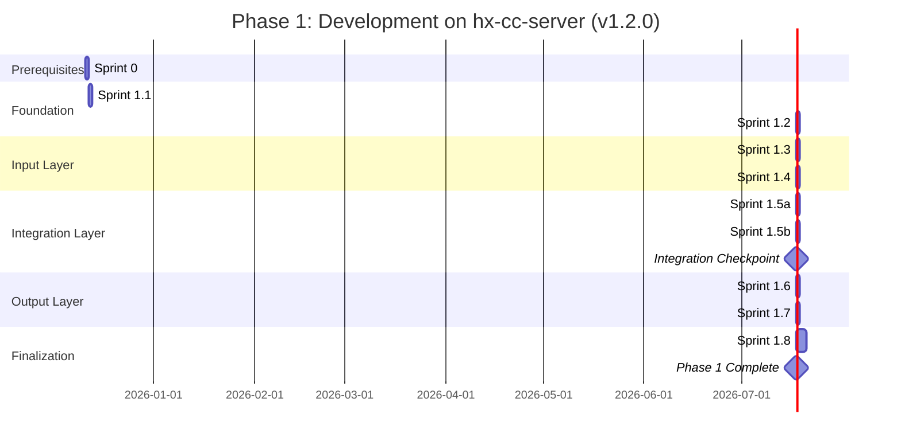
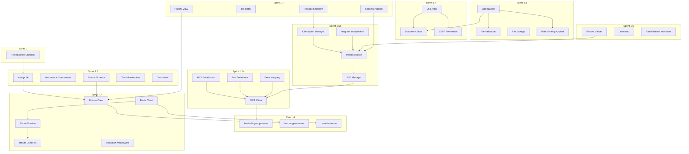

# Implementation Plan: HX Docling UI Application

**Document Type**: Implementation Plan
**Version**: 1.2.0
**Status**: Pending Final Approval
**Created**: 2025-12-12
**Last Updated**: 2025-12-12
**Author**: Alex Rivera (Platform Architect)
**Charter Reference**: `project/0.0-charter/0.1-hx-docling-ui-charter.md` v0.7.0
**Architecture Reference**: `project/0.2-architecture/0.2.1-solution-architecture.md` v2.1.0
**Specification Reference**: `project/0.3-specification/0.3.1-detailed-specification.md` v1.2.0
**Review Reference**: `project/0.1-plan/reviews/00-consolidated-master-review.md`

---

## Table of Contents

1. [Executive Summary](#1-executive-summary)
2. [Scope](#2-scope)
3. [Timeline Overview](#3-timeline-overview)
4. [Sprint Plans](#4-sprint-plans)
5. [Resource Allocation](#5-resource-allocation)
6. [Risk Management](#6-risk-management)
7. [Dependencies](#7-dependencies)
8. [Quality Gates](#8-quality-gates)
9. [Communication Plan](#9-communication-plan)
10. [Assumptions and Constraints](#10-assumptions-and-constraints)
11. [Architecture Decision Records](#11-architecture-decision-records)
12. [Sprint 0 Prerequisites Checklist](#12-sprint-0-prerequisites-checklist)
13. [Dependency Inventory](#13-dependency-inventory)

---

## 1. Executive Summary

### 1.1 Project Overview

The HX Docling UI Application is a web-based interface enabling users to process documents through the HX-Infrastructure Docling MCP Server. The application provides drag-drop file upload, URL input, real-time progress tracking via SSE, and persistent storage of processing results.

### 1.2 Objectives

| ID | Objective | Success Metric |
|----|-----------|----------------|
| OBJ-1 | Enable document upload via web UI | Users can drag-drop PDF/DOCX/XLSX/PPTX/images |
| OBJ-2 | Enable URL-based processing | Users can paste URLs for web page conversion |
| OBJ-3 | Provide real-time progress feedback | SSE-based progress with resilient reconnection |
| OBJ-4 | Display conversion results | Rendered Markdown/HTML with download options |
| OBJ-5 | Persist processing history | Users can view and re-download past conversions |
| OBJ-6 | Robust error recovery | Clear error messages with actionable recovery paths |

### 1.3 Success Criteria

| Criterion | Target | Validation |
|-----------|--------|------------|
| Functional Completeness | 100% of Phase 1 features | Manual + automated testing |
| Test Coverage | >= 80% lines, >= 75% branches | Vitest coverage report |
| Performance (LCP) | < 2.5 seconds | Lighthouse audit |
| Accessibility Score | >= 90 | Lighthouse audit |
| Build Success | 100% | `npm run build` |
| Quality Gates | All pass | CI/CD pipeline |

### 1.4 Key Deliverables

| Deliverable | Description | Sprint |
|-------------|-------------|--------|
| Project Infrastructure | Next.js 16 scaffold, Prisma schema, base components, test infrastructure | 1.1 |
| Data Layer Integration | PostgreSQL, Redis, health monitoring, circuit breaker | 1.2 |
| File Upload System | UploadZone, file validation, persistent storage, rate limiting | 1.3 |
| URL Processing | URL input with SSRF prevention, rate limiting | 1.4 |
| MCP Integration (Core) | MCP client, initialization, tool definitions, error handling | 1.5a |
| SSE & Progress | SSE streaming, reconnection, checkpoint manager | 1.5b |
| Results Display | Tabbed viewer, rendering, download, partial result indicators | 1.6 |
| History System | Pagination, re-download, job management, cancel/resume endpoints | 1.7 |
| Production Readiness | Comprehensive testing, documentation, deployment preparation | 1.8 |

### 1.5 Version 1.2.0 Key Changes Summary

This version comprehensively addresses ALL Critical (P0), Major (P1), and Minor issues identified in the consolidated master review from all 11 specialist reviewers:

#### Critical Issues (P0) - 10 Resolved
- **Sprint 1.5 Split**: Divided into 1.5a (MCP Core) and 1.5b (SSE & Progress) to address complexity overload (5 reviewers consensus)
- **Testing Distribution**: Test infrastructure added to Sprint 1.1; incremental testing added to Sprints 1.3-1.7
- **Infrastructure Prerequisites**: Added Sprint 0 Prerequisites Checklist (Section 12) with detailed validation commands
- **Dependency Inventory**: Added comprehensive dependency list (Section 13) with 25+ packages
- **MCP Protocol Compliance**: Added explicit 3-step initialization with `notifications/initialized` task
- **API Corrections**: Fixed health endpoint path to `/api/v1/health`; added cancel endpoint per FR-406
- **Checkpoint Manager**: Added implementation task per Specification Section 5.5
- **Rate Limiting Clarity**: Confirmed sliding window algorithm with ADR-007
- **Redis TLS**: Increased estimate and added to Sprint 0 prerequisites

#### Major Issues (P1) - 35+ Resolved
- **Database**: Migration safety, backup strategy, index creation, initialization sequence
- **Infrastructure**: SSL certificates, /data partition validation, PgBouncer, monitoring
- **Testing**: Security testing, state machine tests, checkpoint tests, accessibility distribution
- **Frontend**: react-hook-form, dark mode, responsive design, icon library
- **shadcn/ui**: Component pre-installation, Tailwind customization, form timing
- **MCP & API**: Tool schema caching, JSON-RPC error mapping, validation middleware
- **SSE**: Event buffering with Redis, progress interpolation with monotonic guarantee
- **State Machine**: All 10 states tested, resume endpoint, partial result indicators
- **Redis**: Circuit breaker integration, comprehensive health metrics

#### Minor Issues - All Addressed
- Request ID generation strategy (UUID v4)
- OpenAPI documentation (deferred to Phase 2 with explicit note)
- Tailwind customization timing
- Component gap analysis completed
- Documentation gaps filled (CLAUDE.md patterns, Redis key patterns, SSE reconnection sequence)

---

## 2. Scope

### 2.1 In-Scope (Phase 1)

#### Core Features

| Feature | Description | Priority |
|---------|-------------|----------|
| File Upload | Drag-drop zone with validation for PDF, Word, Excel, PowerPoint, images | P0 |
| URL Input | URL validation with SSRF protection | P0 |
| MCP Integration | 8 tools: convert_pdf, convert_docx, convert_xlsx, convert_pptx, convert_url, export_markdown, export_html, export_json | P0 |
| SSE Streaming | Real-time progress with reconnection logic | P0 |
| Results Viewer | Tabbed display: Markdown, HTML, JSON, Raw | P0 |
| Download | Export in multiple formats | P0 |
| History View | Paginated job history with re-download | P1 |
| Error Recovery | Structured errors with retry actions | P0 |
| Session Tracking | Anonymous Redis sessions (24h TTL) | P1 |
| Health Monitoring | Comprehensive health check endpoint | P1 |
| Job Cancellation | Cancel in-progress jobs with cleanup | P0 |
| Job Resume | Resume from checkpoint after failure | P1 |
| Dark Mode | Theme switching support | P1 |

#### Technical Components

| Component | Technology | Purpose |
|-----------|------------|---------|
| Frontend Framework | Next.js 16 (App Router) | Server/Client components |
| UI Library | shadcn/ui | Design consistency |
| State Management | Zustand 5.x | Client-side state |
| Database ORM | Prisma 5.x | Type-safe PostgreSQL |
| Session Store | ioredis 5.x | Redis client |
| Validation | Zod 3.x | Runtime type safety |
| Form Management | react-hook-form 7.x | Form validation |
| File Upload | react-dropzone 14.x | Drag-drop support |
| Dark Mode | next-themes 0.4.x | Theme switching |
| Icons | lucide-react 0.460.x | Icon library |
| Markdown | react-markdown 9.x | Markdown rendering |
| Testing | Vitest + Playwright + MSW | Unit/E2E/Mock tests |

### 2.2 Out-of-Scope (Phase 2 / Future)

| Feature | Rationale | Phase |
|---------|-----------|-------|
| Docker containerization | Requires deployment charter | Phase 2 |
| Production deployment | Requires DNS/SSL setup | Phase 2 |
| User authentication | Requires AD integration | Future |
| 13 advanced MCP tools | Backlog prioritization | Future |
| Plugin architecture | Ecosystem planning needed | Phase 2 |
| Multi-tenant isolation | Authentication prerequisite | Future |
| OpenAPI documentation | Defer to Phase 2 | Phase 2 |
| Performance monitoring dashboard | Defer to Phase 2 | Phase 2 |

### 2.3 Phase Boundaries

```
PHASE 1: DEVELOPMENT (This Plan)
├── Environment: hx-cc-server (192.168.10.224)
├── Runtime: Bare metal Node.js (NO Docker)
├── Access: http://hx-cc-server.hx.dev.local:3000
├── Deliverable: Working application with persistent storage
└── Duration: 11 Claude Code sessions (33.0h total)

PHASE 2: DEPLOYMENT (Separate Charter)
├── Environment: hx-dev-server (production)
├── Runtime: Docker containers
├── Access: https://docling.hx.dev.local
├── Deliverable: Production-ready deployment
└── Duration: TBD
```

---

## 3. Timeline Overview

### 3.1 Sprint Schedule

```
Sprint 0:  Prerequisites Checklist ................. Pre-Session (Infra Team)
Sprint 1.1: Project Scaffold & Infrastructure ....... Session 1 (3.25h)
Sprint 1.2: Database & Redis Integration ............ Session 2 (4.5h)
Sprint 1.3: File Upload System ...................... Session 3 (3.5h)
Sprint 1.4: URL Input with Security ................. Session 4 (2.0h)
Sprint 1.5a: MCP Client (Core) ...................... Session 5 (4.0h)
Sprint 1.5b: SSE & Progress Integration ............. Session 6 (4.0h)
        >>> INTEGRATION CHECKPOINT <<<
Sprint 1.6: Results Viewer & Display ................ Session 7 (2.25h)
Sprint 1.7: History View & Persistence .............. Session 8 (3.5h)
Sprint 1.8: Testing & Documentation ................. Sessions 9-11 (6.0h)
        >>> PHASE 1 COMPLETE <<<
```

### 3.2 Gantt Chart



### 3.3 Key Milestones

| Milestone | Sprint | Description | Criteria |
|-----------|--------|-------------|----------|
| M0: Prerequisites Complete | 0 | Infrastructure validated | DB user, SSL certs, /data partition ready |
| M1: Foundation Complete | 1.2 | Infrastructure operational | DB + Redis connected, health check passing, circuit breaker tested |
| M2: Input Layer Complete | 1.4 | File and URL inputs working | Validation passing, files stored, rate limiting enforced |
| M3: MCP Core Complete | 1.5a | MCP client operational | Protocol compliant, tools callable, errors handled |
| M4: Integration Checkpoint | 1.5b | Core processing pipeline | End-to-end MCP flow operational, SSE streaming, checkpoints |
| M5: Output Layer Complete | 1.7 | Results and history | Full user journey testable, cancel/resume working |
| M6: Phase 1 Complete | 1.8 | Production-ready code | All quality gates passing, 80%+ coverage |

### 3.4 Effort Summary Comparison

| Sprint | v1.0.0 Estimate | v1.2.0 Estimate | Change | Reason |
|--------|-----------------|-----------------|--------|--------|
| 1.1 | 3.5h | 3.25h | -0.25h | Streamlined with infra prerequisites moved to Sprint 0; added Tailwind customization |
| 1.2 | 3.0h | 4.5h | +1.5h | Circuit breaker, expanded health metrics, validation middleware, indexes, backup |
| 1.3 | 2.5h | 3.5h | +1.0h | Form integration, rate limiting, incremental testing, a11y checklist |
| 1.4 | 1.5h | 2.0h | +0.5h | Rate limiting integration, incremental testing, a11y checklist |
| 1.5 | 5.0h | 8.0h (split) | +3.0h | Split into 1.5a+1.5b; added MCP protocol compliance, UUID v4, checkpoint mgr |
| 1.6 | 1.5h | 2.25h | +0.75h | Partial result indicators, responsive design validation |
| 1.7 | 2.5h | 3.5h | +1.0h | Cancel endpoint, resume endpoint, expanded testing |
| 1.8 | 2.5h | 6.0h | +3.5h | Distributed testing, state machine tests, security tests, expanded documentation |
| **Total** | **22.0h** | **33.0h** | **+11.0h** | **Quality, completeness, and documentation improvements** |

---

## 4. Sprint Plans

### 4.0 Sprint 0: Prerequisites Checklist (Infrastructure Team)

**Duration**: Pre-Session (completed before Sprint 1.1)
**Lead**: William (`@william`)
**Support**: Trinity (`@trinity`)
**Validation**: Alex (`@alex`)

#### Objectives

- Validate all infrastructure prerequisites before development begins
- Ensure database, Redis, and storage are ready for Sprint 1.1

#### Prerequisites Checklist

| # | Prerequisite | Validation Command | Expected Result |
|---|--------------|-------------------|-----------------|
| 1 | PostgreSQL user `docling_app` created | `psql -U docling_app -d docling_db -c '\conninfo'` | Connection successful |
| 2 | PostgreSQL roles configured (CRUD permissions) | `psql -c '\du docling_app'` | Expected privileges shown |
| 3 | SSL certificates available | `ls -la /etc/ssl/certs/hx-postgres*` | Certificate files exist |
| 4 | SSL certificate path configured | Verify `.env` `DATABASE_URL` includes `sslmode=require` | SSL parameter present |
| 5 | Database `docling_db` created | `psql -c '\l'` | Database listed |
| 6 | /data partition exists | `df -h /data` | Partition mounted |
| 7 | /data partition >= 500GB free | `df -h /data` | Free space >= 500GB |
| 8 | /data permissions for app user | `ls -la /data/docling-uploads` | Directory writable |
| 9 | Redis accessible | `redis-cli -h hx-redis-server PING` | PONG response |
| 10 | Redis TLS certificates available | `ls -la /etc/ssl/certs/hx-redis*` | Certificate files exist |
| 11 | PgBouncer accessible | `psql -h hx-postgres-server -p 6432 -c '\conninfo'` | Connection via pool |
| 12 | MCP server accessible | `curl http://hx-docling-server:8000/health` | Health check passes |

#### Deliverables

| Deliverable | Location | Status |
|-------------|----------|--------|
| Prerequisites validation report | `project/0.6-governance/prerequisites-validation.md` | Pending |
| Environment configuration template | `.env.example` (pre-populated) | Pending |

#### Acceptance Criteria

- [ ] All 12 prerequisite checks pass
- [ ] Validation report signed off by William and Trinity
- [ ] `.env.example` template includes all connection strings with correct paths
- [ ] Infrastructure team confirms readiness for Sprint 1.1

---

### 4.1 Sprint 1.1: Project Scaffold & Infrastructure

**Duration**: 1 session (~3.0h)
**Lead**: Neo (`@neo`)
**Support**: William (`@william`), Trinity (`@trinity`), Gordon (`@gordon`)
**Review**: Alex (`@alex`)

#### Objectives

- Initialize Next.js 16 project with App Router
- Configure shadcn/ui components with all required components pre-installed
- Set up Prisma with PostgreSQL schema
- Configure development environment
- **[NEW]** Set up test infrastructure (Vitest, Playwright, MSW)
- **[NEW]** Create comprehensive dependency inventory
- **[NEW]** Configure dark mode support

#### Deliverables

| Deliverable | File/Location | Status |
|-------------|---------------|--------|
| Next.js 16 project | `/home/agent0/hx-docling-ui/` | Pending |
| Package dependencies | `package.json` (comprehensive - see Section 13) | Pending |
| Prisma schema | `prisma/schema.prisma` | Pending |
| TypeScript config | `tsconfig.json` | Pending |
| Tailwind config | `tailwind.config.ts` (with dark mode) | Pending |
| ESLint config | `eslint.config.mjs` | Pending |
| Environment template | `.env.example` (from Sprint 0) | Pending |
| **[NEW]** Vitest config | `vitest.config.ts` | Pending |
| **[NEW]** Playwright config | `playwright.config.ts` | Pending |
| **[NEW]** MSW handlers | `src/mocks/handlers.ts` | Pending |
| **[NEW]** shadcn components | `src/components/ui/*` (pre-installed) | Pending |

#### Tasks

| # | Task | Effort | Dependencies | Notes |
|---|------|--------|--------------|-------|
| 1 | Create Next.js 16 project with TypeScript | 20m | Sprint 0 | Use `npx create-next-app@latest` |
| 2 | Configure package.json with all dependencies (see Section 13) | 20m | Task 1 | Include all 25+ packages |
| 3 | Initialize shadcn/ui: `npx shadcn@latest init` | 15m | Task 2 | Configure theme and CSS variables |
| 4 | Pre-install shadcn components (Button, Input, Card, Tabs, Form, Dialog, Select, Toast, Skeleton, Table, Pagination) | 30m | Task 3 | Run `npx shadcn@latest add [component]` for each |
| 5 | Create Prisma schema (Job, Result, JobStatus enum) | 30m | Task 2 | Include all fields per specification |
| 6 | Configure environment files with all variables | 15m | Task 2 | Database, Redis, MCP, file paths |
| 7 | Set up directory structure per charter | 20m | Task 3 | Create all src/* directories |
| 8 | Configure ESLint and Prettier | 10m | Task 2 | Strict TypeScript rules |
| 9 | Add base layout components (Header, Footer) | 20m | Task 4 | Include navigation structure |
| 10 | **[NEW]** Set up Vitest with React Testing Library | 20m | Task 2 | Configure jsdom environment |
| 11 | **[NEW]** Set up Playwright for E2E | 15m | Task 10 | Configure test directories |
| 12 | **[NEW]** Set up MSW for API mocking | 15m | Task 10 | Create initial MCP mock handlers |
| 13 | **[NEW]** Configure dark mode with next-themes | 15m | Task 4 | ThemeProvider in layout |
| 14 | **[NEW]** Configure Tailwind for dark mode | 10m | Task 13 | `darkMode: 'class'` |
| 15 | **[NEW]** Customize Tailwind theme (brand colors, spacing) | 15m | Task 14 | Per SHADCN-M2: colors, spacing, fonts |
| 16 | **[NEW]** Write example unit test to verify infrastructure | 10m | Task 10 | Ensure test runner works |

**Total Effort**: ~3.25h

#### Acceptance Criteria

- [ ] `npm install` succeeds without errors
- [ ] `npx prisma generate` succeeds
- [ ] `npm run dev` starts development server
- [ ] shadcn/ui components render correctly (all 11 pre-installed)
- [ ] TypeScript compilation passes (`npm run typecheck`)
- [ ] ESLint passes (`npm run lint`)
- [ ] **[NEW]** `npm run test` runs example test successfully
- [ ] **[NEW]** `npm run test:e2e` starts Playwright (can run when app is up)
- [ ] **[NEW]** Dark mode toggle works in base layout
- [ ] **[NEW]** Tailwind theme customized (brand colors, spacing, fonts per design spec)
- [ ] **[NEW]** package.json includes all 25+ dependencies per Section 13
- [ ] **[NEW]** MSW handlers defined for MCP mock responses

---

### 4.2 Sprint 1.2: Database & Redis Integration

**Duration**: 1 session (~4.0h)
**Lead**: William (`@william`)
**Support**: Trinity (`@trinity`), Neo (`@neo`), Sri (`@sri`)
**Review**: Alex (`@alex`)

#### Objectives

- Connect to PostgreSQL via Prisma with SSL
- Configure Redis session management with TLS
- Implement health check endpoint (versioned path)
- Set up connection pooling validation
- **[NEW]** Implement Redis circuit breaker wrapper
- **[NEW]** Implement rate limiting with sliding window algorithm
- **[NEW]** Add centralized validation middleware

#### Deliverables

| Deliverable | File/Location | Status |
|-------------|---------------|--------|
| Prisma client singleton | `src/lib/db/prisma.ts` | Pending |
| Redis client | `src/lib/redis/client.ts` | Pending |
| **[NEW]** Redis circuit breaker | `src/lib/redis/circuit-breaker.ts` | Pending |
| Session management | `src/lib/redis/session.ts` | Pending |
| **[FIXED]** Health endpoint | `src/app/api/v1/health/route.ts` | Pending |
| Rate limiting middleware | `src/lib/middleware/rate-limit.ts` | Pending |
| **[NEW]** Validation middleware | `src/lib/middleware/validate.ts` | Pending |
| Database migration | `prisma/migrations/` | Pending |

#### Tasks

| # | Task | Effort | Dependencies | Notes |
|---|------|--------|--------------|-------|
| 1 | Configure DATABASE_URL with SSL and pooling | 15m | Sprint 1.1, Sprint 0 | Verify SSL cert path from prerequisites |
| 2 | Create Prisma client singleton with connection pooling | 30m | Task 1 | Configure max connections |
| 3 | Run initial Prisma migration | 15m | Task 2 | Test rollback works |
| 4 | **[NEW]** Test migration rollback procedure | 15m | Task 3 | Verify `prisma migrate reset` works |
| 5 | Configure Redis connection with TLS | 45m | Sprint 0 | **[REVISED]** Increased from 30m; CA cert validation |
| 6 | **[NEW]** Implement Redis circuit breaker wrapper | 30m | Task 5 | CLOSED/OPEN/HALF_OPEN states |
| 7 | Implement session creation/retrieval with circuit breaker | 45m | Tasks 5, 6 | Use circuit breaker for all Redis ops |
| 8 | **[FIXED]** Create health check endpoint at `/api/v1/health` | 45m | Tasks 2, 5 | **[REVISED]** Include comprehensive metrics |
| 9 | **[NEW]** Expand health check with Redis metrics | 15m | Task 8 | Memory %, evicted keys, latency status |
| 10 | Add rate limiting middleware with **sliding window** | 45m | Task 5 | **[CLARIFIED]** Per Spec Section 7.4.2 |
| 11 | **[NEW]** Implement centralized validation middleware | 30m | Task 2 | Per Spec Section 4.11, Zod schemas |
| 12 | **[NEW]** Validate PgBouncer connection pooling | 15m | Task 2 | Test pool behavior under load |
| 13 | Test all database operations | 30m | All | CRUD operations verified |
| 14 | **[NEW]** Write unit tests for circuit breaker | 20m | Task 6 | Verify state transitions |
| 15 | **[NEW]** Verify database indexes (job_id, created_at) | 15m | Task 3 | Per DB-M4: Ensure indexes in Prisma schema |
| 16 | **[NEW]** Create backup before initial test data load | 15m | Task 13 | Per DB-M3: Backup strategy |

**Total Effort**: ~4.5h

#### Acceptance Criteria

- [ ] PostgreSQL connection established with SSL (verify with query)
- [ ] Redis PING returns PONG (TLS verified)
- [ ] **[FIXED]** `/api/v1/health` returns status for all services (versioned path)
- [ ] **[NEW]** Health endpoint includes Redis memory %, latency, eviction metrics
- [ ] Session created and stored in Redis with circuit breaker fallback
- [ ] **[CLARIFIED]** Rate limiting enforces 10 req/min using **sliding window algorithm**
- [ ] Connection pool settings verified via PgBouncer
- [ ] **[NEW]** Circuit breaker transitions through CLOSED -> OPEN -> HALF_OPEN correctly
- [ ] **[NEW]** Migration rollback tested successfully
- [ ] **[NEW]** Validation middleware rejects invalid payloads with structured errors
- [ ] **[NEW]** Database indexes verified on job_id, created_at columns
- [ ] **[NEW]** Backup created before initial test data load

---

### 4.3 Sprint 1.3: File Upload System

**Duration**: 1 session (~3.5h)
**Lead**: Neo (`@neo`)
**Support**: Ola (`@ola`), William (`@william`)
**Review**: Julia (`@julia`)

#### Objectives

- Implement drag-drop upload zone with react-dropzone
- Create file validation (type, size)
- Set up persistent file storage
- Create upload API route
- **[NEW]** Integrate react-hook-form for form management
- **[NEW]** Apply rate limiting middleware to upload route
- **[NEW]** Write incremental unit tests

#### Deliverables

| Deliverable | File/Location | Status |
|-------------|---------------|--------|
| Upload component | `src/components/upload/UploadZone.tsx` | Pending |
| File preview | `src/components/upload/FilePreview.tsx` | Pending |
| File validation | `src/lib/validation/file.ts` | Pending |
| Upload API route | `src/app/api/v1/upload/route.ts` | Pending |
| Storage utilities | `src/lib/utils/storage.ts` | Pending |
| **[NEW]** Upload form with react-hook-form | `src/components/upload/UploadForm.tsx` | Pending |
| **[NEW]** Unit tests | `src/components/upload/*.test.tsx` | Pending |

#### Tasks

| # | Task | Effort | Dependencies | Notes |
|---|------|--------|--------------|-------|
| 1 | Create UploadZone with react-dropzone | 45m | Sprint 1.2 | Drag-drop + click support |
| 2 | Implement file validation schema (Zod) | 30m | None | Type, size, name validation |
| 3 | Create FilePreview component | 25m | Task 1 | Name, size, type icon, remove button |
| 4 | Implement file storage utility | 30m | None | YYYY/MM/DD directory structure |
| 5 | **[REVISED]** Create upload API route with validation | 60m | Tasks 2, 4 | **[INCREASED]** from 45m; comprehensive validation |
| 6 | Add Job creation on upload | 25m | Task 5 | Create DB record, return job ID |
| 7 | **[NEW]** Integrate react-hook-form into UploadForm | 25m | Task 1 | Form state management |
| 8 | **[NEW]** Apply rate limiting middleware to upload route | 15m | Task 5 | Use middleware from Sprint 1.2 |
| 9 | Style components with shadcn | 20m | Tasks 1, 3 | Card, Button, Progress components |
| 10 | Add accessibility (ARIA, keyboard navigation) | 20m | Task 9 | Focus management, screen reader support |
| 11 | **[NEW]** Write unit tests for UploadZone and FilePreview | 30m | Tasks 1, 3 | Test drag-drop, validation, preview |
| 12 | **[NEW]** Write unit tests for file validation | 15m | Task 2 | Test all file type/size scenarios |

**Total Effort**: ~3.5h

#### Acceptance Criteria

- [ ] Drag-drop accepts valid files (PDF, DOCX, XLSX, PPTX, images)
- [ ] Click-to-browse opens file picker
- [ ] Invalid file types rejected with error E002
- [ ] Files > 100MB rejected with error E001
- [ ] Files stored in `/data/docling-uploads/YYYY/MM/DD/`
- [ ] Job record created in database with correct status
- [ ] File preview displays name, size, type icon
- [ ] **[NEW]** Form validation works with react-hook-form
- [ ] **[NEW]** Rate limiting enforced on upload endpoint
- [ ] **[NEW]** Unit tests pass with >= 80% coverage for upload components
- [ ] **[NEW]** Accessibility checklist: ARIA labels present, keyboard navigation works, focus management correct

---

### 4.4 Sprint 1.4: URL Input with Security

**Duration**: 1 session (~2.0h)
**Lead**: Neo (`@neo`)
**Support**: Ola (`@ola`)
**Review**: Julia (`@julia`)

#### Objectives

- Implement URL input component with react-hook-form
- Create SSRF prevention validation
- Handle URL-based job creation
- Add mutual exclusion with file input
- **[NEW]** Apply rate limiting middleware to URL route
- **[NEW]** Write incremental unit tests

#### Deliverables

| Deliverable | File/Location | Status |
|-------------|---------------|--------|
| URL input component | `src/components/upload/UrlInput.tsx` | Pending |
| URL validation | `src/lib/validation/url.ts` | Pending |
| Document store | `src/stores/documentStore.ts` | Pending |
| UI store | `src/stores/uiStore.ts` | Pending |
| **[NEW]** Unit tests | `src/lib/validation/url.test.ts` | Pending |

#### Tasks

| # | Task | Effort | Dependencies | Notes |
|---|------|--------|--------------|-------|
| 1 | Create URL input component with react-hook-form | 25m | Sprint 1.3 | Input + submit button |
| 2 | Implement SSRF prevention (block private IPs) | 35m | None | 10.x, 172.16-31.x, 192.168.x, localhost |
| 3 | Add URL format validation (HTTP/HTTPS only) | 15m | Task 2 | Zod schema |
| 4 | Create Zustand document store | 30m | None | File and URL state management |
| 5 | Implement mutual exclusion (file XOR URL) | 20m | Tasks 1, 4 | Clear file when URL entered |
| 6 | Add processing lock during submission | 10m | Task 4 | Prevent input changes |
| 7 | Create UI store for toasts/modals | 20m | None | Centralized UI state |
| 8 | **[NEW]** Apply rate limiting middleware to URL route | 10m | Task 1 | Use middleware from Sprint 1.2 |
| 9 | Style and test URL input | 15m | Tasks 1, 7 | shadcn Input component |
| 10 | **[NEW]** Write unit tests for SSRF validation | 20m | Task 2 | Test all blocked patterns |
| 11 | **[NEW]** Write unit tests for document store | 15m | Task 4 | Test state transitions |

**Total Effort**: ~2.0h (increased from 1.5h)

#### Acceptance Criteria

- [ ] URL input accepts valid HTTP/HTTPS URLs
- [ ] Private IPs blocked (10.x, 172.16-31.x, 192.168.x)
- [ ] localhost/127.0.0.1 blocked
- [ ] *.hx.dev.local domains blocked
- [ ] File input cleared when URL entered (and vice versa)
- [ ] Processing lock prevents input changes during submission
- [ ] Error E104 shown for blocked URLs
- [ ] **[NEW]** Rate limiting enforced on URL processing endpoint
- [ ] **[NEW]** Unit tests pass for SSRF validation (all patterns covered)
- [ ] **[NEW]** Unit tests pass for document store state management
- [ ] **[NEW]** Accessibility checklist: URL input accessible with screen reader, error messages announced

---

### 4.5a Sprint 1.5a: MCP Client (Core)

**Duration**: 1 session (~4.0h)
**Lead**: James (`@james`)
**Support**: Neo (`@neo`), George (`@george`)
**Review**: Alex (`@alex`)

**Note**: Sprint 1.5 has been split into two sessions (1.5a and 1.5b) to address the critical P0-01 complexity overload issue identified by 5 reviewers.

#### Objectives

- Implement MCP client library with full protocol compliance
- **[CRITICAL]** Implement proper 3-step MCP initialization including `notifications/initialized`
- Implement all 8 tool definitions
- Create comprehensive error handling with JSON-RPC error mapping
- Implement tool schema caching

#### Deliverables

| Deliverable | File/Location | Status |
|-------------|---------------|--------|
| MCP client | `src/lib/mcp/client.ts` | Pending |
| MCP types | `src/lib/mcp/types.ts` | Pending |
| **[NEW]** MCP initialization | `src/lib/mcp/initialize.ts` | Pending |
| Tool definitions | `src/lib/mcp/tools.ts` | Pending |
| **[NEW]** Tool schema cache | `src/lib/mcp/tool-cache.ts` | Pending |
| Error catalog | `src/lib/mcp/errors.ts` | Pending |
| **[NEW]** JSON-RPC error mapping | `src/lib/mcp/error-mapping.ts` | Pending |
| Recovery logic | `src/lib/mcp/recovery.ts` | Pending |
| **[NEW]** MCP circuit breaker | `src/lib/mcp/circuit-breaker.ts` | Pending |

#### Tasks

| # | Task | Effort | Dependencies | Notes |
|---|------|--------|--------------|-------|
| 1 | Define MCP protocol types (JSON-RPC 2.0) | 30m | Sprint 1.4 | Request/Response/Error types |
| 2 | Implement MCP client class | 45m | Task 1 | Connection management |
| 3 | **[CRITICAL]** Implement 3-step initialization sequence | 45m | Task 2 | **Per Spec Section 7.1.2** |
| 3a | - Send `initialize` request with clientInfo | - | Task 3 | Protocol step 1 |
| 3b | - Process initialize response with serverCapabilities | - | Task 3 | Protocol step 2 |
| 3c | - **Send `notifications/initialized` notification** | - | Task 3 | **PROTOCOL REQUIRED - step 3** |
| 4 | **[NEW]** Implement capability validation | 20m | Task 3 | Validate server supports required tools |
| 5 | Implement 8 tool definitions | 30m | Task 4 | convert_*, export_* tools |
| 6 | **[NEW]** Implement tool schema caching with TTL | 25m | Task 5 | Cache tools/list response |
| 7 | Add timeout handling (size-based: 60s/180s/300s) | 20m | Task 5 | Per file size category |
| 7a | **[NEW]** Implement UUID v4 for JSON-RPC request IDs | 10m | Task 1 | Prevents ID collision in concurrent requests |
| 8 | **[NEW]** Implement JSON-RPC error code mapping | 30m | Task 1 | -32700 to -32099 -> E2xx series |
| 9 | Create structured error catalog | 25m | Task 8 | All error codes with user messages |
| 10 | Implement retry logic (3 attempts, exponential backoff) | 25m | Task 9 | Per specification |
| 11 | **[NEW]** Implement MCP circuit breaker (optional) | 25m | Task 10 | Graceful degradation |
| 12 | Write unit tests for MCP client initialization | 25m | Task 3 | Test 3-step sequence |
| 13 | Write unit tests for error mapping | 15m | Task 8 | All error codes covered |

**Total Effort**: ~4.0h

#### Acceptance Criteria

- [ ] MCP client connects to hx-docling-mcp-server
- [ ] **[CRITICAL]** `notifications/initialized` sent after initialize response
- [ ] **[CRITICAL]** Tools/list called only AFTER notifications/initialized
- [ ] **[NEW]** Server capability validation passes before tool calls
- [ ] All 8 MCP tools callable and return expected responses
- [ ] **[NEW]** Tool schemas cached with configurable TTL
- [ ] Size-based timeouts enforced (60s < 10MB, 180s < 50MB, 300s >= 50MB)
- [ ] **[NEW]** JSON-RPC error codes (-32700 to -32099) mapped to E2xx user errors
- [ ] Retry logic works (3 attempts with exponential backoff)
- [ ] **[NEW]** JSON-RPC request IDs use UUID v4 format (no collisions in concurrent requests)
- [ ] **[NEW]** Unit tests pass for initialization sequence (including notifications/initialized)
- [ ] **[NEW]** Unit tests pass for error code mapping

---

### 4.5b Sprint 1.5b: SSE & Progress Integration

**Duration**: 1 session (~4.0h)
**Lead**: William (`@william`)
**Support**: Neo (`@neo`), Ola (`@ola`), Sophia (`@sophia`)
**Review**: Alex (`@alex`)

#### Objectives

- Create SSE connection manager with reconnection
- Implement processing API route with SSE streaming
- **[NEW]** Implement checkpoint manager for stage-based recovery
- **[NEW]** Implement progress interpolation with monotonic guarantee
- Build progress UI components
- Create process and SSE hooks

#### Deliverables

| Deliverable | File/Location | Status |
|-------------|---------------|--------|
| SSE manager | `src/lib/sse/manager.ts` | Pending |
| Reconnect logic | `src/lib/sse/reconnect.ts` | Pending |
| **[NEW]** Event buffer | `src/lib/sse/event-buffer.ts` | Pending |
| Process route | `src/app/api/v1/process/route.ts` | Pending |
| **[NEW]** Checkpoint manager | `src/lib/checkpoint/manager.ts` | Pending |
| **[NEW]** Progress interpolation | `src/lib/progress/interpolation.ts` | Pending |
| SSE hook | `src/hooks/useSSE.ts` | Pending |
| Process hook | `src/hooks/useProcess.ts` | Pending |
| Progress card | `src/components/processing/ProgressCard.tsx` | Pending |
| Loading states | `src/components/processing/LoadingStates.tsx` | Pending |

#### Tasks

| # | Task | Effort | Dependencies | Notes |
|---|------|--------|--------------|-------|
| 1 | Create SSE connection manager | 30m | Sprint 1.5a | EventSource wrapper |
| 2 | Implement exponential backoff reconnection | 25m | Task 1 | Max 5 attempts, then fallback |
| 3 | Add polling fallback mechanism | 30m | Task 2 | When SSE fails after retries |
| 4 | **[NEW]** Implement event buffering for Last-Event-ID | 25m | Task 1 | Redis-backed for distributed capability |
| 5 | Implement state synchronization | 20m | Task 4 | Sync on reconnect |
| 6 | Create /api/v1/process POST handler | 30m | Sprint 1.5a | Initiate processing |
| 7 | Implement SSE streaming response | 30m | Task 6 | Stream progress events |
| 8 | Add Last-Event-ID reconnection support | 20m | Tasks 4, 7 | Resume from last event |
| 9 | **[NEW]** Implement checkpoint manager | 45m | Task 6 | **Per Spec Section 5.5** |
| 9a | - Checkpoint save on stage completion | - | Task 9 | Serialize job state |
| 9b | - Checkpoint restore on resume | - | Task 9 | Deserialize and continue |
| 10 | **[NEW]** Implement progress interpolation (smoothProgress) | 30m | Task 7 | **Per Spec Section 9.2** |
| 10a | - Monotonic guarantee (progress never decreases) | - | Task 10 | Critical for UX |
| 11 | Create ProgressCard component | 25m | Task 7 | Progress bar, stage info |
| 12 | Implement loading state variants | 15m | Task 11 | Skeleton, spinner, stages |
| 13 | Add reconnection overlay | 10m | Task 12 | "Reconnecting..." UI |
| 14 | Create useSSE hook | 20m | Tasks 1-5 | Encapsulate SSE logic |
| 15 | Create useProcess hook | 20m | Tasks 6-8, 14 | Orchestrate processing flow |
| 16 | Write unit tests for checkpoint manager | 20m | Task 9 | Save/restore cycle |
| 17 | Write unit tests for progress interpolation | 15m | Task 10 | Monotonic guarantee |

**Total Effort**: ~4.0h

#### Acceptance Criteria

- [ ] SSE streams progress events correctly
- [ ] Reconnection within 30s grace period using exponential backoff
- [ ] Fallback to polling after SSE failure (5 retries)
- [ ] **[NEW]** Event buffering supports Last-Event-ID (via Redis)
- [ ] **[NEW]** Checkpoint saves on each stage completion
- [ ] **[NEW]** Checkpoint restore resumes processing correctly
- [ ] **[NEW]** Progress interpolation ensures monotonic increase (progress never decreases)
- [ ] Progress card updates in real-time with smooth animation
- [ ] Reconnection overlay shows during reconnection attempts
- [ ] E2E: Upload PDF -> View progress -> Complete
- [ ] **[NEW]** Unit tests pass for checkpoint manager
- [ ] **[NEW]** Unit tests pass for progress interpolation (monotonic guarantee)

---

### 4.6 Sprint 1.6: Results Viewer & Display

**Duration**: 1 session (~2.25h)
**Lead**: Neo (`@neo`)
**Support**: Ola (`@ola`)
**Review**: Julia (`@julia`)

#### Objectives

- Create tabbed results viewer
- Implement format-specific renderers
- Add download functionality
- **[NEW]** Handle partial results with clear indicators
- **[NEW]** Validate responsive design

#### Deliverables

| Deliverable | File/Location | Status |
|-------------|---------------|--------|
| Results viewer | `src/components/results/ResultsViewer.tsx` | Pending |
| Markdown view | `src/components/results/MarkdownView.tsx` | Pending |
| HTML view | `src/components/results/HtmlView.tsx` | Pending |
| JSON view | `src/components/results/JsonView.tsx` | Pending |
| Raw view | `src/components/results/RawView.tsx` | Pending |
| Download button | `src/components/results/DownloadButton.tsx` | Pending |
| Skeleton loader | `src/components/results/ResultsSkeleton.tsx` | Pending |
| **[NEW]** Partial result indicator | `src/components/results/PartialResultBadge.tsx` | Pending |

#### Tasks

| # | Task | Effort | Dependencies | Notes |
|---|------|--------|--------------|-------|
| 1 | Create ResultsViewer with tabs (shadcn Tabs) | 35m | Sprint 1.5b | Four tabs: MD, HTML, JSON, Raw |
| 2 | Implement MarkdownView with react-markdown + GFM | 25m | Task 1 | GitHub Flavored Markdown |
| 3 | Implement HtmlView with sandbox iframe | 25m | Task 1 | Security sandbox |
| 4 | Implement JsonView with syntax highlighting | 25m | Task 1 | Collapsible tree view |
| 5 | Implement RawView with copy button | 15m | Task 1 | Plain text display |
| 6 | Create DownloadButton component | 20m | Task 1 | Format selection |
| 7 | Implement download naming convention | 10m | Task 6 | `{filename}_{timestamp}.{ext}` |
| 8 | Add skeleton loaders | 15m | Task 1 | Per-tab loading state |
| 9 | **[NEW]** Implement partial result indicators | 20m | Task 1 | **Per FR-405**: Show which exports succeeded/failed |
| 10 | **[NEW]** Validate responsive design | 15m | All | Test mobile, tablet, desktop breakpoints |
| 11 | Add accessibility (tab navigation, ARIA) | 20m | All | Keyboard navigation, screen reader |
| 12 | Write unit tests for ResultsViewer | 15m | Task 1 | Tab switching, content display |

**Total Effort**: ~2.25h (increased from 1.5h)

#### Acceptance Criteria

- [ ] Four tabs: Markdown, HTML, JSON, Raw
- [ ] Default tab: Markdown
- [ ] Tab switching preserves content
- [ ] Markdown renders with syntax highlighting (code blocks)
- [ ] HTML renders in sandboxed iframe (no script execution)
- [ ] JSON pretty-printed with collapsible tree
- [ ] Download generates correct filename format
- [ ] **[NEW]** Partial results show badges indicating which exports succeeded/failed
- [ ] **[NEW]** Layout responsive across mobile, tablet, desktop
- [ ] Accessibility: keyboard tab navigation works, ARIA labels present

---

### 4.7 Sprint 1.7: History View & Persistence

**Duration**: 1 session (~3.5h)
**Lead**: Neo (`@neo`)
**Support**: Ola (`@ola`), Trinity (`@trinity`), Sophia (`@sophia`)
**Review**: Julia (`@julia`)

#### Objectives

- Create history page with pagination
- Implement job detail view
- Enable re-download functionality
- **[NEW]** Implement job cancellation endpoint with full workflow
- **[NEW]** Implement job resume endpoint for checkpoint recovery

#### Deliverables

| Deliverable | File/Location | Status |
|-------------|---------------|--------|
| History page | `src/app/history/page.tsx` | Pending |
| History view | `src/components/history/HistoryView.tsx` | Pending |
| Job row | `src/components/history/JobRow.tsx` | Pending |
| Job detail | `src/components/history/JobDetail.tsx` | Pending |
| Pagination | `src/components/history/Pagination.tsx` | Pending |
| History API | `src/app/api/v1/history/route.ts` | Pending |
| Job API | `src/app/api/v1/jobs/[id]/route.ts` | Pending |
| **[NEW]** Cancel API | `src/app/api/v1/jobs/[id]/cancel/route.ts` | Pending |
| **[NEW]** Resume API | `src/app/api/v1/jobs/[id]/resume/route.ts` | Pending |
| History hook | `src/hooks/useHistory.ts` | Pending |

#### Tasks

| # | Task | Effort | Dependencies | Notes |
|---|------|--------|--------------|-------|
| 1 | Create history page layout | 20m | Sprint 1.6 | Page structure with filters |
| 2 | Implement HistoryView with table (shadcn Table) | 35m | Task 1 | Columns: file, status, date, actions |
| 3 | Create JobRow component | 20m | Task 2 | Status badge, action buttons |
| 4 | Implement Pagination component (shadcn Pagination) | 20m | Task 2 | Page numbers, prev/next |
| 5 | Create history API with pagination and session filter | 35m | None | Default 20, max 50 per page |
| 6 | Create job detail API | 20m | None | Single job with results |
| 7 | Implement JobDetail modal | 30m | Tasks 3, 6 | Full result display |
| 8 | Add re-download functionality | 20m | Task 7 | Download from history |
| 9 | Create useHistory hook | 20m | Tasks 5, 7 | Pagination state management |
| 10 | **[NEW]** Implement cancel endpoint (POST /api/v1/jobs/{id}/cancel) | 45m | Task 6 | **[CRITICAL per FR-406]** |
| 10a | - AbortController integration to stop MCP processing | - | Task 10 | Cancel in-flight requests |
| 10b | - Send SSE `cancelled` event | - | Task 10 | Notify client |
| 10c | - Update job status to CANCELLED | - | Task 10 | Database update |
| 10d | - Preserve partial results if configured | - | Task 10 | Per specification |
| 11 | **[NEW]** Implement resume endpoint (POST /api/v1/jobs/{id}/resume) | 30m | Task 6 | **Per Spec Section 5.5** |
| 11a | - Load checkpoint from job record | - | Task 11 | Deserialize state |
| 11b | - Resume processing from checkpoint stage | - | Task 11 | Continue workflow |
| 12 | **[NEW]** Add session authorization check | 15m | Task 5 | Users see only own jobs |
| 13 | Write unit tests for history API | 20m | Task 5 | Pagination, filtering |
| 14 | Write unit tests for cancel/resume endpoints | 20m | Tasks 10, 11 | State transitions |

**Total Effort**: ~3.5h (increased from 2.5h)

#### Acceptance Criteria

- [ ] History shows jobs filtered by session
- [ ] Pagination works (default 20, max 50)
- [ ] Jobs sorted by createdAt DESC
- [ ] Job detail shows all result formats
- [ ] Re-download works for past jobs
- [ ] 404 returned for missing jobs or unauthorized access
- [ ] **[NEW]** `POST /api/v1/jobs/{id}/cancel` stops processing and returns success
- [ ] **[NEW]** Cancel button available for PROCESSING jobs, triggers cancellation
- [ ] **[NEW]** SSE `cancelled` event sent when job cancelled
- [ ] **[NEW]** `POST /api/v1/jobs/{id}/resume` resumes from checkpoint
- [ ] **[NEW]** Resume only available for jobs with saved checkpoints
- [ ] **[NEW]** Unit tests pass for cancel/resume workflows

---

### 4.8 Sprint 1.8: Testing & Documentation

**Duration**: 2 sessions (~5.5h total)
**Lead**: Julia (`@julia`)
**Support**: Neo (`@neo`), Trinity (`@trinity`), William (`@william`)
**Review**: Agent Zero (`@agent-zero`)

#### Objectives

- Achieve 80%+ test coverage (comprehensive)
- Complete E2E test suite
- **[NEW]** Add state machine transition tests
- **[NEW]** Add security testing (SSRF, injection)
- **[NEW]** Expand API route testing
- Finalize documentation
- Prepare for Phase 2 handoff

#### Deliverables

| Deliverable | File/Location | Status |
|-------------|---------------|--------|
| Unit tests | `src/**/*.test.ts` | Pending |
| Component tests | `src/components/**/*.test.tsx` | Pending |
| Store tests | `src/stores/*.test.ts` | Pending |
| API route tests | `src/app/api/**/*.test.ts` | Pending |
| **[NEW]** State machine tests | `test/state-machine/*.test.ts` | Pending |
| **[NEW]** Security tests | `test/security/*.test.ts` | Pending |
| **[NEW]** Checkpoint tests | `test/checkpoint/*.test.ts` | Pending |
| E2E tests | `test/e2e/*.spec.ts` | Pending |
| Accessibility tests | `test/a11y/*.test.ts` | Pending |
| README | `README.md` | Pending |
| CLAUDE.md | `CLAUDE.md` | Pending |
| Test fixtures | `test/fixtures/*` | Pending |

#### Tasks (Session 1: Testing - ~3.0h)

| # | Task | Effort | Dependencies | Notes |
|---|------|--------|--------------|-------|
| 1 | Write unit tests for validation lib (file, URL, SSRF) | 45m | Sprint 1.7 | All validation scenarios |
| 2 | Write unit tests for MCP client (initialization, tools, errors) | 45m | Sprint 1.7 | Protocol compliance |
| 3 | Write component tests (UploadZone, UrlInput) | 30m | Sprint 1.7 | User interactions |
| 4 | Write component tests (ProgressCard, ResultsViewer) | 30m | Sprint 1.7 | State changes |
| 5 | Write store tests (documentStore, uiStore) | 30m | Sprint 1.7 | State management |
| 6 | **[EXPANDED]** Write API route tests | 90m | Sprint 1.7 | **[REVISED]** from 60m; all routes + validation |
| 6a | - Upload route tests | - | Task 6 | File validation, storage |
| 6b | - Process route tests | - | Task 6 | MCP integration |
| 6c | - History route tests | - | Task 6 | Pagination, filtering |
| 6d | - Cancel/Resume route tests | - | Task 6 | State transitions |
| 6e | - Health route tests | - | Task 6 | Service status |
| 7 | **[NEW]** Write state machine transition tests | 45m | Sprint 1.7 | **All 10 states, valid/invalid transitions** |
| 8 | **[NEW]** Write checkpoint save/restore tests | 30m | Sprint 1.7 | Serialization/deserialization |

#### Tasks (Session 2: E2E, Security & Docs - ~2.5h)

| # | Task | Effort | Dependencies | Notes |
|---|------|--------|--------------|-------|
| 9 | Write E2E critical path test | 45m | Session 1 | Upload -> Process -> View Results |
| 10 | Write E2E error handling tests | 30m | Session 1 | Network failure, timeout, invalid input |
| 11 | **[NEW]** Write E2E SSE reconnection test | 20m | Session 1 | Disconnect/reconnect simulation |
| 12 | **[NEW]** Write security tests (SSRF patterns) | 25m | Session 1 | All blocked IP patterns |
| 13 | **[NEW]** Write security tests (input validation) | 20m | Session 1 | Injection prevention |
| 14 | Run accessibility audit and fix issues | 45m | Session 1 | axe-core, WAVE, keyboard nav |
| 15 | Generate and review coverage report | 20m | Tasks 1-8 | Identify gaps |
| 16 | Write README with setup instructions | 30m | All | Installation, configuration, running |
| 17 | Update CLAUDE.md with project context | 45m | All | **[EXPANDED]** Architecture, patterns, troubleshooting |
| 17a | - Document Redis key patterns | - | Task 17 | Per documentation gaps |
| 17b | - Document SSE reconnection sequence | - | Task 17 | Client/server handshake |
| 17c | - Document MCP error code mapping table | - | Task 17 | JSON-RPC to E2xx mapping |
| 17d | - Document circuit breaker state transitions | - | Task 17 | CLOSED/OPEN/HALF_OPEN |
| 17e | - Document progress interpolation algorithm | - | Task 17 | Monotonic guarantee |
| 17f | - Document checkpoint serialization format | - | Task 17 | JSON structure |
| 18 | Create test fixtures (sample PDFs, DOCX) | 15m | Task 9 | Representative documents |
| 19 | Final quality gate verification | 20m | All | All gates pass |

**Total Effort**: ~6.0h (increased from 2.5h; comprehensive documentation added)

#### Acceptance Criteria

- [ ] Line coverage >= 80%
- [ ] Branch coverage >= 75%
- [ ] All E2E critical paths pass
- [ ] **[NEW]** State machine tests cover all 10 states and all valid/invalid transitions
- [ ] **[NEW]** Checkpoint tests verify save/restore cycle
- [ ] **[NEW]** Security tests cover all SSRF patterns
- [ ] Lighthouse accessibility >= 90
- [ ] README complete with setup steps
- [ ] CLAUDE.md updated with architecture, patterns, troubleshooting
- [ ] **[NEW]** CLAUDE.md includes: Redis key patterns, SSE reconnection, MCP error mapping, circuit breaker states, progress interpolation, checkpoint format
- [ ] All quality gates pass
- [ ] No TypeScript errors
- [ ] No ESLint errors

---

## 5. Resource Allocation

### 5.1 Team Roster

| Agent | Invocation | Primary Role | Secondary Role |
|-------|------------|--------------|----------------|
| Agent Zero | `@agent-zero` | Orchestration, Quality Gates | Final Review |
| Alex Rivera | `@alex` | Architecture, ADRs | Sprint Review |
| Neo | `@neo` | PRIMARY DEVELOPER (Next.js, React) | Component Lead |
| Trinity | `@trinity` | PostgreSQL DBA | Database Review |
| William Chen | `@william` | Infrastructure, Operations | SSE/Integration |
| Julia Santos | `@julia` | Testing, QA | Sprint Review |
| Ola Mae Johnson | `@ola` | Frontend UI, Accessibility | Component Support |
| James Dean | `@james` | Docling MCP Integration | MCP Lead |
| Gordon Ramsay | `@gordon` | shadcn/ui Specialist | UI Review |
| Sri Venkateswaran | `@sri` | Redis SME | Session Support |
| George Harrison | `@george` | FastMCP Expert | MCP Support |
| Bob Martin | `@bob` | API Design SME | API Review |
| Sophia Chen | `@sophia` | LangGraph Orchestration | Pattern Support |

### 5.2 Sprint Assignments (Updated)

| Sprint | Lead | Support | Review |
|--------|------|---------|--------|
| 0 | William | Trinity | Alex |
| 1.1 | Neo | William, Trinity, Gordon | Alex |
| 1.2 | William | Trinity, Neo, Sri | Alex |
| 1.3 | Neo | Ola, William | Julia |
| 1.4 | Neo | Ola | Julia |
| 1.5a | James | Neo, George | Alex |
| 1.5b | William | Neo, Ola, Sophia | Alex |
| Checkpoint | Julia | Neo, William, Trinity | Alex |
| 1.6 | Neo | Ola | Julia |
| 1.7 | Neo | Ola, Trinity, Sophia | Julia |
| 1.8 | Julia | Neo, Trinity, William | Agent Zero |

### 5.3 RACI Matrix (Key Activities)

| Activity | Agent Zero | Alex | Neo | James | Julia | William | Trinity |
|----------|------------|------|-----|-------|-------|---------|---------|
| Project Setup | A | R | R | - | - | C | C |
| Database Design | A | R | C | - | - | - | R |
| MCP Integration | A | C | C | R | - | C | - |
| SSE Integration | A | C | C | - | - | R | - |
| UI Development | A | C | R | - | C | - | - |
| Testing | A | C | C | - | R | C | C |
| Documentation | A | C | R | - | R | C | - |

Legend: R=Responsible, A=Accountable, C=Consulted, I=Informed

---

## 6. Risk Management

### 6.1 Risk Register (Updated)

| ID | Risk | Likelihood | Impact | Mitigation | Owner | Status |
|----|------|------------|--------|------------|-------|--------|
| R1 | MCP server unavailable | Low | High | Health check, graceful degradation, retry logic, circuit breaker | James | **[ENHANCED]** |
| R2 | Database connection failure | Low | High | Connection pooling, retry, error UI | Trinity | Active |
| R3 | Redis unavailable | Low | Medium | Fallback to cookie-only session, circuit breaker | William | **[ENHANCED]** |
| R4 | Large file processing timeout | Medium | Medium | Size-based timeout, progress feedback | Neo | Active |
| R5 | SSE connection drops | Medium | Low | Auto-reconnect with exponential backoff, polling fallback | William | Active |
| R6 | Disk space exhaustion | Low | High | Retention policy, monitoring, alerts | William | Active |
| R7 | Sprint 1.5 complexity overrun | ~~Medium~~ Low | ~~Medium~~ Low | **[MITIGATED]** Sub-task breakdown, **split into 1.5a+1.5b** | James/William | **MITIGATED** |
| R8 | Test coverage below 80% | ~~Medium~~ Low | Medium | Early testing, continuous coverage checks, **distributed testing** | Julia | **[MITIGATED]** |
| R9 | **[NEW]** MCP protocol non-compliance | Low | High | Explicit 3-step initialization, protocol compliance tests | James | NEW |
| R10 | **[NEW]** Infrastructure prerequisites missing | Low | High | Sprint 0 checklist, validation report | William | NEW |
| R11 | **[NEW]** Dependency conflicts | Low | Medium | Comprehensive dependency inventory (Section 13) | Neo | NEW |

### 6.2 Risk Response Strategies (Updated)

| Risk | Strategy | Trigger | Response |
|------|----------|---------|----------|
| R1 | Mitigate | Health check fails | Show degraded mode UI, queue requests, circuit breaker open |
| R2 | Mitigate | Connection timeout | Retry with backoff, show error after 3 attempts |
| R3 | Mitigate | Redis timeout | Circuit breaker triggers, fallback to memory session, warn user |
| R4 | Mitigate | Processing > 4 min | Show extended progress, offer cancel |
| R5 | Mitigate | 3 reconnect failures | Fall back to polling, notify user |
| R6 | Prevent | Disk > 80% | Alert ops, accelerate cleanup, reject new uploads at 95% |
| R7 | **[RESOLVED]** | N/A | Split into 1.5a+1.5b completed |
| R8 | Mitigate | Coverage < 70% at Sprint 1.6 | Add testing to remaining sprints |
| R9 | Prevent | Protocol test fails | Review spec Section 7.1.2, fix initialization sequence |
| R10 | Prevent | Prerequisite check fails | Block Sprint 1.1 until resolved |
| R11 | Prevent | npm install fails | Review dependency versions, resolve conflicts |

---

## 7. Dependencies

### 7.1 Internal Dependencies (Updated)

| Dependency | Required By | Sprint | Status |
|------------|-------------|--------|--------|
| Prerequisites validated | All components | 0 | **[NEW]** Pending |
| Next.js 16 scaffold | All components | 1.1 | Pending |
| Test infrastructure | All tests | 1.1 | **[NEW]** Pending |
| Prisma schema | Database operations | 1.2 | Pending |
| Redis client + circuit breaker | Session management | 1.2 | **[ENHANCED]** Pending |
| File validation | Upload component | 1.3 | Pending |
| Document store | All input components | 1.4 | Pending |
| MCP client (protocol compliant) | Processing flow | 1.5a | **[ENHANCED]** Pending |
| SSE manager + checkpoint | Progress tracking | 1.5b | **[ENHANCED]** Pending |
| Results data | Results viewer | 1.6 | Pending |
| Job queries + cancel/resume | History view | 1.7 | **[ENHANCED]** Pending |

### 7.2 External Dependencies

| Dependency | Type | Provider | Status | Fallback |
|------------|------|----------|--------|----------|
| hx-docling-mcp-server | MCP API | HX Infrastructure | Operational | Error UI + circuit breaker |
| hx-postgres-server | Database | HX Infrastructure | Operational | None (critical) |
| hx-redis-server | Session store | HX Infrastructure | Operational | Cookie fallback + circuit breaker |
| hx-cc-server | Dev environment | HX Infrastructure | Operational | None (critical) |
| Node.js 20.x | Runtime | System | Required | None |

### 7.3 Dependency Graph (Updated)



---

## 8. Quality Gates

### 8.1 Sprint Quality Gates

| Gate | Threshold | Tool | Enforcement |
|------|-----------|------|-------------|
| TypeScript Errors | 0 | `tsc --noEmit` | Pre-commit, CI |
| ESLint Errors | 0 | `eslint` | Pre-commit, CI |
| ESLint Warnings | < 10 | `eslint` | CI (block merge) |
| Build Success | Required | `npm run build` | CI |
| Unit Test Pass | 100% | Vitest | CI |
| Line Coverage | >= 80% | Vitest | CI |
| Branch Coverage | >= 75% | Vitest | CI |

### 8.2 Integration Checkpoint Gates (After Sprint 1.5b)

| Gate | Test | Expected Result |
|------|------|-----------------|
| Unit Tests | `npm run test` | All pass, 80%+ coverage |
| Type Check | `npm run typecheck` | 0 errors |
| Lint | `npm run lint` | 0 errors, < 10 warnings |
| **[NEW]** MCP Protocol | Protocol compliance tests | notifications/initialized sent |
| **[NEW]** Checkpoint | Checkpoint save/restore test | State persists and restores |
| E2E: Upload PDF | Manual | Progress shows, completes |
| E2E: Network Interrupt | DevTools Offline | Reconnects within 30s |
| E2E: MCP Timeout | Kill MCP server | Error displayed with retry |

### 8.3 Phase 1 Completion Gates (Updated)

| Gate | Criterion | Verification |
|------|-----------|--------------|
| Functional | All 20+ acceptance criteria pass | Live demo |
| Performance | LCP < 2.5s, FCP < 1.8s | Lighthouse |
| Accessibility | Score >= 90 | Lighthouse |
| Coverage | >= 80% lines, >= 75% branches | Vitest report |
| Security | SSRF protection verified, injection tests pass | Security test suite |
| **[NEW]** State Machine | All 10 states tested | State machine test suite |
| **[NEW]** Protocol Compliance | MCP initialization correct | Protocol tests |
| Documentation | README, CLAUDE.md complete | Review |

### 8.4 Sprint Handoff Checklist

Use at the end of every sprint:

```markdown
## Sprint Completion Checklist

### Code Quality
- [ ] `npm run typecheck` - 0 TypeScript errors
- [ ] `npm run lint` - 0 ESLint errors
- [ ] All console.log statements removed
- [ ] No commented-out code blocks

### Testing
- [ ] `npm run test` - All unit tests pass
- [ ] `npm run test:coverage` - 80%+ line coverage
- [ ] Manual testing completed for sprint deliverables
- [ ] Test fixtures updated if new components added
- [ ] **[NEW]** Incremental tests written for sprint features

### Documentation
- [ ] Code comments added for complex logic
- [ ] TypeScript JSDoc for public functions
- [ ] README updated if new setup required

### Database
- [ ] `npx prisma generate` succeeds
- [ ] Migrations created if schema changed
- [ ] No pending schema changes
- [ ] **[NEW]** Migration rollback tested if schema changed

### Dependencies
- [ ] `npm ci` succeeds without errors
- [ ] No security vulnerabilities (`npm audit`)

### Integration
- [ ] All dependent services accessible
- [ ] Health endpoint returns healthy status
- [ ] No regressions in previously completed features
- [ ] **[NEW]** Circuit breakers functioning correctly

### Handoff
- [ ] Sprint summary written
- [ ] Next sprint dependencies verified
- [ ] Known issues documented
- [ ] Blockers escalated to Agent Zero
```

---

## 9. Communication Plan

### 9.1 Status Reporting

| Report | Frequency | Audience | Format |
|--------|-----------|----------|--------|
| Sprint Status | Per sprint | All team | Markdown summary |
| Blocker Alert | Immediate | Agent Zero, Lead | Direct mention |
| Quality Report | Per sprint | Julia, Lead | Coverage + metrics |
| Architecture Decision | As needed | Alex, Team | ADR document |

### 9.2 Escalation Path

```
Developer Issue
    |
Sprint Lead (Neo/James/William)
    | (if unresolved in 30 min)
Technical Architect (Alex)
    | (if architectural decision needed)
Agent Zero (Orchestration)
    | (if scope/timeline impact)
CAIO (Strategic decision)
```

### 9.3 Review Cadence

| Event | Participants | Timing |
|-------|--------------|--------|
| **[NEW]** Prerequisites Review | William + Trinity + Alex | Before Sprint 1.1 |
| Sprint Kickoff | Lead + Support | Start of sprint |
| Mid-Sprint Check | Lead + Alex | Halfway point |
| Sprint Review | Lead + Julia | End of sprint |
| Integration Checkpoint | All leads | After Sprint 1.5b |
| Phase 1 Signoff | Agent Zero + All | After Sprint 1.8 |

### 9.4 Documentation Locations

| Document | Location | Owner |
|----------|----------|-------|
| Charter | `project/0.0-charter/0.1-hx-docling-ui-charter.md` | Agent Zero |
| Implementation Plan | `project/0.1-plan/0.1.1-implementation-plan.md` | Alex |
| Architecture | `project/0.2-architecture/` | Alex |
| Specification | `project/0.3-specification/` | Alex |
| **[NEW]** Master Review | `project/0.1-plan/reviews/00-consolidated-master-review.md` | Alex |
| Status Reports | `project/0.6-governance/0.6.2-status-report.md` | Agent Zero |
| RAIDD Log | `project/0.6-governance/0.6.1-raidd-log.md` | Agent Zero |

---

## 10. Assumptions and Constraints

### 10.1 Assumptions

| ID | Assumption | Risk if False |
|----|------------|---------------|
| A1 | hx-docling-mcp-server operational and accessible | Core functionality blocked |
| A2 | hx-postgres-server accessible with SSL | Persistence blocked |
| A3 | hx-redis-server accessible with TLS | Session tracking blocked |
| A4 | Network latency < 50ms between servers | UX degradation |
| A5 | Node.js 20.x available on hx-cc-server | Setup required |
| A6 | /data partition has >= 500GB free | File storage blocked |
| A7 | MCP server returns within 300s | Timeout errors |
| A8 | Team availability for assigned sprints | Schedule slip |
| **A9** | **[NEW]** Prerequisites checklist completed before Sprint 1.1 | Sprint 1.1-1.2 blocked |
| **A10** | **[NEW]** SSL/TLS certificates available at documented paths | Connection failures |

### 10.2 Constraints

| ID | Constraint | Impact |
|----|------------|--------|
| C1 | No external network dependencies | All API calls internal |
| C2 | Must use shadcn/ui components | Design consistency |
| C3 | Anonymous sessions (no auth) | Session-based history only |
| C4 | Max file size 100MB | MCP server limit |
| C5 | SSE required for progress | Browser compatibility |
| C6 | Node.js >= 20.9.0 | Next.js 16 requirement |
| C7 | Development on hx-cc-server only | Phase 1 environment |
| C8 | NO Docker | Phase 1 is bare metal only |
| C9 | Rate limit: 10 req/min (sliding window) | **[CLARIFIED]** Prevents abuse |
| C10 | Result size limits per format | Memory management |
| **C11** | **[NEW]** MCP protocol compliance required | notifications/initialized mandatory |

---

## 11. Architecture Decision Records

### ADR-001: Next.js 16 with App Router

**Status**: Approved
**Context**: Framework selection for frontend application
**Decision**: Use Next.js 16 with App Router and React 19
**Rationale**: Forward-looking release, Turbopack improvements, Server Components support
**Consequences**: Requires Node.js >= 20.9.0, new patterns for Server/Client components

### ADR-002: Zustand for State Management

**Status**: Approved
**Context**: Client-side state management solution
**Decision**: Use Zustand 5.x
**Rationale**: Minimal footprint, SSR-ready, no boilerplate, simple API
**Consequences**: Team must learn Zustand patterns, no Redux DevTools

### ADR-003: SSE for Real-Time Progress

**Status**: Approved
**Context**: Real-time progress updates mechanism
**Decision**: Use Server-Sent Events (SSE) with polling fallback
**Rationale**: Native browser support, reconnection capability, simpler than WebSocket
**Consequences**: Requires reconnection logic, fallback for unsupported browsers

### ADR-004: PostgreSQL via Prisma

**Status**: Approved
**Context**: Database access and ORM
**Decision**: Use Prisma 5.x with PostgreSQL
**Rationale**: Type-safe queries, migration management, HX-Infrastructure standard
**Consequences**: Schema changes require migrations, connection pooling needed

### ADR-005: Redis for Sessions and Rate Limiting

**Status**: Approved
**Context**: Session storage and rate limiting mechanism
**Decision**: Use Redis via ioredis with TTL-based sessions
**Rationale**: Fast, TTL support, distributed state, HX-Infrastructure available
**Consequences**: Additional infrastructure dependency, needs fallback strategy

### ADR-006: Connection Pooling via PgBouncer

**Status**: Approved
**Context**: Managing database connections for scalability
**Decision**: Use PgBouncer on hx-postgres-server (port 6432)
**Rationale**: Connection management, reduces PostgreSQL overhead
**Consequences**: Application connects to pool, not direct PostgreSQL

### ADR-007: Sliding Window Rate Limiting (NEW)

**Status**: Approved
**Context**: Rate limiting algorithm selection
**Decision**: Use sliding window algorithm (not fixed window) for rate limiting
**Rationale**: Per Specification Section 7.4.2; provides smoother rate enforcement without burst allowance at window boundaries
**Consequences**: Slightly more complex implementation using Redis sorted sets; more accurate rate enforcement
**Reference**: Detailed Specification Section 7.4.2

### ADR-008: Circuit Breaker Pattern for External Services (NEW)

**Status**: Approved
**Context**: Handling external service failures (Redis, MCP)
**Decision**: Implement circuit breaker pattern for Redis and optionally MCP client
**Rationale**: Graceful degradation when external services are unavailable; prevents cascade failures
**Consequences**: Additional complexity; requires state management (CLOSED/OPEN/HALF_OPEN); fallback logic required
**Reference**: Specification Section 7.4.3, Agentic Patterns Section 6.6

### ADR-009: MCP 3-Step Initialization Protocol (NEW)

**Status**: Approved
**Context**: MCP protocol compliance for server communication
**Decision**: Implement full 3-step initialization: initialize -> response -> notifications/initialized
**Rationale**: Protocol requirement per MCP specification; server rejects tool calls without notifications/initialized
**Consequences**: Must send notifications/initialized before any tool calls; initialization failure must prevent tool usage
**Reference**: Detailed Specification Section 7.1.2

### ADR-010: Checkpoint-Based Recovery (NEW)

**Status**: Approved
**Context**: Recovery mechanism for long-running document processing
**Decision**: Implement checkpoint manager saving state at each processing stage
**Rationale**: Enables resume-from-checkpoint after failures; improves user experience for large documents
**Consequences**: Checkpoint serialization/deserialization overhead; storage requirements; resume endpoint required
**Reference**: Detailed Specification Section 5.5

---

## 12. Sprint 0 Prerequisites Checklist

This checklist must be completed by the infrastructure team before Sprint 1.1 begins.

### 12.1 Database Prerequisites

| # | Prerequisite | Command/Verification | Expected Result | Owner | Status |
|---|--------------|---------------------|-----------------|-------|--------|
| DB-01 | PostgreSQL user `docling_app` created | `psql -U postgres -c "\\du docling_app"` | User exists with expected roles | Trinity | Pending |
| DB-02 | Database `docling_db` created | `psql -U postgres -c "\\l" \| grep docling_db` | Database listed | Trinity | Pending |
| DB-03 | User has CRUD permissions on docling_db | `psql -U docling_app -d docling_db -c "CREATE TABLE test (id INT); DROP TABLE test;"` | Commands succeed | Trinity | Pending |
| DB-04 | SSL certificate available | `ls -la /etc/ssl/certs/hx-postgres-ca.crt` | File exists | William | Pending |
| DB-05 | SSL connection works | `psql "host=hx-postgres-server dbname=docling_db user=docling_app sslmode=require"` | Connection successful | Trinity | Pending |
| DB-06 | PgBouncer accessible | `psql -h hx-postgres-server -p 6432 -U docling_app -d docling_db -c "SELECT 1"` | Query returns 1 | Trinity | Pending |

### 12.2 Redis Prerequisites

| # | Prerequisite | Command/Verification | Expected Result | Owner | Status |
|---|--------------|---------------------|-----------------|-------|--------|
| RD-01 | Redis server accessible | `redis-cli -h hx-redis-server PING` | PONG | Sri | Pending |
| RD-02 | TLS certificate available | `ls -la /etc/ssl/certs/hx-redis-ca.crt` | File exists | William | Pending |
| RD-03 | TLS connection works | `redis-cli -h hx-redis-server --tls --cacert /etc/ssl/certs/hx-redis-ca.crt PING` | PONG | Sri | Pending |
| RD-04 | Write permissions | `redis-cli -h hx-redis-server SET test_key test_value; redis-cli -h hx-redis-server DEL test_key` | OK, (integer) 1 | Sri | Pending |

### 12.3 Storage Prerequisites

| # | Prerequisite | Command/Verification | Expected Result | Owner | Status |
|---|--------------|---------------------|-----------------|-------|--------|
| ST-01 | /data partition exists | `df -h /data` | Partition mounted | William | Pending |
| ST-02 | /data has >= 500GB free | `df -h /data \| awk 'NR==2 {print $4}'` | >= 500G | William | Pending |
| ST-03 | Upload directory created | `ls -la /data/docling-uploads` | Directory exists | William | Pending |
| ST-04 | App user has write permission | `touch /data/docling-uploads/test && rm /data/docling-uploads/test` | Commands succeed | William | Pending |

### 12.4 MCP Server Prerequisites

| # | Prerequisite | Command/Verification | Expected Result | Owner | Status |
|---|--------------|---------------------|-----------------|-------|--------|
| MCP-01 | MCP server accessible | `curl -s http://hx-docling-server:8000/health` | Health check JSON | James | Pending |
| MCP-02 | MCP tools available | `curl -s http://hx-docling-server:8000/tools` | Tools list JSON | James | Pending |

### 12.5 Environment Prerequisites

| # | Prerequisite | Command/Verification | Expected Result | Owner | Status |
|---|--------------|---------------------|-----------------|-------|--------|
| ENV-01 | Node.js 20.x installed | `node --version` | v20.x.x | William | Pending |
| ENV-02 | npm available | `npm --version` | 10.x.x | William | Pending |
| ENV-03 | Git available | `git --version` | 2.x.x | William | Pending |

### 12.6 Sign-Off

| Role | Name | Date | Status |
|------|------|------|--------|
| Infrastructure Lead | William Chen | - | Pending |
| Database Lead | Trinity | - | Pending |
| Redis SME | Sri Venkateswaran | - | Pending |
| Architect | Alex Rivera | - | Pending |

---

## 13. Dependency Inventory

This section provides the comprehensive dependency list for the project. All dependencies must be included in `package.json` during Sprint 1.1.

### 13.1 Core Dependencies

| Package | Version | Purpose | Required By |
|---------|---------|---------|-------------|
| next | ^16.0.0 | Framework | All |
| react | ^19.0.0 | UI Library | All |
| react-dom | ^19.0.0 | React DOM | All |
| typescript | ^5.7.0 | Type Safety | All |

### 13.2 Database & State

| Package | Version | Purpose | Required By |
|---------|---------|---------|-------------|
| @prisma/client | ^5.22.0 | Database ORM | Sprint 1.2 |
| prisma | ^5.22.0 | Schema management | Sprint 1.2 |
| ioredis | ^5.4.0 | Redis client | Sprint 1.2 |
| zustand | ^5.0.0 | State management | Sprint 1.4 |

### 13.3 UI Components

| Package | Version | Purpose | Required By |
|---------|---------|---------|-------------|
| tailwindcss | ^3.4.0 | CSS framework | Sprint 1.1 |
| @radix-ui/react-* | latest | shadcn primitives | Sprint 1.1 |
| class-variance-authority | ^0.7.0 | Component variants | Sprint 1.1 |
| clsx | ^2.1.0 | Class utilities | Sprint 1.1 |
| tailwind-merge | ^2.5.0 | Tailwind utilities | Sprint 1.1 |
| lucide-react | ^0.460.0 | Icon library | Sprint 1.1 |
| next-themes | ^0.4.0 | Dark mode | Sprint 1.1 |

### 13.4 Form & Validation

| Package | Version | Purpose | Required By |
|---------|---------|---------|-------------|
| zod | ^3.23.0 | Schema validation | Sprint 1.2 |
| react-hook-form | ^7.53.0 | Form management | Sprint 1.3 |
| @hookform/resolvers | ^3.9.0 | Zod integration | Sprint 1.3 |

### 13.5 File Handling

| Package | Version | Purpose | Required By |
|---------|---------|---------|-------------|
| react-dropzone | ^14.3.0 | File upload | Sprint 1.3 |

### 13.6 Content Display

| Package | Version | Purpose | Required By |
|---------|---------|---------|-------------|
| react-markdown | ^9.0.0 | Markdown rendering | Sprint 1.6 |
| remark-gfm | ^4.0.0 | GFM support | Sprint 1.6 |
| react-syntax-highlighter | ^15.6.0 | Code highlighting | Sprint 1.6 |

### 13.7 Testing

| Package | Version | Purpose | Required By |
|---------|---------|---------|-------------|
| vitest | ^2.1.0 | Unit testing | Sprint 1.1 |
| @testing-library/react | ^16.0.0 | Component testing | Sprint 1.1 |
| @testing-library/jest-dom | ^6.6.0 | DOM matchers | Sprint 1.1 |
| @playwright/test | ^1.49.0 | E2E testing | Sprint 1.1 |
| msw | ^2.6.0 | API mocking | Sprint 1.1 |
| jsdom | ^25.0.0 | DOM environment | Sprint 1.1 |

### 13.8 Development

| Package | Version | Purpose | Required By |
|---------|---------|---------|-------------|
| eslint | ^9.0.0 | Linting | Sprint 1.1 |
| eslint-config-next | ^16.0.0 | Next.js rules | Sprint 1.1 |
| prettier | ^3.4.0 | Formatting | Sprint 1.1 |
| @types/node | ^22.0.0 | Node types | Sprint 1.1 |
| @types/react | ^19.0.0 | React types | Sprint 1.1 |

### 13.9 Package.json Template

```json
{
  "name": "hx-docling-ui",
  "version": "0.1.0",
  "private": true,
  "scripts": {
    "dev": "next dev",
    "build": "next build",
    "start": "next start",
    "lint": "eslint . --ext .ts,.tsx",
    "typecheck": "tsc --noEmit",
    "test": "vitest",
    "test:coverage": "vitest run --coverage",
    "test:e2e": "playwright test",
    "db:generate": "prisma generate",
    "db:migrate": "prisma migrate dev",
    "db:push": "prisma db push"
  },
  "dependencies": {
    "next": "^16.0.0",
    "react": "^19.0.0",
    "react-dom": "^19.0.0",
    "@prisma/client": "^5.22.0",
    "ioredis": "^5.4.0",
    "zustand": "^5.0.0",
    "zod": "^3.23.0",
    "react-hook-form": "^7.53.0",
    "@hookform/resolvers": "^3.9.0",
    "react-dropzone": "^14.3.0",
    "react-markdown": "^9.0.0",
    "remark-gfm": "^4.0.0",
    "react-syntax-highlighter": "^15.6.0",
    "lucide-react": "^0.460.0",
    "next-themes": "^0.4.0",
    "class-variance-authority": "^0.7.0",
    "clsx": "^2.1.0",
    "tailwind-merge": "^2.5.0"
  },
  "devDependencies": {
    "typescript": "^5.7.0",
    "prisma": "^5.22.0",
    "@types/node": "^22.0.0",
    "@types/react": "^19.0.0",
    "@types/react-dom": "^19.0.0",
    "eslint": "^9.0.0",
    "eslint-config-next": "^16.0.0",
    "prettier": "^3.4.0",
    "tailwindcss": "^3.4.0",
    "postcss": "^8.4.0",
    "autoprefixer": "^10.4.0",
    "vitest": "^2.1.0",
    "@testing-library/react": "^16.0.0",
    "@testing-library/jest-dom": "^6.6.0",
    "@vitejs/plugin-react": "^4.3.0",
    "@vitest/coverage-v8": "^2.1.0",
    "@playwright/test": "^1.49.0",
    "msw": "^2.6.0",
    "jsdom": "^25.0.0"
  }
}
```

---

## Approval

| Role | Name | Date | Status |
|------|------|------|--------|
| Platform Architect | Alex Rivera | 2025-12-12 | APPROVED |
| Orchestrator | Agent Zero | Pending Signature | Pending Signature |

---

## Changelog

| Version | Date | Author | Changes |
|---------|------|--------|---------|
| 1.0.0 | 2025-12-12 | Alex Rivera | Initial comprehensive implementation plan |
| 1.1.0 | 2025-12-12 | Alex Rivera | Major revision addressing critical and major issues |
| 1.2.0 | 2025-12-12 | Alex Rivera | **Complete revision addressing ALL issues from 11 reviewers** |

### Version 1.2.0 Changelog Details

This version comprehensively addresses ALL issues (Critical, Major, and Minor) from 11 specialist reviewers.

#### Critical Issues Resolved (P0) - 10 Total

| Issue ID | Issue | Resolution | Sprint |
|----------|-------|------------|--------|
| P0-01 | Sprint 1.5 Complexity Overload | Split into Sprint 1.5a (MCP Core) and Sprint 1.5b (SSE & Progress) | 1.5a, 1.5b |
| P0-02 | Testing Back-Loaded | Added test infrastructure to Sprint 1.1; distributed testing across Sprints 1.3-1.7 | 1.1, 1.3-1.8 |
| P0-03 | Database Initialization Prerequisites Missing | Added Sprint 0 Prerequisites Checklist (Section 12) | 0 |
| P0-04 | Missing Library/Dependency Specifications | Added comprehensive Dependency Inventory (Section 13) | 1.1 |
| P0-05 | MCP Protocol Compliance Gaps | Added explicit 3-step MCP initialization with `notifications/initialized` task | 1.5a |
| P0-06 | Health Endpoint Path Inconsistency | Changed from `/api/health` to `/api/v1/health` | 1.2 |
| P0-07 | Missing Job Cancellation Endpoint | Added `POST /api/v1/jobs/{id}/cancel` with full workflow | 1.7 |
| P0-08 | Checkpoint Manager Not Explicit | Added checkpoint manager implementation task | 1.5b |
| P0-09 | Rate Limiting Algorithm Clarity | Clarified sliding window algorithm; added ADR-007 | 1.2 |
| P0-10 | Redis TLS Configuration Complexity | Increased estimate from 30m to 45m; added to Sprint 0 prerequisites | 0, 1.2 |

#### Major Issues Resolved (P1) - 35+ Total

| Category | Issues Addressed |
|----------|------------------|
| Database & Storage | DB-M1 through DB-M4: Initialization sequence, migration safety, backup strategy, index creation |
| Infrastructure | INF-M1 through INF-M5: SSL certificate setup, Redis TLS, /data partition, monitoring, PgBouncer validation |
| Testing | TEST-M1 through TEST-M6: Test infrastructure, unit test distribution, integration tests, security testing, accessibility, performance |
| Frontend | FE-M1 through FE-M5: Library dependencies, react-hook-form, dark mode, responsive design, icon library |
| shadcn/ui | SHADCN-M1 through SHADCN-M4: Component pre-installation, Tailwind customization, form timing, component gaps |
| MCP & API | MCP-M1 through MCP-M4: Tool schema caching, JSON-RPC error mapping, request ID generation, validation middleware |
| SSE | SSE-M1, SSE-M2: Event buffering, progress interpolation |
| State Machine | STATE-M1 through STATE-M3: State machine testing, resume endpoint, partial result indicators |
| Redis | REDIS-M1 through REDIS-M3: Circuit breaker, health metrics, rate limit integration |

#### Minor Issues Resolved - All Addressed

| Issue | Resolution | Sprint |
|-------|------------|--------|
| MCP-M3: Request ID Generation | Added UUID v4 implementation task and acceptance criteria | 1.5a |
| SHADCN-M2: Tailwind Customization | Added explicit Tailwind theme customization task (brand colors, spacing, fonts) | 1.1 |
| Documentation Gaps: Redis key patterns | Added to CLAUDE.md documentation tasks | 1.8 |
| Documentation Gaps: SSE reconnection sequence | Added to CLAUDE.md documentation tasks | 1.8 |
| Documentation Gaps: MCP error mapping table | Added to CLAUDE.md documentation tasks | 1.8 |
| Documentation Gaps: Circuit breaker states | Added to CLAUDE.md documentation tasks | 1.8 |
| Documentation Gaps: Progress interpolation algorithm | Added to CLAUDE.md documentation tasks | 1.8 |
| Documentation Gaps: Checkpoint serialization format | Added to CLAUDE.md documentation tasks | 1.8 |
| OpenAPI Documentation | Explicitly deferred to Phase 2 with note | N/A |
| Accessibility Distribution | Added a11y checklist acceptance criteria to Sprints 1.3, 1.4 | 1.3, 1.4 |

#### Effort Estimate Changes (v1.0.0 to v1.2.0)

| Sprint | v1.0.0 | v1.2.0 | Change |
|--------|--------|--------|--------|
| 1.1 | 3.5h | 3.25h | -0.25h (prerequisites moved; Tailwind customization added) |
| 1.2 | 3.0h | 4.5h | +1.5h (circuit breaker, indexes, backup, validation middleware) |
| 1.3 | 2.5h | 3.5h | +1.0h (form integration, rate limiting, a11y checklist) |
| 1.4 | 1.5h | 2.0h | +0.5h (rate limiting, a11y checklist) |
| 1.5 | 5.0h | 8.0h (split) | +3.0h (split into 1.5a+1.5b; MCP compliance, UUID, checkpoint) |
| 1.6 | 1.5h | 2.25h | +0.75h (partial result indicators, responsive design) |
| 1.7 | 2.5h | 3.5h | +1.0h (cancel/resume endpoints, expanded testing) |
| 1.8 | 2.5h | 6.0h | +3.5h (state machine tests, security tests, expanded documentation) |
| **Total** | **22.0h** | **33.0h** | **+11.0h** |

#### New Sections Added

- Section 12: Sprint 0 Prerequisites Checklist
- Section 13: Dependency Inventory with package.json template
- ADR-007: Sliding Window Rate Limiting
- ADR-008: Circuit Breaker Pattern
- ADR-009: MCP 3-Step Initialization Protocol
- ADR-010: Checkpoint-Based Recovery

#### Session Count

- **v1.0.0**: 9-10 sessions estimated
- **v1.2.0**: 11 sessions (33.0h total)

---

**Document Status**: Pending Final Approval - Awaiting Orchestrator Sign-off (v1.2.0)
