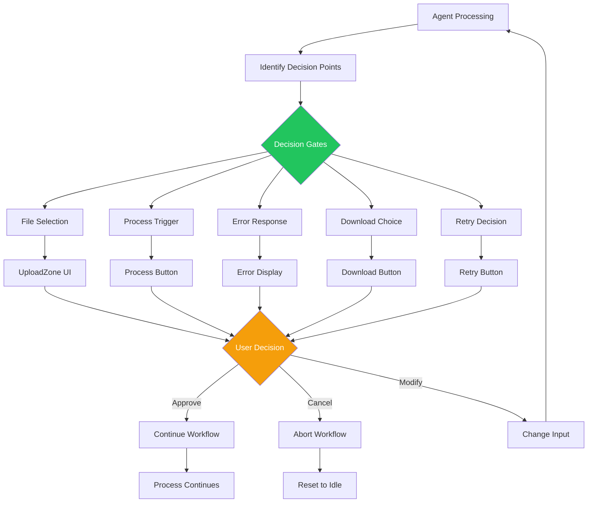

# Agentic Design Patterns: HX Docling UI Application

**Document Type**: Agentic Design Patterns Analysis
**Version**: 2.1.0
**Status**: APPROVED
**Created**: 2025-12-11
**Last Updated**: 2025-12-11
**Author**: Alex Rivera (Platform Architect)
**Charter Reference**: `project/0.0-charter/0.1-hx-docling-ui-charter.md` v0.7.0
**Review Reference**: `project/0.2-architecture/reviews/03-gap-resolution-for-alex.md`
**Pattern Reference**: `project/0.8-references/agentic-design-patterns-docs-main/`
**Target Audience**: Development Team, Architecture Review, AI Integration Specialists

---

## Table of Contents

1. [Executive Summary](#1-executive-summary)
2. [Pattern Mapping Overview](#2-pattern-mapping-overview)
3. [Tool Use Pattern](#3-tool-use-pattern)
4. [Model Context Protocol Pattern](#4-model-context-protocol-pattern)
5. [Prompt Chaining Pattern](#5-prompt-chaining-pattern)
6. [Exception Handling and Recovery Pattern](#6-exception-handling-and-recovery-pattern)
7. [Human-in-the-Loop Pattern](#7-human-in-the-loop-pattern)
8. [Reflection Pattern](#8-reflection-pattern)
9. [Guardrails and Safety Patterns](#9-guardrails-and-safety-patterns)
10. [Routing Pattern](#10-routing-pattern)
11. [Implementation Guidance](#11-implementation-guidance)
12. [Pattern Interactions](#12-pattern-interactions)
13. [Anti-Patterns to Avoid](#13-anti-patterns-to-avoid)
14. [Appendices](#14-appendices)

---

## 1. Executive Summary

### 1.1 Purpose

This document maps the 21 agentic design patterns from the reference documentation to the specific implementation requirements of the HX Docling UI Application. It provides concrete guidance on how each applicable pattern should be implemented, why certain patterns were selected, and how they interact within the application architecture.

### 1.2 Applicable Patterns

Of the 21 agentic design patterns documented in the reference material, the following 8 patterns are directly applicable to the HX Docling UI:

| Pattern | Applicability | Primary Use Case |
|---------|---------------|------------------|
| **Tool Use** | Critical | MCP tool invocation for document conversion |
| **Model Context Protocol** | Critical | Standardized interface to hx-docling-mcp-server |
| **Prompt Chaining** | High | Document processing pipeline (convert -> export) |
| **Exception Handling & Recovery** | Critical | Resilient error handling with retry logic |
| **Human-in-the-Loop** | Medium | Upload approval, retry decisions, error resolution |
| **Reflection** | Medium | Result validation, quality checks |
| **Guardrails/Safety** | High | Input validation, SSRF prevention, rate limiting |
| **Routing** | Medium | Document type routing to appropriate MCP tools |

### 1.3 Pattern Selection Rationale

The selected patterns align with the charter's key requirements:

- **Resilience First**: Exception Handling, Reflection
- **Security by Design**: Guardrails/Safety
- **User Control**: Human-in-the-Loop
- **MCP Integration**: Tool Use, Model Context Protocol
- **Pipeline Processing**: Prompt Chaining, Routing

---

## 2. Pattern Mapping Overview

### 2.1 Pattern Flow Diagram


### 2.2 Pattern Application Matrix

| Feature Area | Tool Use | MCP | Chaining | Exception | HITL | Reflection | Safety | Routing |
|--------------|----------|-----|----------|-----------|------|------------|--------|---------|
| File Upload | - | - | - | X | X | - | X | - |
| URL Input | - | - | - | X | - | - | X | - |
| Document Conversion | X | X | X | X | - | - | - | X |
| Export Generation | X | X | X | X | - | X | - | - |
| Result Display | - | - | - | X | X | X | - | - |
| Error Handling | - | - | - | X | X | - | X | - |
| History View | - | - | - | X | - | - | - | - |

---

## 3. Tool Use Pattern

### 3.1 Pattern Overview

The **Tool Use Pattern** (Function Calling) enables the application to invoke external capabilities through the MCP server's 19 tools. This is the foundational pattern for document processing functionality.

**Reference**: `project/0.8-references/agentic-design-patterns-docs-main/pattern-discussion/tool-use.md`

### 3.2 When to Use in HX Docling UI

- Document conversion (convert_pdf, convert_docx, etc.)
- Export generation (export_markdown, export_html, export_json)
- Future: Advanced document analysis tools

### 3.3 Application Mapping


### 3.4 Implementation Specification

**File**: `src/lib/mcp/client.ts`

```typescript
// Tool Use Pattern Implementation
// Reference: Charter Section 8.2

interface MCPToolCall {
  tool: MCPTool;
  params: Record<string, unknown>;
  timeout: number;
  retryConfig: RetryConfig;
}

interface MCPTool {
  name: string;
  description: string;
  inputSchema: ZodSchema;
  outputSchema: ZodSchema;
}

// Phase 1 Tool Registry
const PHASE1_TOOLS: MCPTool[] = [
  {
    name: 'convert_pdf',
    description: 'Convert PDF document to DoclingDocument',
    inputSchema: z.object({
      file_path: z.string(),
      options: z.object({}).optional(),
    }),
    outputSchema: DoclingDocumentSchema,
  },
  // ... 7 more tools
];

// Tool Execution with Safety Checks
async function executeTool(call: MCPToolCall): Promise<ToolResult> {
  // 1. Validate input against schema
  const validatedParams = call.tool.inputSchema.parse(call.params);

  // 2. Check permissions (safety pattern)
  assertToolPermission(call.tool.name);

  // 3. Execute with timeout
  const result = await withTimeout(
    mcpClient.invoke(call.tool.name, validatedParams),
    call.timeout
  );

  // 4. Validate output
  return call.tool.outputSchema.parse(result);
}
```

### 3.5 Tool Selection Logic

| Document Type | Tool Selected | Timeout | Reference |
|---------------|--------------|---------|-----------|
| PDF (.pdf) | `convert_pdf` | Size-based (60s-300s) | Charter Section 8.1.2 |
| Word (.doc, .docx) | `convert_docx` | Size-based | Charter Section 8.1.2 |
| Excel (.xls, .xlsx) | `convert_xlsx` | Size-based | Charter Section 8.1.2 |
| PowerPoint (.ppt, .pptx) | `convert_pptx` | Size-based | Charter Section 8.1.2 |
| URL (http/https) | `convert_url` | 30s | Charter Section 11.3 |

**Reference**: Charter Section 4.1.1 - Core Features

---

## 4. Model Context Protocol Pattern

### 4.1 Pattern Overview

The **Model Context Protocol (MCP) Pattern** provides a standardized interface for communicating with the hx-docling-mcp-server. This pattern ensures consistent tool discovery, invocation, and response handling.

**Reference**: `project/0.8-references/agentic-design-patterns-docs-main/pattern-discussion/model-context-protocol.md`

### 4.2 When to Use in HX Docling UI

- All interactions with hx-docling-mcp-server
- Tool discovery and capability listing
- Streaming progress updates via SSE
- Error handling for MCP-specific failures

### 4.3 MCP Communication Flow

**CRITICAL**: The MCP protocol requires proper initialization before tool invocation.


### 4.3.1 Capability Negotiation

During initialization, the client and server negotiate capabilities:

```typescript
// Client sends capabilities
const initRequest = {
  jsonrpc: '2.0',
  method: 'initialize',
  params: {
    clientInfo: {
      name: 'hx-docling-ui',
      version: '1.0.0',
    },
    capabilities: {
      tools: { listChanged: false },  // We don't support dynamic tool updates
    },
  },
  id: 1,
};

// Server responds with its capabilities
const initResponse = {
  serverInfo: {
    name: 'hx-docling-mcp-server',
    version: '1.0.0',
  },
  capabilities: {
    tools: true,           // Server supports tools
    streaming: true,       // Server supports SSE streaming
  },
};
```

**Post-Initialization Validation**:
- Verify server supports `tools` capability
- Verify server supports `streaming` for SSE
- Cache tool list for client-side validation

### 4.4 Implementation Specification

**File**: `src/lib/mcp/client.ts`

```typescript
// MCP Pattern Implementation
// Reference: Charter Section 8.1

interface MCPClientConfig {
  endpoint: string;  // http://hx-docling-mcp-server.hx.dev.local:8000/mcp
  transport: 'http' | 'sse';
  timeout: number;
  retries: number;
  apiKey?: string;   // Optional API key for Authorization header
}

class MCPClient {
  private config: MCPClientConfig;
  private initialized = false;
  private toolRegistry: Map<string, MCPTool> = new Map();
  private serverCapabilities: ServerCapabilities | null = null;

  constructor(config: MCPClientConfig) {
    this.config = config;
  }

  // Initialization (REQUIRED before tool calls)
  async initialize(): Promise<void> {
    if (this.initialized) return;

    // Step 1: Capability negotiation
    const initResponse = await this.request({
      jsonrpc: '2.0',
      method: 'initialize',
      params: {
        clientInfo: {
          name: 'hx-docling-ui',
          version: process.env.NEXT_PUBLIC_APP_VERSION || '1.0.0',
        },
        capabilities: {
          tools: { listChanged: false },
        },
      },
      id: generateId(),
    });

    this.serverCapabilities = initResponse.capabilities;

    // Step 2: Discover and cache available tools
    const toolsResponse = await this.request({
      jsonrpc: '2.0',
      method: 'tools/list',
      id: generateId(),
    });

    for (const tool of toolsResponse.tools) {
      this.toolRegistry.set(tool.name, tool);
    }

    this.initialized = true;
  }

  // Tool discovery (returns cached tools)
  async listTools(): Promise<MCPTool[]> {
    if (!this.initialized) {
      await this.initialize();
    }
    return Array.from(this.toolRegistry.values());
  }

  // Tool invocation with SSE streaming
  async invoke(
    tool: string,
    params: Record<string, unknown>,
    onProgress?: (progress: Progress) => void
  ): Promise<unknown> {
    // Ensure initialized
    if (!this.initialized) {
      await this.initialize();
    }

    // Validate tool exists
    if (!this.toolRegistry.has(tool)) {
      throw new MCPError('E204', `Unknown tool: ${tool}`);
    }

    const request = {
      jsonrpc: '2.0',
      method: 'tools/call',
      params: { name: tool, arguments: params },
      id: generateId(),
    };

    if (this.config.transport === 'sse') {
      return this.invokeWithSSE(request, onProgress);
    }
    return this.invokeHTTP(request);
  }

  /**
   * SSE streaming using POST-then-GET two-endpoint pattern.
   * IMPORTANT: This method is CLIENT-SIDE ONLY (browser).
   * Server-side code must use invokeWithReadableStream() instead.
   *
   * Pattern: POST /api/v1/mcp/sse/init → returns streamId
   *          GET  /api/v1/mcp/sse/{streamId} → EventSource connection
   *
   * This pattern is required because:
   * 1. EventSource API only supports GET requests
   * 2. Large JSON-RPC payloads cannot fit in URL query parameters
   * 3. POST init stores request server-side, returns short-lived stream ID
   * 4. GET stream retrieves using stream ID, enables EventSource
   *
   * @see Solution Architecture Section 6.2 - SSE Two-Endpoint Pattern
   */
  private async invokeWithSSE(
    request: JSONRPCRequest,
    onProgress?: (progress: Progress) => void
  ): Promise<unknown> {
    // Guard: EventSource is browser-only API
    if (typeof EventSource === 'undefined') {
      throw new MCPError('EventSource not available; use invokeWithReadableStream() server-side');
    }

    // Step 1: POST request to init endpoint, receive stream ID
    const initResponse = await fetch(`${this.config.endpoint}/sse/init`, {
      method: 'POST',
      headers: {
        'Content-Type': 'application/json',
        ...(this.config.apiKey && { 'Authorization': `Bearer ${this.config.apiKey}` }),
      },
      body: JSON.stringify(request),
    });

    if (!initResponse.ok) {
      const error = await initResponse.json().catch(() => ({ message: 'SSE init failed' }));
      throw new MCPError(error.message || `SSE init failed: ${initResponse.status}`);
    }

    const { streamId, expiresIn } = await initResponse.json() as {
      streamId: string;
      expiresIn: number;  // seconds until stream ID expires (typically 30-60s)
    };

    // Step 2: GET stream endpoint with EventSource using stream ID
    const eventSource = new EventSource(
      `${this.config.endpoint}/sse/${encodeURIComponent(streamId)}`
    );

    return new Promise((resolve, reject) => {
      // Set timeout based on stream expiry
      const timeout = setTimeout(() => {
        eventSource.close();
        reject(new MCPError(`SSE stream timed out after ${expiresIn}s`));
      }, expiresIn * 1000);

      eventSource.addEventListener('progress', (event) => {
        onProgress?.(JSON.parse(event.data));
      });

      eventSource.addEventListener('result', (event) => {
        clearTimeout(timeout);
        resolve(JSON.parse(event.data));
        eventSource.close();
      });

      eventSource.addEventListener('error', (event) => {
        clearTimeout(timeout);
        reject(new MCPError(event));
        eventSource.close();
      });
    });
  }

  /**
   * Server-side SSE consumption using fetch + ReadableStream.
   * Use this in Route Handlers, Server Components, or Node.js code.
   */
  private async invokeWithReadableStream(
    request: JSONRPCRequest,
    onProgress?: (progress: Progress) => void,
    signal?: AbortSignal
  ): Promise<unknown> {
    // Step 1: POST to init endpoint
    const initResponse = await fetch(`${this.config.endpoint}/sse/init`, {
      method: 'POST',
      headers: {
        'Content-Type': 'application/json',
        ...(this.config.apiKey && { 'Authorization': `Bearer ${this.config.apiKey}` }),
      },
      body: JSON.stringify(request),
      signal,
    });

    if (!initResponse.ok) {
      const error = await initResponse.json().catch(() => ({ message: 'SSE init failed' }));
      throw new MCPError(error.message || `SSE init failed: ${initResponse.status}`);
    }

    const { streamId } = await initResponse.json() as { streamId: string };

    // Step 2: GET stream with ReadableStream
    const streamResponse = await fetch(
      `${this.config.endpoint}/sse/${encodeURIComponent(streamId)}`,
      { signal }
    );

    if (!streamResponse.ok || !streamResponse.body) {
      throw new MCPError(`SSE stream failed: ${streamResponse.status}`);
    }

    const reader = streamResponse.body.getReader();
    const decoder = new TextDecoder();
    let buffer = '';

    while (true) {
      const { done, value } = await reader.read();
      if (done) break;

      buffer += decoder.decode(value, { stream: true });
      const lines = buffer.split('\n');
      buffer = lines.pop() || '';

      for (const line of lines) {
        if (line.startsWith('event: progress')) {
          const dataLine = lines[lines.indexOf(line) + 1];
          if (dataLine?.startsWith('data: ')) {
            onProgress?.(JSON.parse(dataLine.slice(6)));
          }
        } else if (line.startsWith('event: result')) {
          const dataLine = lines[lines.indexOf(line) + 1];
          if (dataLine?.startsWith('data: ')) {
            return JSON.parse(dataLine.slice(6));
          }
        } else if (line.startsWith('event: error')) {
          const dataLine = lines[lines.indexOf(line) + 1];
          throw new MCPError(dataLine?.slice(6) || 'SSE error');
        }
      }
    }

    throw new MCPError('SSE stream ended without result');
  }
}
```

### 4.4.1 SSE Route Handler (Server-Side)

The Next.js Route Handler that serves SSE streams:

```typescript
// app/api/v1/mcp/sse/[streamId]/route.ts
// Reference: Charter Section 8.1, Solution Architecture Section 6.2

// Force Node.js runtime (Edge doesn't support long-lived connections)
export const runtime = 'nodejs';
export const dynamic = 'force-dynamic';

import { NextRequest } from 'next/server';

export async function GET(
  request: NextRequest,
  { params }: { params: { streamId: string } }
) {
  const { streamId } = params;

  // Validate stream ID exists (from Redis or in-memory store)
  const streamData = await getStreamData(streamId);
  if (!streamData) {
    return new Response('Stream not found or expired', { status: 404 });
  }

  // Create SSE stream with proper headers
  const encoder = new TextEncoder();
  const stream = new ReadableStream({
    async start(controller) {
      // Send initial connection confirmation
      controller.enqueue(encoder.encode('event: connected\ndata: {}\n\n'));

      try {
        // Process the stored MCP request and stream progress
        for await (const progress of processMCPRequest(streamData.request)) {
          if (progress.type === 'progress') {
            controller.enqueue(
              encoder.encode(`event: progress\ndata: ${JSON.stringify(progress.data)}\n\n`)
            );
          } else if (progress.type === 'result') {
            controller.enqueue(
              encoder.encode(`event: result\ndata: ${JSON.stringify(progress.data)}\n\n`)
            );
            break;
          }
        }
      } catch (error) {
        controller.enqueue(
          encoder.encode(`event: error\ndata: ${JSON.stringify({ message: String(error) })}\n\n`)
        );
      } finally {
        controller.close();
        // Clean up stream data
        await deleteStreamData(streamId);
      }
    },
    cancel() {
      // Handle client disconnect (AbortSignal)
      deleteStreamData(streamId);
    },
  });

  return new Response(stream, {
    headers: {
      'Content-Type': 'text/event-stream',
      'Cache-Control': 'no-cache, no-transform',
      'Connection': 'keep-alive',
      'X-Accel-Buffering': 'no',  // Disable nginx buffering
    },
  });
}
```

### 4.5 MCP Protocol Details

| Aspect | Specification | Reference |
|--------|---------------|-----------|
| Protocol | JSON-RPC 2.0 | MCP Standard |
| Transport | HTTP for simple calls, SSE for streaming | Charter Section 8.1 |
| Endpoint | `/mcp` | Charter Section 8.1 |
| Timeout | 60s-300s (size-based) | Charter Section 8.1.2 |
| Retry | 3 attempts, exponential backoff | Charter Section 8.1 |

---

## 5. Prompt Chaining Pattern

### 5.1 Pattern Overview

The **Prompt Chaining Pattern** breaks complex document processing into discrete, sequential steps with clear handoffs. In the HX Docling UI, this manifests as the conversion-export pipeline.

**Reference**: `project/0.8-references/agentic-design-patterns-docs-main/pattern-discussion/prompt-chaining.md`

### 5.2 When to Use in HX Docling UI

- Document conversion followed by multiple export formats
- Multi-step processing with progress tracking
- Partial result handling when some steps fail

### 5.3 Processing Pipeline


### 5.4 Implementation Specification

**File**: `src/app/api/process/route.ts`

```typescript
// Prompt Chaining Pattern Implementation
// Reference: Charter Section 6.6 - Progress Stages

interface ProcessingStage {
  name: string;
  percentStart: number;
  percentEnd: number;
  description: string;
}

const PROCESSING_STAGES: ProcessingStage[] = [
  { name: 'upload', percentStart: 0, percentEnd: 10, description: 'Uploading document...' },
  { name: 'parsing', percentStart: 10, percentEnd: 40, description: 'Analyzing document structure...' },
  { name: 'conversion', percentStart: 40, percentEnd: 80, description: 'Processing with AI...' },
  { name: 'export', percentStart: 80, percentEnd: 95, description: 'Generating outputs...' },
  { name: 'saving', percentStart: 95, percentEnd: 99, description: 'Saving results...' },
  { name: 'complete', percentStart: 100, percentEnd: 100, description: 'Complete!' },
];

async function processDocument(
  jobId: string,
  input: FileInput | URLInput,
  onProgress: (stage: string, percent: number, message: string) => void
): Promise<ProcessingResult> {
  // Stage 1: Upload (handled before this function)

  // Stage 2: Conversion
  onProgress('conversion', 40, 'Processing with AI...');
  const conversionTool = selectConversionTool(input);
  const doclingDocument = await mcpClient.invoke(
    conversionTool,
    input.params,
    (progress) => {
      const percent = interpolateProgress(progress, 10, 80);
      onProgress('conversion', percent, progress.message);
    }
  );

  // Stage 3: Export (parallel with partial failure support)
  onProgress('export', 80, 'Generating outputs...');
  const exports = await Promise.allSettled([
    mcpClient.invoke('export_markdown', { document: doclingDocument }),
    mcpClient.invoke('export_html', { document: doclingDocument }),
    mcpClient.invoke('export_json', { document: doclingDocument }),
  ]);

  // Handle partial results
  const results = processExportResults(exports);

  // Stage 4: Persist
  onProgress('saving', 95, 'Saving results...');
  await persistResults(jobId, results);

  onProgress('complete', 100, 'Complete!');
  return results;
}
```

### 5.5 Stage-to-Progress Mapping

| Stage | Percent Range | User Message | Reference |
|-------|---------------|--------------|-----------|
| Upload | 0-10% | "Uploading document..." | Charter Section 6.6 |
| Parsing | 10-40% | "Analyzing document structure..." | Charter Section 6.6 |
| Conversion | 40-80% | "Processing with AI..." | Charter Section 6.6 |
| Export | 80-95% | "Generating outputs..." | Charter Section 6.6 |
| Saving | 95-99% | "Saving results..." | Charter Section 6.6 |
| Complete | 100% | "Complete!" | Charter Section 6.6 |

### 5.6 Checkpoint/Durability Strategy

For recovery after application crashes, the pipeline saves checkpoints at each major stage.

**Checkpoint Stages**:
| Stage | What Gets Saved | Resume Capability |
|-------|-----------------|-------------------|
| `uploaded` | File path, metadata | Restart from conversion |
| `converted` | DoclingDocument JSON | Resume from export |
| `export_markdown` | Markdown result | Skip to next export |
| `export_html` | HTML result | Skip to next export |
| `export_json` | JSON result | Skip to complete |

**Implementation**:
```typescript
// Save checkpoint after each stage
async function processWithCheckpoint(
  jobId: string,
  input: FileInput | URLInput
): Promise<ProcessingResult> {
  // Check for existing checkpoint
  const checkpoint = await resumeFromCheckpoint(jobId);
  let doclingDocument: DoclingDocument | null = checkpoint?.data ?? null;
  let startStage = checkpoint?.stage ?? 'uploaded';

  // Resume from appropriate stage
  if (startStage === 'uploaded' || !doclingDocument) {
    doclingDocument = await convertDocument(input);
    await saveCheckpoint(jobId, 'converted', doclingDocument);
  }

  // Export stages with individual checkpoints
  const results: Partial<ProcessingResult> = {};

  if (['converted', 'uploaded'].includes(startStage)) {
    results.markdown = await exportMarkdown(doclingDocument);
    await saveCheckpoint(jobId, 'export_markdown', null);
  }

  if (['converted', 'uploaded', 'export_markdown'].includes(startStage)) {
    results.html = await exportHtml(doclingDocument);
    await saveCheckpoint(jobId, 'export_html', null);
  }

  // ... continue for export_json and complete

  return results as ProcessingResult;
}
```

**Note**: Full LangGraph-style durable execution with persistent task queues is a Phase 2+ enhancement.

---

## 6. Exception Handling and Recovery Pattern

### 6.1 Pattern Overview

The **Exception Handling and Recovery Pattern** ensures the application gracefully handles errors, implements retry logic, and provides clear recovery paths for users.

**Reference**: `project/0.8-references/agentic-design-patterns-docs-main/pattern-discussion/exception-handling-and-recovery.md`

### 6.2 When to Use in HX Docling UI

- MCP server unavailability or timeout
- Network interruptions during SSE streaming
- Database connection failures
- Partial export failures
- File upload errors

### 6.3 Error Handling Flow


### 6.4 Implementation Specification

**File**: `src/lib/mcp/recovery.ts`

```typescript
// Exception Handling Pattern Implementation
// Reference: Charter Section 8.6, Appendix A

interface RetryConfig {
  maxRetries: number;
  backoffBase: number;      // milliseconds
  backoffMultiplier: number;
  maxBackoff: number;       // milliseconds
}

// Default retry configuration (Charter Section 8.6)
const DEFAULT_RETRY: RetryConfig = {
  maxRetries: 3,
  backoffBase: 1000,      // 1 second
  backoffMultiplier: 2,   // 1s -> 2s -> 4s
  maxBackoff: 8000,       // 8 seconds
};

interface ErrorRecovery {
  errorCode: string;
  userMessage: string;
  suggestedAction: string;
  retryable: boolean;
  retryDelay?: number;
  logLevel: 'warn' | 'error';
}

// Retry wrapper with exponential backoff
async function withRetry<T>(
  operation: () => Promise<T>,
  config: RetryConfig,
  onRetry?: (attempt: number, error: Error) => void
): Promise<T> {
  let lastError: Error;

  for (let attempt = 1; attempt <= config.maxRetries; attempt++) {
    try {
      return await operation();
    } catch (error) {
      lastError = error as Error;

      if (!isRetryableError(error) || attempt === config.maxRetries) {
        throw error;
      }

      onRetry?.(attempt, lastError);

      const backoff = Math.min(
        config.backoffBase * Math.pow(config.backoffMultiplier, attempt - 1),
        config.maxBackoff
      );

      await sleep(backoff);
    }
  }

  throw lastError!;
}

// Error classification
function isRetryableError(error: unknown): boolean {
  if (error instanceof MCPError) {
    // Retry on timeout, 5xx, network errors
    return ['TIMEOUT', 'SERVER_ERROR', 'NETWORK_ERROR'].includes(error.type);
  }
  return false;
}

// Error recovery mapping
const ERROR_RECOVERY: Record<string, ErrorRecovery> = {
  'E201': {
    errorCode: 'E201',
    userMessage: 'Document processing service is temporarily unavailable.',
    suggestedAction: 'Please try again in a few minutes.',
    retryable: true,
    retryDelay: 30000,
    logLevel: 'error',
  },
  'E301': {
    errorCode: 'E301',
    userMessage: 'Processing took too long.',
    suggestedAction: 'Large documents may take longer. Try with a smaller file.',
    retryable: true,
    retryDelay: 5000,
    logLevel: 'error',
  },
  // ... more error mappings from Charter Appendix A
};
```

### 6.5 Error Categories and Recovery Actions

| Category | Error Codes | Retryable | Recovery Action | Reference |
|----------|-------------|-----------|-----------------|-----------|
| File Errors | E001-E005 | Varies | User selects different file | Charter Appendix A |
| URL Errors | E101-E104 | Varies | User corrects URL | Charter Appendix A |
| MCP Errors | E201-E204 | Yes | Auto-retry then manual | Charter Section 8.6 |
| Processing Errors | E301-E304 | Yes | Retry, partial results | Charter Section 8.6 |
| Database Errors | E401-E403 | Yes | Auto-retry | Charter Appendix A |
| Session Errors | E501-E502 | No | Refresh page | Charter Appendix A |
| Rate Limiting | E601 | Yes (after delay) | Wait then retry | Charter Section 8.1.1 |

### 6.6 Circuit Breaker Pattern

The circuit breaker prevents cascading failures when the MCP server is unhealthy.

**States**:


**Integration with MCP Client**:
```typescript
// Wrap MCP calls with circuit breaker
async function invokeToolWithCircuitBreaker(
  toolName: string,
  params: unknown
): Promise<unknown> {
  // Check circuit state
  if (!mcpCircuitBreaker.isAvailable()) {
    throw new CircuitOpenError('MCP service temporarily unavailable');
  }

  return mcpCircuitBreaker.execute(() =>
    mcpClient.invoke(toolName, params)
  );
}
```

**User-Facing Behavior**:
| Circuit State | User Experience |
|---------------|-----------------|
| Closed | Normal operation |
| Open | Immediate error: "Service temporarily unavailable. Please try again in X seconds." |
| Half-Open | First few requests may succeed or fail |

---

## 7. Human-in-the-Loop Pattern

### 7.1 Pattern Overview

The **Human-in-the-Loop (HITL) Pattern** incorporates human decision points into the processing workflow, ensuring users maintain control over critical actions.

**Reference**: `project/0.8-references/agentic-design-patterns-docs-main/pattern-discussion/human-in-the-loop.md`

### 7.2 When to Use in HX Docling UI

- File upload confirmation (implicit approval by clicking "Process")
- Error acknowledgment and retry decisions
- Download format selection
- History navigation and re-download decisions

### 7.3 Human Decision Points



### 7.4 Implementation Specification

**File**: `src/components/error/ErrorRecovery.tsx`

```typescript
// Human-in-the-Loop Pattern Implementation
// Reference: Charter Section 8.6

'use client';

import { useDocumentStore } from '@/stores/documentStore';

interface ErrorRecoveryProps {
  error: ErrorState;
  onRetry: () => void;
  onCancel: () => void;
  onModify: () => void;
}

export function ErrorRecovery({ error, onRetry, onCancel, onModify }: ErrorRecoveryProps) {
  const recovery = ERROR_RECOVERY[error.code];

  return (
    <Card className="border-destructive">
      <CardHeader>
        <CardTitle className="flex items-center gap-2">
          <AlertCircle className="text-destructive" />
          Error {error.code}
        </CardTitle>
      </CardHeader>

      <CardContent>
        <p className="text-lg">{recovery.userMessage}</p>
        <p className="text-muted-foreground mt-2">{recovery.suggestedAction}</p>
      </CardContent>

      <CardFooter className="flex gap-2">
        {/* Human Decision Point: Retry */}
        {recovery.retryable && (
          <Button onClick={onRetry} variant="default">
            <RefreshCw className="mr-2 h-4 w-4" />
            Retry
          </Button>
        )}

        {/* Human Decision Point: Modify Input */}
        <Button onClick={onModify} variant="secondary">
          <Edit className="mr-2 h-4 w-4" />
          Try Different File
        </Button>

        {/* Human Decision Point: Cancel */}
        <Button onClick={onCancel} variant="ghost">
          Cancel
        </Button>
      </CardFooter>
    </Card>
  );
}
```

### 7.5 Decision Points Summary

| Decision Point | Trigger | User Options | Default Action |
|----------------|---------|--------------|----------------|
| File Selection | Drag-drop/click | Accept file, Cancel | None required |
| Process Trigger | Process button | Start, Cancel | Wait for click |
| Error Response | Error occurs | Retry, Modify, Cancel | Show options |
| Download Choice | Results ready | Select format, Download | Markdown default |
| Retry Decision | Retry available | Retry, Cancel | Show options |

**Reference**: Charter Section 10.4 - Keyboard Shortcuts

---

## 8. Reflection Pattern

### 8.1 Pattern Overview

The **Reflection Pattern** enables the system to evaluate its own outputs for quality and correctness. In the HX Docling UI, this applies to result validation and quality checks.

**Reference**: `project/0.8-references/agentic-design-patterns-docs-main/pattern-discussion/reflection.md`

### 8.2 When to Use in HX Docling UI

- Validating export outputs are non-empty
- Checking conversion results have expected structure
- Verifying partial results are displayable
- Quality gate enforcement in CI/CD

### 8.3 Reflection Flow


### 8.4 Implementation Specification

**File**: `src/lib/validation/results.ts`

```typescript
// Reflection Pattern Implementation
// Reference: Charter Section 7.6.1

interface ResultValidation {
  format: ResultFormat;
  content: string;
  size: number;
  isValid: boolean;
  issues: string[];
}

// Module-level constant for max sizes (shared by validateResult and truncateContent)
const MAX_SIZES: Record<ResultFormat, number> = {
  MARKDOWN: 10 * 1024 * 1024,  // 10 MB
  HTML: 15 * 1024 * 1024,      // 15 MB
  JSON: 20 * 1024 * 1024,      // 20 MB
  RAW: 25 * 1024 * 1024,       // 25 MB
};

// Quality checks for export results
function validateResult(format: ResultFormat, content: string): ResultValidation {
  const issues: string[] = [];
  const size = new TextEncoder().encode(content).byteLength;

  // Check 1: Non-empty
  if (!content || content.trim().length === 0) {
    issues.push('Content is empty');
  }

  // Check 2: Size within limits (Charter Section 7.6.1)
  if (size > MAX_SIZES[format]) {
    issues.push(`Content exceeds maximum size (${MAX_SIZES[format]} bytes)`);
  }

  // Check 3: Format-specific validation
  switch (format) {
    case 'MARKDOWN':
      if (!content.includes('#') && !content.includes('\n')) {
        issues.push('Markdown may be malformed');
      }
      break;
    case 'HTML':
      if (!content.includes('<') || !content.includes('>')) {
        issues.push('HTML appears invalid');
      }
      break;
    case 'JSON':
      try {
        JSON.parse(content);
      } catch {
        issues.push('JSON is invalid');
      }
      break;
  }

  return {
    format,
    content: issues.length === 0 ? content : truncateContent(content, format),
    size,
    isValid: issues.length === 0,
    issues,
  };
}

// Truncation with indication (Charter Section 7.6.1)
// Uses TextEncoder/TextDecoder for cross-runtime (browser + Node.js) compatibility
function truncateContent(content: string, format: ResultFormat): string {
  const maxSize = MAX_SIZES[format];
  const bytes = new TextEncoder().encode(content);
  if (bytes.byteLength <= maxSize) {
    return content;
  }

  // Truncate by bytes (not chars) to honor byte limits for UTF-8 multibyte text
  const safe = bytes.slice(0, Math.max(0, maxSize - 128));
  const truncated = new TextDecoder().decode(safe);
  return `${truncated}\n\n... [truncated - content exceeded ${(maxSize / 1024 / 1024) | 0} MB limit]`;
}
```

### 8.5 Quality Gate Integration

| Gate | Check | Action on Failure | Reference |
|------|-------|-------------------|-----------|
| Result Non-Empty | Content length > 0 | Mark as failed export | Charter Section 8.6 |
| Result Size | Within format limit | Truncate with notice | Charter Section 7.6.1 |
| Format Valid | Parse successfully | Show error, allow retry | Charter Section 8.6 |
| Structure Valid | Has expected fields | Log warning, continue | Internal |

---

## 9. Guardrails and Safety Patterns

### 9.1 Pattern Overview

The **Guardrails/Safety Pattern** implements protective measures to prevent harmful inputs, ensure system integrity, and protect against abuse.

**Reference**: `project/0.8-references/agentic-design-patterns-docs-main/pattern-discussion/guardrails-safety-patterns.md`

### 9.2 When to Use in HX Docling UI

- Input validation for files and URLs
- SSRF prevention for URL processing
- Rate limiting to prevent abuse
- File type and size restrictions

### 9.3 Safety Architecture


### 9.4 Implementation Specification

#### 9.4.1 File Validation

**File**: `src/lib/validation/file.ts`

```typescript
// File Validation Guardrail
// Reference: Charter Section 11.2

const fileSchema = z.object({
  name: z.string().min(1).refine(
    (name) => ALLOWED_EXTENSIONS.some(ext => name.toLowerCase().endsWith(ext)),
    { message: 'Unsupported file extension' }
  ),
  size: z.number().max(100 * 1024 * 1024, 'File must be under 100 MB'),
  type: z.enum([
    'application/pdf',
    'application/vnd.openxmlformats-officedocument.wordprocessingml.document',
    'application/msword',
    'application/vnd.openxmlformats-officedocument.presentationml.presentation',
    'application/vnd.ms-powerpoint',
    'application/vnd.openxmlformats-officedocument.spreadsheetml.sheet',
    'application/vnd.ms-excel',
    'image/png',
    'image/jpeg',
    'image/tiff',
  ]),
});

const ALLOWED_EXTENSIONS = [
  '.pdf',
  '.doc', '.docx',
  '.ppt', '.pptx',
  '.xls', '.xlsx',
  '.png', '.jpg', '.jpeg', '.tiff'
];
```

#### 9.4.2 SSRF Prevention

**File**: `src/lib/validation/url.ts`

```typescript
// SSRF Prevention Guardrail
// Reference: Charter Section 11.3

function isURLAllowed(url: string): boolean {
  const parsed = new URL(url);
  const hostname = parsed.hostname.toLowerCase();

  // Block localhost
  if (hostname === 'localhost' || hostname === '127.0.0.1') {
    return false;
  }

  // Block private IP ranges (RFC 1918)
  const ipv4Pattern = /^(\d{1,3}\.){3}\d{1,3}$/;
  if (ipv4Pattern.test(hostname)) {
    const parts = hostname.split('.').map(Number);
    if (parts[0] === 10) return false;                    // 10.0.0.0/8
    if (parts[0] === 172 && parts[1] >= 16 && parts[1] <= 31) return false;  // 172.16.0.0/12
    if (parts[0] === 192 && parts[1] === 168) return false;  // 192.168.0.0/16
    if (parts[0] === 169 && parts[1] === 254) return false;  // 169.254.0.0/16
  }

  // Block internal HX domains
  if (hostname.endsWith('.hx.dev.local')) {
    return false;
  }

  return true;
}
```

#### 9.4.3 Rate Limiting

**File**: `src/lib/redis/rate-limit.ts`

**CRITICAL**: Rate limiting MUST use Redis, not in-memory Map, to support distributed deployment.

```typescript
// Rate Limiting Guardrail (Redis-based)
// Reference: Charter Section 8.1.1

import { redis } from './client';

const RATE_LIMIT_MAX = 10;
const RATE_LIMIT_WINDOW = 60; // seconds

interface RateLimitResult {
  allowed: boolean;
  remaining: number;
  retryAfter?: number;
}

export async function checkRateLimit(sessionId: string): Promise<RateLimitResult> {
  const key = `hx-docling:rate:${sessionId}`;

  // Use Redis INCR with EXPIRE (fixed window algorithm)
  const current = await redis.incr(key);

  if (current === 1) {
    // First request in window - set expiry
    await redis.expire(key, RATE_LIMIT_WINDOW);
  }

  const ttl = await redis.ttl(key);

  if (current > RATE_LIMIT_MAX) {
    return {
      allowed: false,
      remaining: 0,
      retryAfter: ttl > 0 ? ttl : RATE_LIMIT_WINDOW,
    };
  }

  return {
    allowed: true,
    remaining: RATE_LIMIT_MAX - current,
  };
}
```

**Response Headers for Rate Limiting**:
```typescript
// Include rate limit headers in responses (RFC 9238 compliant)
// Note: X-RateLimit-Reset uses Unix epoch in SECONDS (not milliseconds)
headers: {
  // Legacy X- headers (widely supported)
  'X-RateLimit-Limit': '10',
  'X-RateLimit-Remaining': String(result.remaining),
  'X-RateLimit-Reset': String(Math.floor(Date.now() / 1000) + (result.retryAfter || 60)),
  // RFC 9238 standard headers (modern clients)
  'RateLimit-Limit': '10',
  'RateLimit-Remaining': String(result.remaining),
  'RateLimit-Reset': String(result.retryAfter || 60),  // Seconds until reset
  // Retry-After in seconds when rate limited
  ...(result.retryAfter && { 'Retry-After': String(result.retryAfter) }),
}
```

### 9.5 Security Controls Summary

| Control | Implementation | Threshold | Reference |
|---------|----------------|-----------|-----------|
| File Type | Zod schema validation | Whitelist only | Charter Section 11.2 |
| File Size | Size check before upload | 100 MB max | Charter Section 4.1.2 |
| URL Protocol | Protocol validation | HTTP/HTTPS only | Charter Section 11.3 |
| SSRF Prevention | IP/domain blocking | Block private ranges | Charter Section 11.3 |
| Rate Limiting | Redis INCR/EXPIRE (distributed) | 10 req/min | Charter Section 8.1.1 |

---

## 10. Routing Pattern

### 10.1 Pattern Overview

The **Routing Pattern** directs requests to the appropriate handler based on input characteristics. In the HX Docling UI, this routes different document types to the correct MCP tools.

**Reference**: `project/0.8-references/agentic-design-patterns-docs-main/pattern-discussion/routing.md`

### 10.2 When to Use in HX Docling UI

- Selecting appropriate conversion tool based on file type
- Routing URL vs file inputs to different handlers
- Determining timeout based on file size

### 10.3 Routing Flow


### 10.4 Implementation Specification

**File**: `src/lib/mcp/router.ts`

```typescript
// Routing Pattern Implementation
// Reference: Charter Section 8.2, 8.1.2

interface RouteResult {
  tool: string;
  params: Record<string, unknown>;
  timeout: number;
}

const FILE_TYPE_ROUTES: Record<string, string> = {
  '.pdf': 'convert_pdf',
  '.doc': 'convert_docx',
  '.docx': 'convert_docx',
  '.xls': 'convert_xlsx',
  '.xlsx': 'convert_xlsx',
  '.ppt': 'convert_pptx',
  '.pptx': 'convert_pptx',
  '.png': 'convert_pdf',   // Image mode
  '.jpg': 'convert_pdf',
  '.jpeg': 'convert_pdf',
  '.tiff': 'convert_pdf',
};

const SIZE_TIMEOUTS: Array<{ maxSize: number; timeout: number }> = [
  { maxSize: 10 * 1024 * 1024, timeout: 60000 },    // < 10 MB: 60s
  { maxSize: 50 * 1024 * 1024, timeout: 180000 },   // 10-50 MB: 180s
  { maxSize: 100 * 1024 * 1024, timeout: 300000 },  // 50-100 MB: 300s
];

function routeInput(input: FileInput | URLInput): RouteResult {
  if (input.type === 'url') {
    return {
      tool: 'convert_url',
      params: { url: input.url },
      timeout: 30000,  // 30 seconds for URL
    };
  }

  // File routing
  const extension = getExtension(input.fileName).toLowerCase();
  const tool = FILE_TYPE_ROUTES[extension];

  if (!tool) {
    throw new ValidationError('E002', `Unsupported file type: ${extension}`);
  }

  // Size-based timeout
  const sizeConfig = SIZE_TIMEOUTS.find(c => input.fileSize <= c.maxSize);
  if (!sizeConfig) {
    throw new ValidationError('E001', 'File too large (max 100 MB)');
  }

  return {
    tool,
    params: {
      file_path: input.filePath,
      ...(['.png', '.jpg', '.jpeg', '.tiff'].includes(extension) && { image_mode: true }),
    },
    timeout: sizeConfig.timeout,
  };
}
```

### 10.5 Routing Rules Summary

| Input | Condition | Route To | Timeout | Reference |
|-------|-----------|----------|---------|-----------|
| File | .pdf | convert_pdf | Size-based | Charter Section 8.2 |
| File | .doc/.docx | convert_docx | Size-based | Charter Section 8.2 |
| File | .xls/.xlsx | convert_xlsx | Size-based | Charter Section 8.2 |
| File | .ppt/.pptx | convert_pptx | Size-based | Charter Section 8.2 |
| File | .png/.jpg/.jpeg/.tiff | convert_pdf (image) | Size-based | Charter Section 8.2 |
| URL | http/https | convert_url | 30s | Charter Section 11.3 |

---

## 11. Implementation Guidance

### 11.1 Pattern Implementation Priority

| Priority | Pattern | Sprint | Rationale |
|----------|---------|--------|-----------|
| P1 | Guardrails/Safety | 1.3, 1.4 | Must validate before processing |
| P1 | Tool Use | 1.5 | Core MCP integration |
| P1 | MCP Protocol | 1.5 | Communication foundation |
| P1 | Exception Handling | 1.5 | Resilience requirement |
| P2 | Prompt Chaining | 1.5 | Pipeline orchestration |
| P2 | Routing | 1.5 | Tool selection logic |
| P3 | Human-in-the-Loop | 1.6, 1.7 | Error recovery UI |
| P3 | Reflection | 1.6 | Result validation |

### 11.2 File-to-Pattern Mapping

| File | Patterns Implemented |
|------|---------------------|
| `src/lib/mcp/client.ts` | Tool Use, MCP Protocol |
| `src/lib/mcp/router.ts` | Routing |
| `src/lib/mcp/recovery.ts` | Exception Handling |
| `src/lib/sse/manager.ts` | Exception Handling |
| `src/lib/validation/file.ts` | Guardrails/Safety |
| `src/lib/validation/url.ts` | Guardrails/Safety |
| `src/lib/validation/results.ts` | Reflection |
| `src/app/api/process/route.ts` | Prompt Chaining |
| `src/components/error/ErrorRecovery.tsx` | Human-in-the-Loop |
| `src/middleware.ts` | Guardrails/Safety (Rate Limiting) |

### 11.3 Testing Strategy by Pattern

| Pattern | Test Type | Coverage Target |
|---------|-----------|-----------------|
| Tool Use | Integration | Real MCP server connection |
| MCP Protocol | Unit + Integration | Protocol compliance |
| Prompt Chaining | Unit + E2E | Full pipeline flow |
| Exception Handling | Unit + Fault Injection | All error codes |
| Human-in-the-Loop | Component + E2E | User interaction flows |
| Reflection | Unit | Validation logic |
| Guardrails/Safety | Unit | All validation rules |
| Routing | Unit | All document types |

---

## 12. Pattern Interactions

### 12.1 Pattern Interaction Diagram


### 12.2 Pattern Dependencies

| Pattern | Depends On | Depended By |
|---------|------------|-------------|
| Guardrails/Safety | None | Routing, Tool Use |
| Routing | Guardrails/Safety | Prompt Chaining |
| Prompt Chaining | Routing | Tool Use |
| Tool Use | MCP Protocol | Prompt Chaining |
| MCP Protocol | None | Tool Use |
| Exception Handling | Tool Use, MCP | Human-in-the-Loop |
| Human-in-the-Loop | Exception Handling | None |
| Reflection | Tool Use | Human-in-the-Loop |

### 12.3 Cross-Pattern Data Flow

```typescript
// Data flow through patterns
interface PatternDataFlow {
  // Guardrails -> Routing
  validatedInput: ValidatedFile | ValidatedURL;

  // Routing -> Prompt Chaining
  routeResult: { tool: string; params: object; timeout: number };

  // Prompt Chaining -> Tool Use
  toolCalls: Array<{ tool: string; params: object }>;

  // Tool Use -> MCP Protocol
  mcpRequest: JSONRPCRequest;

  // MCP Protocol -> Reflection
  mcpResponse: DoclingDocument | ExportResult;

  // Reflection -> Human-in-the-Loop
  validationResult: { isValid: boolean; issues: string[] };

  // Exception Handling -> Human-in-the-Loop
  errorState: { code: string; message: string; retryable: boolean };
}
```

---

## 13. Anti-Patterns to Avoid

### 13.1 Pattern Anti-Patterns

| Pattern | Anti-Pattern | Correct Approach |
|---------|--------------|------------------|
| **Tool Use** | Hardcoding tool parameters | Use validated schemas |
| **Tool Use** | Ignoring tool errors | Always handle tool failures |
| **MCP Protocol** | Synchronous blocking calls | Use async with timeout |
| **Prompt Chaining** | No intermediate state saving | Save progress at each stage |
| **Exception Handling** | Generic catch-all | Classify and handle specifically |
| **Exception Handling** | Silent failures | Log and notify user |
| **Human-in-the-Loop** | Forcing all decisions on user | Auto-handle when safe |
| **Reflection** | Skipping validation | Always validate outputs |
| **Guardrails/Safety** | Client-side only validation | Always validate server-side |
| **Routing** | Dynamic tool discovery | Use static tool registry |

### 13.2 Implementation Anti-Patterns

| Anti-Pattern | Problem | Solution |
|--------------|---------|----------|
| **No retry logic** | Single failures cause complete failure | Implement exponential backoff |
| **Unbounded retries** | Infinite loops on permanent errors | Max retry limit (3) |
| **Missing timeouts** | Hung connections | Size-based timeouts |
| **No rate limiting** | Resource exhaustion | Per-session limits |
| **Client-side secrets** | Security exposure | Server-side only |
| **Polling without SSE** | Increased load, latency | Use SSE with polling fallback |

### 13.3 Charter Violations to Avoid

| Violation | Charter Reference | Consequence |
|-----------|-------------------|-------------|
| Docker deployment | Section 14.1 (C-8) | Phase 2 only |
| External network calls | Section 14.1 (C-1) | Internal network only |
| Skip rate limiting | Section 8.1.1 | Abuse vulnerability |
| Ignore file size limits | Section 4.1.2 | MCP server failure |
| Skip SSRF protection | Section 11.3 | Security vulnerability |

---

## 14. Appendices

### Appendix A: Pattern Reference Quick Links

| Pattern | Discussion Doc | Mermaid Diagram |
|---------|----------------|-----------------|
| Tool Use | `/pattern-discussion/tool-use.md` | `/mermaid-diagrams/tool-use.mmd` |
| MCP | `/pattern-discussion/model-context-protocol.md` | `/mermaid-diagrams/model-context-protocol.mmd` |
| Prompt Chaining | `/pattern-discussion/prompt-chaining.md` | `/mermaid-diagrams/prompt-chaining.mmd` |
| Exception Handling | `/pattern-discussion/exception-handling-and-recovery.md` | `/mermaid-diagrams/exception-handling-and-recovery.mmd` |
| Human-in-the-Loop | `/pattern-discussion/human-in-the-loop.md` | `/mermaid-diagrams/human-in-the-loop.mmd` |
| Reflection | `/pattern-discussion/reflection.md` | `/mermaid-diagrams/reflection.mmd` |
| Guardrails/Safety | `/pattern-discussion/guardrails-safety-patterns.md` | `/mermaid-diagrams/guardrails-safety-patterns.mmd` |
| Routing | `/pattern-discussion/routing.md` | `/mermaid-diagrams/routing.mmd` |

### Appendix B: Charter Cross-Reference

| Agentic Pattern | Charter Sections |
|-----------------|------------------|
| Tool Use | 8.1, 8.2, 8.4 |
| MCP Protocol | 8.1, 8.2, 8.5, 8.6, 8.7 |
| Prompt Chaining | 6.5, 6.6, 6.7 |
| Exception Handling | 6.8, 8.6, Appendix A |
| Human-in-the-Loop | 10.4, 8.6 |
| Reflection | 7.6.1, 13.2 |
| Guardrails/Safety | 8.1.1, 11.1, 11.2, 11.3 |
| Routing | 8.1.2, 8.2 |

### Appendix C: Patterns Not Applied

The following patterns from the reference documentation are **not applied** to this application:

| Pattern | Reason Not Applied |
|---------|-------------------|
| Multi-Agent Collaboration | Single-agent system |
| Memory Management | No long-term context needed |
| Learning and Adaptation | Static behavior, no ML |
| Planning | Simple sequential pipeline |
| Knowledge Retrieval (RAG) | No knowledge base integration |
| Inter-Agent Communication | Single-agent system |
| Resource-Aware Optimization | Simple resource model |
| Reasoning Techniques | No complex reasoning needed |
| Goal Setting and Monitoring | Simple goal structure |
| Prioritization | Single request model |
| Exploration and Discovery | Deterministic processing |
| Parallelization | Export parallelism handled by Promise.allSettled |
| Evaluation and Monitoring | Covered by observability, not agent pattern |

---

**Document Control**

| Version | Date | Author | Changes |
|---------|------|--------|---------|
| 1.0.0 | 2025-12-11 | Alex Rivera | Initial release |
| 2.0.0 | 2025-12-11 | Alex Rivera | Gap resolution: MCP initialization sequence, capability negotiation, checkpointing strategy, circuit breaker pattern, Redis-based rate limiting |
| 2.1.0 | 2025-12-11 | Alex Rivera | CAIO confirmation: Updated architecture to target Next.js 16 (forward-looking design) across all documents |
