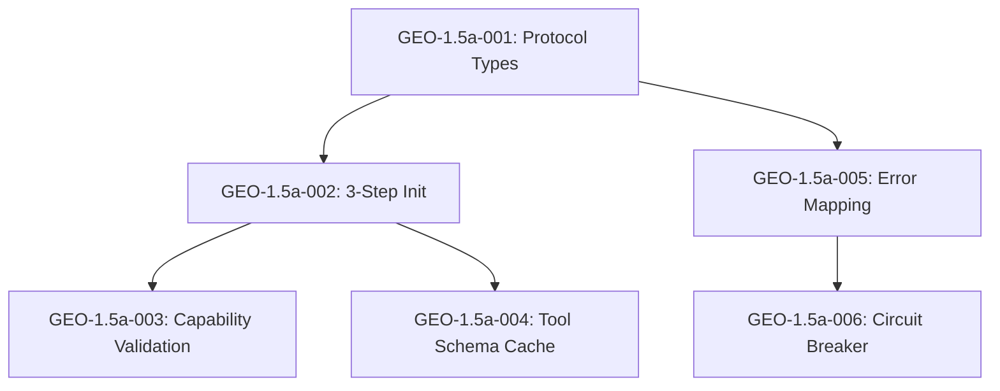

# Tasks: Sprint 1.5a - FastMCP Gateway Patterns

**Input**: Design documents from `/project/0.3-specification/0.3.1-detailed-specification.md`
**Prerequisites**: Implementation Plan v1.2.0 (required)
**Sprint**: 1.5a - MCP Client (Core)
**Role**: Support (FastMCP Expert)
**Lead**: James (`@james`)
**Review**: Alex (`@alex`)

---

## Task Summary

| Task ID | Title | Effort | Status |
|---------|-------|--------|--------|
| GEO-1.5a-001 | MCP Protocol Types Definition | 1.5h | Pending |
| GEO-1.5a-002 | MCP 3-Step Initialization Sequence | 2.0h | Pending |
| GEO-1.5a-003 | Server Capability Validation | 1.0h | Pending |
| GEO-1.5a-004 | Tool Schema Caching with TTL | 1.0h | Pending |
| GEO-1.5a-005 | JSON-RPC Error Code Mapping | 1.5h | Pending |
| GEO-1.5a-006 | MCP Circuit Breaker Pattern | 1.0h | Pending |

**Total Effort**: 8.0h

---

## Phase 3.1: MCP Protocol Foundation

### GEO-1.5a-001: MCP Protocol Types Definition

| Aspect | Details |
|--------|---------|
| **Task ID** | GEO-1.5a-001 |
| **Title** | Define MCP Protocol Types (JSON-RPC 2.0) |
| **Description** | Define comprehensive TypeScript types for the MCP protocol following JSON-RPC 2.0 specification. These types form the foundation for all MCP client communication with hx-docling-mcp-server. Types must cover request/response structures, error formats, tool definitions, and capability negotiation. |
| **Effort** | 1.5h |
| **Dependencies** | Sprint 1.4 completion |

#### Acceptance Criteria

- [ ] AC-001.1: `JsonRpcRequest` type defined with `jsonrpc`, `method`, `params`, `id` fields
- [ ] AC-001.2: `JsonRpcResponse` type defined with success and error variants
- [ ] AC-001.3: `JsonRpcError` type defined with `code`, `message`, `data` fields
- [ ] AC-001.4: `JsonRpcNotification` type defined (no `id` field)
- [ ] AC-001.5: UUID v4 format enforced for request ID generation (prevents collision in concurrent requests)
- [ ] AC-001.6: MCP-specific types defined: `InitializeParams`, `InitializeResult`, `ToolDefinition`, `ToolCallParams`, `ToolCallResult`
- [ ] AC-001.7: Server capability types defined: `MCPServerCapabilities`, `ServerInfo`, `InitializeResponse`
- [ ] AC-001.8: All types exported from `src/lib/mcp/types.ts`

#### Deliverables

| Deliverable | File Path | Description |
|-------------|-----------|-------------|
| MCP Types | `src/lib/mcp/types.ts` | Comprehensive JSON-RPC 2.0 and MCP type definitions |
| ID Generator | `src/lib/mcp/id-generator.ts` | UUID v4 request ID generator |

#### Technical Notes

```typescript
// Reference: Specification Section 7.1.2

// JSON-RPC 2.0 Base Types
interface JsonRpcRequest {
  jsonrpc: '2.0';
  method: string;
  params?: Record<string, unknown>;
  id: string; // UUID v4 format per spec
}

interface JsonRpcNotification {
  jsonrpc: '2.0';
  method: string;
  params?: Record<string, unknown>;
  // No id field - notifications do not expect responses
}

interface JsonRpcResponse {
  jsonrpc: '2.0';
  id: string;
  result?: unknown;
  error?: JsonRpcError;
}

interface JsonRpcError {
  code: number; // JSON-RPC error codes: -32700 to -32099
  message: string;
  data?: unknown;
}

// MCP Protocol Types
interface InitializeParams {
  protocolVersion: string;
  clientInfo: { name: string; version: string };
  capabilities: { tools?: { listChanged?: boolean } };
}

interface MCPServerCapabilities {
  tools?: { listChanged?: boolean };
  prompts?: { listChanged?: boolean };
  resources?: { subscribe?: boolean; listChanged?: boolean };
  logging?: {};
}
```

**Key Protocol Requirement**: Per MCP specification, request IDs MUST use UUID v4 format to prevent collision in concurrent requests. The `generateId()` function must use `crypto.randomUUID()` (Node.js 19+) or `uuid` package.

---

### GEO-1.5a-002: MCP 3-Step Initialization Sequence

| Aspect | Details |
|--------|---------|
| **Task ID** | GEO-1.5a-002 |
| **Title** | Implement 3-Step MCP Initialization Sequence |
| **Description** | Implement the CRITICAL 3-step MCP initialization sequence per specification Section 7.1.2. This is a P0 critical issue - the `notifications/initialized` notification MUST be sent after receiving the `initialize` response and BEFORE invoking any tools. Failure causes MCP server to reject tool calls. |
| **Effort** | 2.0h |
| **Dependencies** | GEO-1.5a-001 |
| **Priority** | P0 (Critical) |

#### Acceptance Criteria

- [ ] AC-002.1: Step 1 - Send `initialize` request with `clientInfo` and `capabilities`
- [ ] AC-002.2: Step 2 - Process `initialize` response with `serverCapabilities` validation
- [ ] AC-002.3: Step 3 - Send `notifications/initialized` notification (NO `id` field)
- [ ] AC-002.4: `tools/list` called ONLY AFTER `notifications/initialized`
- [ ] AC-002.5: Tool schemas cached after `tools/list` response
- [ ] AC-002.6: `initialized` flag prevents re-initialization
- [ ] AC-002.7: Initialization errors throw descriptive `MCPError`
- [ ] AC-002.8: Protocol version configurable via `MCP_PROTOCOL_VERSION` env var (default: `2024-11-05`)

#### Deliverables

| Deliverable | File Path | Description |
|-------------|-----------|-------------|
| MCP Initialize | `src/lib/mcp/initialize.ts` | 3-step initialization sequence implementation |
| MCP Client | `src/lib/mcp/client.ts` | MCPClient class with lazy initialization |

#### Technical Notes

```typescript
// Reference: Specification Section 7.1.2
// CRITICAL: Sequence must be followed exactly

class MCPClient {
  private initialized = false;
  private toolRegistry: Map<string, MCPTool> = new Map();
  private serverCapabilities: MCPServerCapabilities | null = null;

  async initialize(): Promise<void> {
    if (this.initialized) return;

    // Step 1: Capability negotiation (request with id)
    const initResponse = await this.request({
      jsonrpc: '2.0',
      method: 'initialize',
      params: {
        protocolVersion: process.env.MCP_PROTOCOL_VERSION || '2024-11-05',
        clientInfo: { name: 'hx-docling-ui', version: '1.0.0' },
        capabilities: { tools: { listChanged: false } },
      },
      id: generateId(),
    });

    // Validate server capabilities
    this.serverCapabilities = validateServerCapabilities(initResponse.result);

    // Step 2: Send initialized notification (REQUIRED by MCP protocol)
    // This is a NOTIFICATION (no id), not a request
    await this.notify({
      jsonrpc: '2.0',
      method: 'notifications/initialized',
      params: {},
    });

    // Step 3: Tool discovery (only after notifications/initialized)
    const toolsResponse = await this.request({
      jsonrpc: '2.0',
      method: 'tools/list',
      id: generateId(),
    });

    // Cache tool schemas
    for (const tool of toolsResponse.result.tools) {
      this.toolRegistry.set(tool.name, tool);
    }

    this.initialized = true;
  }

  // Helper for notifications (no response expected)
  private async notify(message: JsonRpcNotification): Promise<void> {
    await fetch(this.endpoint, {
      method: 'POST',
      headers: { 'Content-Type': 'application/json' },
      body: JSON.stringify(message),
    });
    // No response expected for notifications
  }
}
```

**CRITICAL WARNING**: Per MCP protocol specification, the `initialized` notification MUST be sent after receiving the `initialize` response and BEFORE invoking any tools. Failure to send this notification may cause the MCP server to reject tool calls.

---

### GEO-1.5a-003: Server Capability Validation

| Aspect | Details |
|--------|---------|
| **Task ID** | GEO-1.5a-003 |
| **Title** | Implement Server Capability Validation |
| **Description** | Implement validation logic to verify that the MCP server supports required capabilities before attempting tool calls. Per specification Section 7.1.1.2, the server MUST support the `tools` capability for this application to function. |
| **Effort** | 1.0h |
| **Dependencies** | GEO-1.5a-002 |

#### Acceptance Criteria

- [ ] AC-003.1: Validate server supports `tools` capability (required)
- [ ] AC-003.2: Throw `MCPError` E205 if `tools` capability missing
- [ ] AC-003.3: Log server information on successful connection
- [ ] AC-003.4: Store capabilities for runtime capability checks
- [ ] AC-003.5: `hasCapability()` method for runtime queries
- [ ] AC-003.6: Protocol version compatibility logged (warn on mismatch)

#### Deliverables

| Deliverable | File Path | Description |
|-------------|-----------|-------------|
| Capabilities Validator | `src/lib/mcp/capabilities.ts` | Server capability validation functions |

#### Technical Notes

```typescript
// Reference: Specification Section 7.1.1.2 (MAJ-MCP-002)

export function validateServerCapabilities(response: InitializeResponse): MCPServerCapabilities {
  // Verify server supports tools capability (required)
  if (!response.capabilities.tools) {
    throw new MCPError(
      'E205',
      'MCP server does not support tools capability'
    );
  }

  // Log server information for debugging
  console.log(`[MCP] Connected to ${response.serverInfo.name} v${response.serverInfo.version}`);
  console.log(`[MCP] Protocol version: ${response.protocolVersion}`);

  return response.capabilities;
}
```

---

## Phase 3.2: Tool Schema Management

### GEO-1.5a-004: Tool Schema Caching with TTL

| Aspect | Details |
|--------|---------|
| **Task ID** | GEO-1.5a-004 |
| **Title** | Implement Tool Schema Caching with TTL |
| **Description** | Implement a caching mechanism for MCP tool schemas to avoid repeated `tools/list` calls. Schemas should be cached with a configurable TTL and automatically refreshed when expired. This improves performance for high-throughput scenarios. |
| **Effort** | 1.0h |
| **Dependencies** | GEO-1.5a-002 |

#### Acceptance Criteria

- [ ] AC-004.1: Tool schemas cached in memory after `tools/list` response
- [ ] AC-004.2: Cache TTL configurable via `MCP_TOOL_CACHE_TTL` env var (default: 5 minutes)
- [ ] AC-004.3: Automatic cache refresh on TTL expiry
- [ ] AC-004.4: `getToolSchema(toolName)` method returns cached schema or refreshes
- [ ] AC-004.5: Cache invalidation method for manual refresh
- [ ] AC-004.6: All 8 Phase 1 tools cached: `convert_pdf`, `convert_docx`, `convert_xlsx`, `convert_pptx`, `convert_url`, `export_markdown`, `export_html`, `export_json`

#### Deliverables

| Deliverable | File Path | Description |
|-------------|-----------|-------------|
| Tool Cache | `src/lib/mcp/tool-cache.ts` | Tool schema cache with TTL management |

#### Technical Notes

```typescript
// Reference: Implementation Plan Sprint 1.5a Task 6

interface CachedToolSchema {
  tool: MCPTool;
  cachedAt: number;
  expiresAt: number;
}

class ToolSchemaCache {
  private cache: Map<string, CachedToolSchema> = new Map();
  private ttl: number;

  constructor(ttlMs: number = 5 * 60 * 1000) { // Default 5 minutes
    this.ttl = parseInt(process.env.MCP_TOOL_CACHE_TTL || '') || ttlMs;
  }

  async getToolSchema(client: MCPClient, toolName: string): Promise<MCPTool> {
    const cached = this.cache.get(toolName);

    if (cached && Date.now() < cached.expiresAt) {
      return cached.tool;
    }

    // Refresh cache
    await this.refresh(client);

    const tool = this.cache.get(toolName);
    if (!tool) {
      throw new MCPError('E204', `Unknown tool: ${toolName}`);
    }

    return tool.tool;
  }

  invalidate(): void {
    this.cache.clear();
  }
}
```

**Tool Routing Table** (Phase 1 - 8 tools):

| Input | Extension/Pattern | MCP Tool | Timeout |
|-------|-------------------|----------|---------|
| File | .pdf | convert_pdf | Size-based |
| File | .docx | convert_docx | Size-based |
| File | .xlsx | convert_xlsx | Size-based |
| File | .pptx | convert_pptx | Size-based |
| URL | http(s):// | convert_url | 180s |
| Export | DoclingDocument | export_markdown | 60s |
| Export | DoclingDocument | export_html | 60s |
| Export | DoclingDocument | export_json | 60s |

---

## Phase 3.3: Error Handling

### GEO-1.5a-005: JSON-RPC Error Code Mapping

| Aspect | Details |
|--------|---------|
| **Task ID** | GEO-1.5a-005 |
| **Title** | Implement JSON-RPC Error Code Mapping |
| **Description** | Implement comprehensive mapping between JSON-RPC 2.0 standard error codes (from MCP server) and application-specific error codes (E2xx series). This ensures consistent error handling and user-friendly error messages throughout the application. |
| **Effort** | 1.5h |
| **Dependencies** | GEO-1.5a-001 |

#### Acceptance Criteria

- [ ] AC-005.1: All JSON-RPC standard errors mapped (-32700 to -32603)
- [ ] AC-005.2: MCP server-specific errors mapped (-32000 to -32099)
- [ ] AC-005.3: Each mapping includes: `appCode`, `userMessage`, `retryable` flag
- [ ] AC-005.4: `mapMCPError()` function transforms `JsonRpcError` to `AppError`
- [ ] AC-005.5: Unknown errors default to E201 with `retryable: true`
- [ ] AC-005.6: Original MCP error code preserved in `originalMCPCode` field
- [ ] AC-005.7: Error catalog exported with all error codes and user messages

#### Deliverables

| Deliverable | File Path | Description |
|-------------|-----------|-------------|
| Error Mapping | `src/lib/mcp/error-mapping.ts` | JSON-RPC to application error mapping |
| Error Catalog | `src/lib/mcp/errors.ts` | Structured error catalog with all codes |

#### Technical Notes

```typescript
// Reference: Specification Section 7.1.4

const MCP_ERROR_MAP: Record<number, MCPErrorMapping> = {
  // JSON-RPC standard errors
  [-32700]: { appCode: 'E203', userMessage: 'Invalid request format', retryable: false },
  [-32600]: { appCode: 'E203', userMessage: 'Invalid request format', retryable: false },
  [-32601]: { appCode: 'E204', userMessage: 'Requested tool not available', retryable: false },
  [-32602]: { appCode: 'E203', userMessage: 'Invalid parameters', retryable: false },
  [-32603]: { appCode: 'E201', userMessage: 'Processing service error', retryable: true },

  // MCP server-specific errors (-32000 range)
  [-32000]: { appCode: 'E201', userMessage: 'Processing service unavailable', retryable: true },
  [-32001]: { appCode: 'E202', userMessage: 'Request timeout', retryable: true },
  [-32002]: { appCode: 'E302', userMessage: 'Document conversion failed', retryable: true },
  [-32003]: { appCode: 'E303', userMessage: 'Export generation failed', retryable: true },
};

export function mapMCPError(mcpError: JsonRpcError): AppError {
  const mapping = MCP_ERROR_MAP[mcpError.code];

  if (mapping) {
    return {
      code: mapping.appCode,
      message: mcpError.message,
      userMessage: mapping.userMessage,
      suggestedAction: mapping.retryable ? 'Try again' : 'Contact support',
      retryable: mapping.retryable,
      originalMCPCode: mcpError.code,
    };
  }

  // Default mapping for unknown errors
  return {
    code: 'E201',
    message: mcpError.message,
    userMessage: 'An unexpected error occurred',
    suggestedAction: 'Try again later',
    retryable: true,
    originalMCPCode: mcpError.code,
  };
}
```

**Application Error Code Categories**:

| Category | Range | Description |
|----------|-------|-------------|
| File Errors | E0xx | File validation errors |
| URL Errors | E1xx | URL validation errors |
| MCP Errors | E2xx | MCP communication errors |
| Processing Errors | E3xx | Document processing errors |
| Database Errors | E4xx | Database operation errors |

---

### GEO-1.5a-006: MCP Circuit Breaker Pattern

| Aspect | Details |
|--------|---------|
| **Task ID** | GEO-1.5a-006 |
| **Title** | Implement MCP Circuit Breaker Pattern |
| **Description** | Implement circuit breaker pattern for MCP client to provide graceful degradation when hx-docling-mcp-server is unavailable or experiencing high error rates. This prevents cascade failures and improves system resilience. |
| **Effort** | 1.0h |
| **Dependencies** | GEO-1.5a-005 |
| **Priority** | P2 (Optional enhancement) |

#### Acceptance Criteria

- [ ] AC-006.1: Circuit breaker states implemented: CLOSED, OPEN, HALF_OPEN
- [ ] AC-006.2: CLOSED -> OPEN transition after 5 consecutive failures (configurable)
- [ ] AC-006.3: OPEN state rejects requests immediately with E201 error
- [ ] AC-006.4: OPEN -> HALF_OPEN transition after 30s cooldown (configurable)
- [ ] AC-006.5: HALF_OPEN allows single test request to determine recovery
- [ ] AC-006.6: HALF_OPEN -> CLOSED on success, HALF_OPEN -> OPEN on failure
- [ ] AC-006.7: Circuit state observable for health check endpoints
- [ ] AC-006.8: State transitions logged for monitoring

#### Deliverables

| Deliverable | File Path | Description |
|-------------|-----------|-------------|
| Circuit Breaker | `src/lib/mcp/circuit-breaker.ts` | MCP circuit breaker implementation |

#### Technical Notes

```typescript
// Reference: Implementation Plan Sprint 1.5a Task 11

enum CircuitState {
  CLOSED = 'CLOSED',       // Normal operation
  OPEN = 'OPEN',           // Failing, reject requests
  HALF_OPEN = 'HALF_OPEN', // Testing recovery
}

interface CircuitBreakerConfig {
  failureThreshold: number;  // Default: 5
  resetTimeout: number;      // Default: 30000ms
  halfOpenMaxRequests: number; // Default: 1
}

class MCPCircuitBreaker {
  private state: CircuitState = CircuitState.CLOSED;
  private failureCount = 0;
  private lastFailureTime: number | null = null;
  private config: CircuitBreakerConfig;

  constructor(config?: Partial<CircuitBreakerConfig>) {
    this.config = {
      failureThreshold: config?.failureThreshold ?? 5,
      resetTimeout: config?.resetTimeout ?? 30000,
      halfOpenMaxRequests: config?.halfOpenMaxRequests ?? 1,
    };
  }

  async execute<T>(operation: () => Promise<T>): Promise<T> {
    if (this.state === CircuitState.OPEN) {
      if (this.shouldAttemptReset()) {
        this.state = CircuitState.HALF_OPEN;
      } else {
        throw new MCPError('E201', 'Service temporarily unavailable (circuit open)');
      }
    }

    try {
      const result = await operation();
      this.onSuccess();
      return result;
    } catch (error) {
      this.onFailure();
      throw error;
    }
  }

  getState(): CircuitState {
    return this.state;
  }
}
```

**State Transition Diagram**:

```
                 success
              +----------+
              |          |
              v          |
+--------+  failure  +--------+   timeout   +-----------+
| CLOSED | -------> |  OPEN  | -----------> | HALF_OPEN |
+--------+ (5x)     +--------+   (30s)      +-----------+
    ^                                            |
    |              success                       |
    +--------------------------------------------+
                   failure -> OPEN
```

---

## Dependencies



## Parallel Execution

Tasks that can run in parallel (different files, no dependencies):

```
# After GEO-1.5a-002 completes:
Task: "GEO-1.5a-003: Server Capability Validation in src/lib/mcp/capabilities.ts"
Task: "GEO-1.5a-004: Tool Schema Caching in src/lib/mcp/tool-cache.ts"
```

## Notes

- [P] tasks = different files, no dependencies
- All tasks follow MCP protocol specification strictly
- Verify tests for initialization sequence before marking complete
- Commit after each task with descriptive message
- Circuit breaker (GEO-1.5a-006) is optional but recommended for production resilience

## References

- Specification Section 7.0: Architecture Overview
- Specification Section 7.1: MCP Client Integration
- Specification Section 7.1.2: MCP Initialization Sequence
- Specification Section 7.1.4: MCP Error Code Mapping
- Implementation Plan Sprint 1.5a Tasks 1-13
