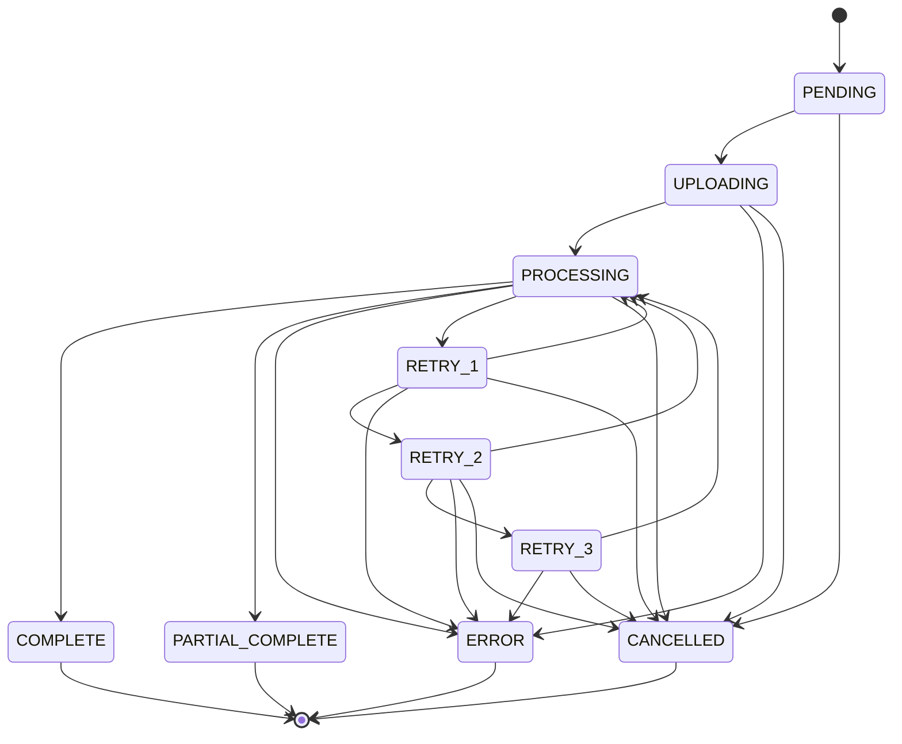

# Tasks: Agent Orchestration - State Machine Implementation (Sprint 1.5a)

**Agent**: Sophia Martinez (@sophia) - LangGraph Agent Orchestration SME
**Sprint**: 1.5a - MCP Client (Core)
**Duration**: Partial session (~1.0h of 4.0h total)
**Lead**: James (@james)
**Support**: Neo (@neo), George (@george)
**Review**: Alex (@alex)

**Input**:
- `/home/agent0/hx-docling-application/project/0.3-specification/0.3.1-detailed-specification.md` (Section 5.1.2, 5.5)
- `/home/agent0/hx-docling-application/project/0.1-plan/0.1.1-implementation-plan.md` (Section 4.5a)

**Prerequisites**:
- Sprint 1.4 complete (URL input and document store)
- Prisma schema with JobStatus enum defined
- Database connection validated

---

## Context

While Sprint 1.5a is primarily led by James for MCP client integration, Sophia contributes orchestration patterns for:
- Job status state machine implementation
- State transition validation logic
- State machine types and interfaces
- Foundation for workflow orchestration patterns

**James's Tasks** (not in this file):
- MCP client implementation
- 3-step initialization sequence
- Tool definitions and caching
- Error handling and JSON-RPC mapping
- Retry logic with exponential backoff

---

## Phase 3.1: State Machine Types and Interfaces

### SOP-1.5a-001: Define Job State Machine Types

**Description**: Create comprehensive TypeScript types for the job status state machine, including all 10 states and transition definitions.

**File**: `src/types/job-status.ts`

**Acceptance Criteria**:
- [ ] `JobStatus` type union with all 10 states: PENDING, UPLOADING, PROCESSING, RETRY_1, RETRY_2, RETRY_3, COMPLETE, PARTIAL_COMPLETE, CANCELLED, ERROR
- [ ] `JobStatusTransition` interface: `{ from: JobStatus, to: JobStatus, timestamp: Date }`
- [ ] `TerminalStatus` type: COMPLETE | PARTIAL_COMPLETE | CANCELLED | ERROR
- [ ] `RetryStatus` type: RETRY_1 | RETRY_2 | RETRY_3
- [ ] `TransientStatus` type: PENDING | UPLOADING | PROCESSING | RETRY_1 | RETRY_2 | RETRY_3
- [ ] Type guards: `isTerminalStatus()`, `isRetryStatus()`, `isTransientStatus()`
- [ ] `STATUS_PRIORITY` constant for UI sorting (per Spec Section 5.3)
- [ ] All types exported for use across the application

**Dependencies**: Prisma schema with JobStatus enum

**Effort**: 25 minutes

**Deliverables**:
- `/home/agent0/hx-docling-application/src/types/job-status.ts`

**Technical Notes**:
- Reference Specification Section 5.1.2 for state definitions
- Reference Specification Section 5.3 for status priority ordering
- Terminal states have empty transition arrays
- Type guards enable compile-time safety for state-dependent logic

```typescript
// Example structure
export type JobStatus =
  | 'PENDING'
  | 'UPLOADING'
  | 'PROCESSING'
  | 'RETRY_1'
  | 'RETRY_2'
  | 'RETRY_3'
  | 'COMPLETE'
  | 'PARTIAL_COMPLETE'
  | 'CANCELLED'
  | 'ERROR';

export const STATUS_PRIORITY: Record<JobStatus, number> = {
  PROCESSING: 1,
  PENDING: 2,
  UPLOADING: 3,
  RETRY_1: 4,
  RETRY_2: 5,
  RETRY_3: 6,
  COMPLETE: 7,
  PARTIAL_COMPLETE: 8,
  CANCELLED: 9,
  ERROR: 10,
};
```

---

### SOP-1.5a-002: Implement State Transition Validation

**Description**: Create state machine validation logic that enforces valid state transitions and prevents illegal state changes.

**File**: `src/lib/job/state-machine.ts`

**Acceptance Criteria**:
- [ ] `VALID_TRANSITIONS` constant mapping each state to allowed next states
- [ ] `isValidTransition(from: JobStatus, to: JobStatus): boolean` function
- [ ] `InvalidStateTransitionError` class with from/to states
- [ ] `getValidNextStates(current: JobStatus): JobStatus[]` helper
- [ ] All transitions per Specification Section 5.1.2:
  - PENDING -> [UPLOADING, CANCELLED]
  - UPLOADING -> [PROCESSING, ERROR, CANCELLED]
  - PROCESSING -> [COMPLETE, PARTIAL_COMPLETE, ERROR, RETRY_1, CANCELLED]
  - RETRY_1 -> [PROCESSING, RETRY_2, ERROR, CANCELLED]
  - RETRY_2 -> [PROCESSING, RETRY_3, ERROR, CANCELLED]
  - RETRY_3 -> [PROCESSING, ERROR, CANCELLED]
  - COMPLETE -> [] (terminal)
  - PARTIAL_COMPLETE -> [] (terminal)
  - CANCELLED -> [] (terminal)
  - ERROR -> [] (terminal)
- [ ] Comprehensive JSDoc documentation
- [ ] Export all public functions

**Dependencies**: SOP-1.5a-001

**Effort**: 35 minutes

**Deliverables**:
- `/home/agent0/hx-docling-application/src/lib/job/state-machine.ts`

**Technical Notes**:
- Reference Specification Section 5.1.2 state machine diagram
- This is the core validation logic used by `transitionJobStatus()`
- Invalid transitions should throw `InvalidStateTransitionError`
- Do NOT perform database operations in this file (pure functions)

```typescript
// Example structure
export const VALID_TRANSITIONS: Record<JobStatus, JobStatus[]> = {
  PENDING: ['UPLOADING', 'CANCELLED'],
  UPLOADING: ['PROCESSING', 'ERROR', 'CANCELLED'],
  PROCESSING: ['COMPLETE', 'PARTIAL_COMPLETE', 'ERROR', 'RETRY_1', 'CANCELLED'],
  RETRY_1: ['PROCESSING', 'RETRY_2', 'ERROR', 'CANCELLED'],
  RETRY_2: ['PROCESSING', 'RETRY_3', 'ERROR', 'CANCELLED'],
  RETRY_3: ['PROCESSING', 'ERROR', 'CANCELLED'],
  COMPLETE: [],
  PARTIAL_COMPLETE: [],
  CANCELLED: [],
  ERROR: [],
};

export function isValidTransition(from: JobStatus, to: JobStatus): boolean {
  return VALID_TRANSITIONS[from]?.includes(to) ?? false;
}
```

---

## Phase 3.2: State Transition Service

### SOP-1.5a-003: Implement Job State Transition Service

**Description**: Create the service layer that orchestrates job status transitions, integrating validation with database operations.

**File**: `src/lib/job/transition-service.ts`

**Acceptance Criteria**:
- [ ] `transitionJobStatus(jobId: string, newStatus: JobStatus): Promise<Job>` function
- [ ] Fetch current job status from database
- [ ] Validate transition using `isValidTransition()`
- [ ] Update job status in database
- [ ] Record transition metadata (previousStatus, timestamp)
- [ ] Throw `InvalidStateTransitionError` for invalid transitions
- [ ] Throw `JobNotFoundError` if job doesn't exist
- [ ] Return updated job record
- [ ] Transaction safety for concurrent updates
- [ ] JSDoc with @throws documentation

**Dependencies**: SOP-1.5a-001, SOP-1.5a-002, Prisma client

**Effort**: 35 minutes

**Deliverables**:
- `/home/agent0/hx-docling-application/src/lib/job/transition-service.ts`

**Technical Notes**:
- Reference Specification Section 5.1.2 for `transitionJobStatus()` signature
- Use Prisma transactions for atomic updates
- Consider optimistic locking for concurrent access
- Update `updatedAt` timestamp on transition
- For terminal states, also set `completedAt` timestamp

```typescript
// Example structure
export async function transitionJobStatus(
  jobId: string,
  newStatus: JobStatus
): Promise<Job> {
  const job = await prisma.job.findUnique({
    where: { id: jobId },
    select: { id: true, status: true },
  });

  if (!job) {
    throw new JobNotFoundError(jobId);
  }

  if (!isValidTransition(job.status as JobStatus, newStatus)) {
    throw new InvalidStateTransitionError(job.status as JobStatus, newStatus);
  }

  const updatedJob = await prisma.job.update({
    where: { id: jobId },
    data: {
      status: newStatus,
      updatedAt: new Date(),
      ...(isTerminalStatus(newStatus) ? { completedAt: new Date() } : {}),
    },
  });

  return updatedJob;
}
```

---

### SOP-1.5a-004: Create State Machine Error Classes

**Description**: Define custom error classes for state machine operations to enable structured error handling.

**File**: `src/lib/job/errors.ts`

**Acceptance Criteria**:
- [ ] `InvalidStateTransitionError` class:
  - Constructor: `(from: JobStatus, to: JobStatus)`
  - Properties: `fromStatus`, `toStatus`, `validTransitions`
  - Message: "Invalid state transition from {from} to {to}. Valid transitions: {list}"
- [ ] `JobNotFoundError` class:
  - Constructor: `(jobId: string)`
  - Property: `jobId`
  - Message: "Job not found: {jobId}"
- [ ] `TerminalStateError` class:
  - Constructor: `(status: JobStatus)`
  - Property: `status`
  - Message: "Cannot transition from terminal state: {status}"
- [ ] All errors extend base `AppError` class
- [ ] Error codes: E701 (invalid transition), E702 (job not found), E707 (terminal state)
- [ ] Export all error classes

**Dependencies**: Base AppError class from error catalog

**Effort**: 20 minutes

**Deliverables**:
- `/home/agent0/hx-docling-application/src/lib/job/errors.ts`

**Technical Notes**:
- Reference Specification error code pattern (E7xx for job/workflow errors)
- Errors should be serializable for API responses
- Include `validTransitions` in error to help debugging
- These errors are NOT retryable (client must fix request)

---

## Phase 3.3: Mermaid Workflow Documentation

### SOP-1.5a-005: Create State Machine Documentation

**Description**: Document the job status state machine with Mermaid diagrams and transition tables for developer reference.

**File**: `src/lib/job/README.md`

**Acceptance Criteria**:
- [ ] Mermaid state diagram showing all 10 states and transitions
- [ ] State definitions table (state, description, is_terminal)
- [ ] Transition table (from, to, trigger, notes)
- [ ] Code examples for common transition patterns
- [ ] Error handling examples
- [ ] Links to specification sections
- [ ] Usage instructions for `transitionJobStatus()`

**Dependencies**: SOP-1.5a-001 through SOP-1.5a-004

**Effort**: 25 minutes

**Deliverables**:
- `/home/agent0/hx-docling-application/src/lib/job/README.md`

**Technical Notes**:
- Per HX-Infrastructure documentation-requirements.md: Mermaid diagrams required
- Include the state diagram from Specification Section 5.1.2
- Document retry state progression (1 -> 2 -> 3 -> ERROR)
- Document cancellation paths from each state
- Include examples of valid and invalid transitions



---

## Dependencies

| Task ID | Depends On | Reason |
|---------|------------|--------|
| SOP-1.5a-001 | Prisma schema | JobStatus enum must exist |
| SOP-1.5a-002 | SOP-1.5a-001 | Types must be defined first |
| SOP-1.5a-003 | SOP-1.5a-001, SOP-1.5a-002 | Requires types and validation |
| SOP-1.5a-004 | Base AppError | Must extend base error class |
| SOP-1.5a-005 | SOP-1.5a-001 through SOP-1.5a-004 | Documents all components |

---

## Parallel Execution

```
# Tasks that can run in parallel (different files, no dependencies):
# None - these tasks have sequential dependencies

# Sequential execution order:
SOP-1.5a-001 -> SOP-1.5a-002 -> SOP-1.5a-003
                              -> SOP-1.5a-004 (parallel with 003)
                                            -> SOP-1.5a-005 (after all)
```

---

## Summary

| Task ID | Description | Effort | File |
|---------|-------------|--------|------|
| SOP-1.5a-001 | Define Job State Machine Types | 25m | `src/types/job-status.ts` |
| SOP-1.5a-002 | Implement State Transition Validation | 35m | `src/lib/job/state-machine.ts` |
| SOP-1.5a-003 | Implement Job State Transition Service | 35m | `src/lib/job/transition-service.ts` |
| SOP-1.5a-004 | Create State Machine Error Classes | 20m | `src/lib/job/errors.ts` |
| SOP-1.5a-005 | Create State Machine Documentation | 25m | `src/lib/job/README.md` |

**Total Effort**: 2h 20m (140 minutes)

---

## Quality Checklist

Before marking tasks complete:
- [ ] All TypeScript types compile without errors
- [ ] All 10 states defined with correct transitions
- [ ] Terminal states (COMPLETE, PARTIAL_COMPLETE, CANCELLED, ERROR) have empty transition arrays
- [ ] Type guards work correctly at runtime
- [ ] Error classes include helpful messages
- [ ] Mermaid diagram renders correctly
- [ ] Code follows HX-Infrastructure standards
- [ ] JSDoc documentation complete
