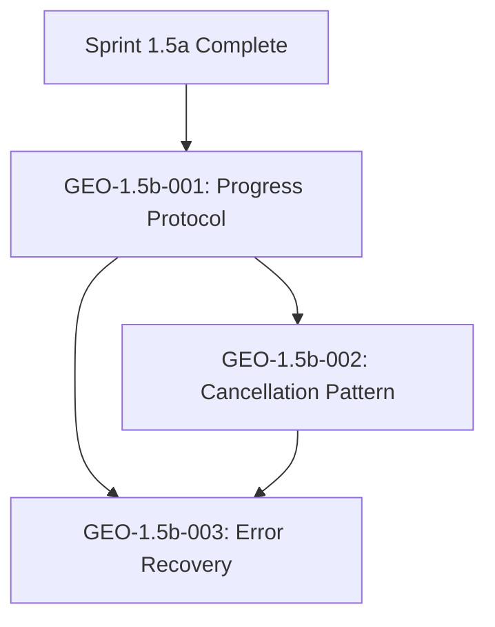

# Tasks: Sprint 1.5b - FastMCP Progress & Error Patterns

**Version**: 1.1.0
**Input**: Design documents from `/project/0.3-specification/0.3.1-detailed-specification.md`
**Prerequisites**: Sprint 1.5a completion, Implementation Plan v1.2.0
**Sprint**: 1.5b - SSE & Progress Integration
**Role**: Consultant (FastMCP Expert)
**Lead**: William (`@william`)
**Review**: Alex (`@alex`)

---

## Changelog

| Version | Date | Author | Changes |
|---------|------|--------|---------|
| 1.1.0 | 2025-12-12 | George Kim | Fixed DEF-016: MCPClient AbortController race condition for concurrent invoke() calls |
| 1.0.0 | - | George Kim | Initial task document |

---

## Task Summary

| Task ID | Title | Effort | Status |
|---------|-------|--------|--------|
| GEO-1.5b-001 | MCP Progress Event Protocol Design | 1.0h | Pending |
| GEO-1.5b-002 | MCP Tool Cancellation Pattern | 1.5h | Pending |
| GEO-1.5b-003 | MCP Error Recovery Patterns | 1.0h | Pending |

**Total Effort**: 3.5h

---

## Context

Sprint 1.5b focuses on SSE streaming and progress integration. George's role as FastMCP expert is to provide consultation on:
1. How MCP protocol interacts with application-level SSE (they are separate)
2. MCP tool cancellation via AbortController
3. Error recovery patterns when MCP calls fail during processing

**IMPORTANT CLARIFICATION**: Per Specification Section 7.0.1:
- MCP protocol uses HTTP/JSON-RPC 2.0 (request-response)
- Application SSE is completely separate from MCP protocol
- MCP server does NOT stream responses to the browser
- Progress events are generated by Next.js API routes and published via Redis pub/sub

---

## Phase 3.1: Protocol Design Consultation

### GEO-1.5b-001: MCP Progress Event Protocol Design

| Aspect | Details |
|--------|---------|
| **Task ID** | GEO-1.5b-001 |
| **Title** | MCP Progress Event Protocol Design |
| **Description** | Design the protocol for translating MCP tool execution stages into application-level SSE progress events. This includes defining progress milestones, event structure, and the relationship between MCP response handling and Redis pub/sub for progress streaming. |
| **Effort** | 1.0h |
| **Dependencies** | Sprint 1.5a completion |

#### Acceptance Criteria

- [ ] AC-001.1: Progress event protocol documented with clear stage definitions
- [ ] AC-001.2: MCP tool execution mapped to progress percentages (0-100%)
- [ ] AC-001.3: Stage transitions defined: upload -> convert -> export_markdown -> export_html -> export_json -> complete
- [ ] AC-001.4: Checkpoint save points aligned with stage completion
- [ ] AC-001.5: SSE event structure matches specification Section 5.3

#### Deliverables

| Deliverable | File Path | Description |
|-------------|-----------|-------------|
| Protocol Design Doc | `docs/mcp-progress-protocol.md` | Design document for MCP-to-SSE progress mapping |

#### Technical Notes

```typescript
// Reference: Specification Section 7.0.1 - Two Communication Patterns

/**
 * Pattern 1: Application SSE (Browser <-> Next.js)
 * - Purpose: Real-time progress updates to browser
 * - Transport: Server-Sent Events
 * - Content: Progress events, completion events, error events
 *
 * Pattern 2: MCP Protocol (Next.js <-> hx-docling-mcp-server)
 * - Purpose: Document processing tool invocation
 * - Transport: HTTP/JSON-RPC 2.0 (NOT SSE transport)
 * - Content: Tool invocations, DoclingDocument responses
 */

// Progress Stage Mapping
interface ProgressStage {
  stage: string;
  percentStart: number;
  percentEnd: number;
  mcpMethod?: string;
  checkpointSave: boolean;
}

const PROGRESS_STAGES: ProgressStage[] = [
  { stage: 'uploaded', percentStart: 0, percentEnd: 10, checkpointSave: true },
  { stage: 'converting', percentStart: 10, percentEnd: 60, mcpMethod: 'tools/call:convert_*', checkpointSave: false },
  { stage: 'converted', percentStart: 60, percentEnd: 70, checkpointSave: true },
  { stage: 'exporting_markdown', percentStart: 70, percentEnd: 80, mcpMethod: 'tools/call:export_markdown', checkpointSave: false },
  { stage: 'exporting_html', percentStart: 80, percentEnd: 90, mcpMethod: 'tools/call:export_html', checkpointSave: false },
  { stage: 'exporting_json', percentStart: 90, percentEnd: 95, mcpMethod: 'tools/call:export_json', checkpointSave: false },
  { stage: 'complete', percentStart: 95, percentEnd: 100, checkpointSave: true },
];

// SSE Progress Event Structure (per Specification Section 5.3)
interface SSEProgressEvent {
  id: string;              // Event ID for Last-Event-ID reconnection
  event: 'progress';       // Event type
  data: {
    jobId: string;
    stage: string;
    progress: number;      // 0-100
    message: string;       // User-friendly message
    timestamp: string;     // ISO 8601
    eta?: number;          // Estimated seconds remaining
  };
}
```

**Key Distinction**: MCP tool calls are synchronous request-response. Progress events are published to Redis by the Next.js API route DURING MCP processing to simulate progress. The actual conversion result comes in a single response.

---

### GEO-1.5b-002: MCP Tool Cancellation Pattern

| Aspect | Details |
|--------|---------|
| **Task ID** | GEO-1.5b-002 |
| **Title** | MCP Tool Cancellation Pattern |
| **Description** | Design and implement the pattern for cancelling in-progress MCP tool calls using AbortController. This supports FR-406 (job cancellation) and ensures clean resource cleanup when users cancel processing jobs. |
| **Effort** | 1.5h |
| **Dependencies** | Sprint 1.5a completion, GEO-1.5b-001 |

#### Acceptance Criteria

- [ ] AC-002.1: `AbortController` integration in MCP client for cancellation
- [ ] AC-002.2: `cancel()` method on `MCPClient` class
- [ ] AC-002.3: Cancelled requests properly reject with AbortError
- [ ] AC-002.4: Cleanup logic documented for partial results
- [ ] AC-002.5: SSE `cancelled` event sent when job cancelled
- [ ] AC-002.6: Job status transitions to CANCELLED in database
- [ ] AC-002.7: Partial results preserved or cleaned based on configuration

#### Deliverables

| Deliverable | File Path | Description |
|-------------|-----------|-------------|
| Cancellation Pattern | `src/lib/mcp/cancellation.ts` | AbortController-based cancellation logic |
| Recovery Logic Update | `src/lib/mcp/recovery.ts` | Updated with cancellation handling |

#### Technical Notes

```typescript
// Reference: Specification Section 3.2.6 (FR-406)
// Fixed in v1.1.0: DEF-016 - AbortController now uses Map for concurrent call safety

class MCPClient {
  private abortControllers: Map<string, AbortController> = new Map();

  /**
   * Invoke an MCP tool with cancellation support.
   * Returns the request ID to allow targeted cancellation.
   *
   * DEF-016 FIX: Each invoke() call gets its own AbortController stored by
   * request ID, preventing race conditions when multiple calls are in-flight.
   */
  async invoke(toolName: string, params: unknown): Promise<{ requestId: string; result: unknown }> {
    const requestId = generateId();
    const controller = new AbortController();
    this.abortControllers.set(requestId, controller);

    try {
      const result = await this.request({
        jsonrpc: '2.0',
        method: 'tools/call',
        params: { name: toolName, arguments: params },
        id: requestId,
      }, { signal: controller.signal });
      return { requestId, result };
    } finally {
      this.abortControllers.delete(requestId);
    }
  }

  /**
   * Cancel a specific request by ID.
   * @param requestId - The ID returned from invoke()
   */
  cancel(requestId: string): void {
    const controller = this.abortControllers.get(requestId);
    if (controller) {
      controller.abort();
      this.abortControllers.delete(requestId);
    }
  }

  /**
   * Cancel all pending requests.
   * Use when job is cancelled entirely.
   */
  cancelAll(): void {
    for (const controller of this.abortControllers.values()) {
      controller.abort();
    }
    this.abortControllers.clear();
  }

  /**
   * Check if any requests are pending.
   */
  hasPendingRequests(): boolean {
    return this.abortControllers.size > 0;
  }
}

// Cancellation state transitions per specification:
// PENDING -> CANCELLED (immediate)
// UPLOADING -> CANCELLED (abort upload)
// PROCESSING -> CANCELLED (abort MCP, cleanup partial)
// RETRY_* -> CANCELLED (stop retry, cleanup partial)

interface CancellationConfig {
  preservePartialResults: boolean;  // Default: true
  cleanupTimeout: number;           // Default: 5000ms
}

async function handleCancellation(
  jobId: string,
  mcpClient: MCPClient,
  config: CancellationConfig
): Promise<void> {
  // 1. Signal MCP abort for all pending requests
  mcpClient.cancelAll();

  // 2. Update job status
  await prisma.job.update({
    where: { id: jobId },
    data: { status: 'CANCELLED' },
  });

  // 3. Send SSE cancelled event
  await publishEvent(jobId, {
    event: 'cancelled',
    data: { jobId, message: 'Job cancelled by user' },
  });

  // 4. Handle partial results
  if (!config.preservePartialResults) {
    await cleanupPartialResults(jobId);
  }
}
```

**Cancel Endpoint** (per FR-406):
```
POST /api/v1/jobs/{id}/cancel

Response:
{
  "jobId": "...",
  "status": "CANCELLED",
  "partialResultsPreserved": true|false
}
```

---

### GEO-1.5b-003: MCP Error Recovery Patterns

| Aspect | Details |
|--------|---------|
| **Task ID** | GEO-1.5b-003 |
| **Title** | MCP Error Recovery Patterns |
| **Description** | Design error recovery patterns for MCP tool failures during the processing pipeline. This includes retry logic integration with checkpoint manager, graceful degradation strategies, and user notification patterns. |
| **Effort** | 1.0h |
| **Dependencies** | GEO-1.5b-001, GEO-1.5b-002, GEO-1.5a-005 (Error Mapping) |

#### Acceptance Criteria

- [ ] AC-003.1: Retry logic integrated with checkpoint restoration
- [ ] AC-003.2: Retry attempts use exponential backoff (3 attempts max)
- [ ] AC-003.3: Non-retryable errors fail immediately with user-friendly message
- [ ] AC-003.4: Retry state tracked in job status (RETRY_1, RETRY_2, RETRY_3)
- [ ] AC-003.5: SSE events sent for retry attempts
- [ ] AC-003.6: Final failure triggers FAILED status with error details
- [ ] AC-003.7: Resume endpoint allows retry from last checkpoint

#### Deliverables

| Deliverable | File Path | Description |
|-------------|-----------|-------------|
| Recovery Patterns | `src/lib/mcp/recovery.ts` | MCP error recovery and retry logic |

#### Technical Notes

```typescript
// Reference: Implementation Plan Sprint 1.5a Task 10, Specification Section 9.5

interface RetryConfig {
  maxAttempts: number;        // Default: 3
  initialDelayMs: number;     // Default: 1000
  maxDelayMs: number;         // Default: 10000
  backoffMultiplier: number;  // Default: 2
}

async function executeWithRetry<T>(
  operation: () => Promise<T>,
  jobId: string,
  config: RetryConfig = DEFAULT_RETRY_CONFIG
): Promise<T> {
  let lastError: Error | null = null;
  let delay = config.initialDelayMs;

  for (let attempt = 1; attempt <= config.maxAttempts; attempt++) {
    try {
      return await operation();
    } catch (error) {
      lastError = error as Error;

      // Check if error is retryable
      const appError = error instanceof AppError ? error : mapMCPError(error);
      if (!appError.retryable) {
        throw error; // Non-retryable, fail immediately
      }

      // Update job status to RETRY_N
      await prisma.job.update({
        where: { id: jobId },
        data: { status: `RETRY_${attempt}` },
      });

      // Send retry event via SSE
      await publishEvent(jobId, {
        event: 'retry',
        data: {
          jobId,
          attempt,
          maxAttempts: config.maxAttempts,
          nextRetryIn: delay,
          message: `Retrying... (attempt ${attempt} of ${config.maxAttempts})`,
        },
      });

      // Wait before retry (exponential backoff)
      if (attempt < config.maxAttempts) {
        await sleep(delay);
        delay = Math.min(delay * config.backoffMultiplier, config.maxDelayMs);
      }
    }
  }

  // All retries exhausted
  await prisma.job.update({
    where: { id: jobId },
    data: {
      status: 'FAILED',
      error: lastError?.message,
    },
  });

  throw lastError;
}

// Resume from checkpoint pattern
async function resumeFromCheckpoint(jobId: string): Promise<void> {
  const checkpoint = await loadCheckpoint(jobId);
  if (!checkpoint) {
    throw new AppError('E305', 'No checkpoint available for resume');
  }

  // Restore state from checkpoint
  const { stage, doclingDocument, exportResults } = checkpoint;

  // Determine resume point
  const resumeStage = getResumeStage(stage);

  // Update job status
  await prisma.job.update({
    where: { id: jobId },
    data: { status: 'PROCESSING' },
  });

  // Resume processing from checkpoint
  await processFromStage(jobId, resumeStage, { doclingDocument, exportResults });
}
```

**Error Recovery State Machine**:

```
PROCESSING
    |
    v (error, retryable)
  RETRY_1 --success--> PROCESSING
    |
    v (error, retryable)
  RETRY_2 --success--> PROCESSING
    |
    v (error, retryable)
  RETRY_3 --success--> PROCESSING
    |
    v (error)
  FAILED
```

**Resume Endpoint** (per FR-407):
```
POST /api/v1/jobs/{id}/resume

Response:
{
  "jobId": "...",
  "status": "PROCESSING",
  "resumedFromStage": "converted"
}
```

---

## Dependencies



## Parallel Execution

Tasks that can run in parallel:

```
# After GEO-1.5b-001 completes:
Task: "GEO-1.5b-002: Cancellation Pattern in src/lib/mcp/cancellation.ts"
# GEO-1.5b-003 depends on both GEO-1.5b-001 and GEO-1.5b-002
```

## Integration Points with Sprint Lead Tasks

George's tasks integrate with William's SSE implementation:

| George Task | William Task | Integration Point |
|-------------|--------------|-------------------|
| GEO-1.5b-001 | Task 6, 7 | Progress event structure for SSE streaming |
| GEO-1.5b-002 | Task 10 | Cancel endpoint MCP integration |
| GEO-1.5b-003 | Task 9 | Checkpoint manager recovery logic |

## Notes

- These are consultation/design tasks that support the Sprint Lead
- Implementation is integrated into main Sprint 1.5b deliverables
- George provides MCP protocol expertise, William handles SSE infrastructure
- All patterns must align with specification Section 7.0.1 communication model
- Avoid confusion: MCP does NOT use SSE transport; application SSE is separate

## References

- Specification Section 7.0: Architecture Overview (Two Communication Patterns)
- Specification Section 3.2.6: FR-406 Job Cancellation
- Specification Section 5.5: Checkpoint Manager
- Specification Section 9.5: Error Recovery
- Implementation Plan Sprint 1.5b Tasks 1-17
