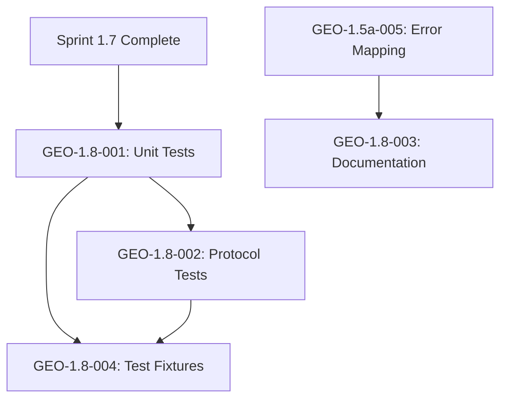

# Tasks: Sprint 1.8 - FastMCP Protocol Testing & Documentation

**Input**: Design documents from `/project/0.3-specification/0.3.1-detailed-specification.md`
**Prerequisites**: Sprints 1.5a, 1.5b, 1.7 completion
**Sprint**: 1.8 - Testing & Documentation
**Role**: Contributor (FastMCP Expert)
**Lead**: Julia (`@julia`)
**Review**: Agent Zero (`@agent-zero`)

---

## Task Summary

| Task ID | Title | Effort | Status |
|---------|-------|--------|--------|
| GEO-1.8-001 | MCP Client Unit Tests | 1.5h | Pending |
| GEO-1.8-002 | MCP Protocol Compliance Tests | 1.5h | Pending |
| GEO-1.8-003 | MCP Error Code Mapping Documentation | 1.0h | Pending |
| GEO-1.8-004 | MCP Integration Test Fixtures | 0.5h | Pending |

**Total Effort**: 4.5h

---

## Context

Sprint 1.8 focuses on comprehensive testing and documentation. George's role as FastMCP expert is to:
1. Provide unit tests for MCP client components (initialization, tools, errors)
2. Ensure MCP protocol compliance through dedicated tests
3. Document MCP error code mapping table for CLAUDE.md
4. Create test fixtures for MCP integration testing

---

## Phase 3.1: Unit Testing

### GEO-1.8-001: MCP Client Unit Tests

| Aspect | Details |
|--------|---------|
| **Task ID** | GEO-1.8-001 |
| **Title** | MCP Client Unit Tests (Initialization, Tools, Errors) |
| **Description** | Write comprehensive unit tests for the MCP client implementation covering initialization sequence, tool invocation, error handling, and circuit breaker functionality. Tests must verify protocol compliance and edge cases. |
| **Effort** | 1.5h |
| **Dependencies** | Sprint 1.7 completion |
| **Reference** | Implementation Plan Task 2: "Write unit tests for MCP client (initialization, tools, errors)" |

#### Acceptance Criteria

- [ ] AC-001.1: Test 3-step initialization sequence (initialize -> initialized notification -> tools/list)
- [ ] AC-001.2: Test capability validation (success and failure cases)
- [ ] AC-001.3: Test tool schema caching with TTL expiry
- [ ] AC-001.4: Test all 8 tool invocations (convert_*, export_*)
- [ ] AC-001.5: Test JSON-RPC error code mapping (all standard codes)
- [ ] AC-001.6: Test circuit breaker state transitions
- [ ] AC-001.7: Test AbortController cancellation
- [ ] AC-001.8: Test UUID v4 ID generation uniqueness
- [ ] AC-001.9: All tests pass with 100% coverage of MCP client files

#### Deliverables

| Deliverable | File Path | Description |
|-------------|-----------|-------------|
| Client Tests | `src/lib/mcp/__tests__/client.test.ts` | MCPClient class unit tests |
| Initialize Tests | `src/lib/mcp/__tests__/initialize.test.ts` | 3-step initialization tests |
| Error Tests | `src/lib/mcp/__tests__/errors.test.ts` | Error mapping unit tests |
| Circuit Breaker Tests | `src/lib/mcp/__tests__/circuit-breaker.test.ts` | Circuit breaker state tests |

#### Technical Notes

```typescript
// src/lib/mcp/__tests__/client.test.ts

import { describe, it, expect, vi, beforeEach, afterEach } from 'vitest';
import { MCPClient } from '../client';
import { MCPError } from '../errors';

// Mock fetch for HTTP/JSON-RPC
const mockFetch = vi.fn();
global.fetch = mockFetch;

describe('MCPClient', () => {
  let client: MCPClient;

  beforeEach(() => {
    client = new MCPClient({
      endpoint: 'http://hx-docling-mcp-server:8000',
      timeout: 5000,
    });
    mockFetch.mockClear();
  });

  describe('initialization', () => {
    it('should complete 3-step initialization sequence', async () => {
      // Mock initialize response
      mockFetch
        .mockResolvedValueOnce({
          ok: true,
          json: () => Promise.resolve({
            jsonrpc: '2.0',
            id: 'init-id',
            result: {
              protocolVersion: '2024-11-05',
              serverInfo: { name: 'hx-docling-mcp', version: '1.0.0' },
              capabilities: { tools: { listChanged: false } },
            },
          }),
        })
        // Mock initialized notification (no response expected but fetch called)
        .mockResolvedValueOnce({ ok: true })
        // Mock tools/list response
        .mockResolvedValueOnce({
          ok: true,
          json: () => Promise.resolve({
            jsonrpc: '2.0',
            id: 'tools-id',
            result: {
              tools: [
                { name: 'convert_pdf', description: 'Convert PDF', inputSchema: {} },
                { name: 'export_markdown', description: 'Export MD', inputSchema: {} },
              ],
            },
          }),
        });

      await client.initialize();

      // Verify 3 fetch calls made
      expect(mockFetch).toHaveBeenCalledTimes(3);

      // Verify Step 1: initialize request
      const initCall = JSON.parse(mockFetch.mock.calls[0][1].body);
      expect(initCall.method).toBe('initialize');
      expect(initCall.params.clientInfo.name).toBe('hx-docling-ui');

      // Verify Step 2: initialized notification (no id)
      const notifyCall = JSON.parse(mockFetch.mock.calls[1][1].body);
      expect(notifyCall.method).toBe('notifications/initialized');
      expect(notifyCall.id).toBeUndefined();

      // Verify Step 3: tools/list request
      const toolsCall = JSON.parse(mockFetch.mock.calls[2][1].body);
      expect(toolsCall.method).toBe('tools/list');
    });

    it('should throw E205 when server lacks tools capability', async () => {
      mockFetch.mockResolvedValueOnce({
        ok: true,
        json: () => Promise.resolve({
          jsonrpc: '2.0',
          id: 'init-id',
          result: {
            protocolVersion: '2024-11-05',
            serverInfo: { name: 'test', version: '1.0.0' },
            capabilities: {}, // Missing tools capability
          },
        }),
      });

      await expect(client.initialize()).rejects.toThrow(MCPError);
      await expect(client.initialize()).rejects.toMatchObject({
        code: 'E205',
      });
    });

    it('should not re-initialize if already initialized', async () => {
      // Setup successful initialization
      mockFetch
        .mockResolvedValueOnce({ ok: true, json: () => Promise.resolve({ /* init response */ }) })
        .mockResolvedValueOnce({ ok: true })
        .mockResolvedValueOnce({ ok: true, json: () => Promise.resolve({ result: { tools: [] } }) });

      await client.initialize();
      await client.initialize(); // Second call

      // Only 3 calls from first initialization
      expect(mockFetch).toHaveBeenCalledTimes(3);
    });
  });

  describe('tool invocation', () => {
    beforeEach(async () => {
      // Setup initialized client
      // ... mock initialization
    });

    it('should invoke convert_pdf tool with correct parameters', async () => {
      mockFetch.mockResolvedValueOnce({
        ok: true,
        json: () => Promise.resolve({
          jsonrpc: '2.0',
          id: 'call-id',
          result: { /* DoclingDocument */ },
        }),
      });

      await client.invoke('convert_pdf', { file_path: '/tmp/test.pdf' });

      const callBody = JSON.parse(mockFetch.mock.lastCall[1].body);
      expect(callBody.method).toBe('tools/call');
      expect(callBody.params.name).toBe('convert_pdf');
      expect(callBody.params.arguments.file_path).toBe('/tmp/test.pdf');
    });

    it('should throw E204 for unknown tool', async () => {
      await expect(client.invoke('unknown_tool', {}))
        .rejects.toMatchObject({ code: 'E204' });
    });
  });

  describe('cancellation', () => {
    it('should abort in-progress request via AbortController', async () => {
      mockFetch.mockImplementation(() => new Promise((_, reject) => {
        setTimeout(() => reject(new DOMException('Aborted', 'AbortError')), 1000);
      }));

      const invokePromise = client.invoke('convert_pdf', { file_path: '/tmp/test.pdf' });

      // Cancel after 100ms
      setTimeout(() => client.cancel(), 100);

      await expect(invokePromise).rejects.toThrow('AbortError');
    });
  });
});
```

---

### GEO-1.8-002: MCP Protocol Compliance Tests

| Aspect | Details |
|--------|---------|
| **Task ID** | GEO-1.8-002 |
| **Title** | MCP Protocol Compliance Tests |
| **Description** | Write protocol compliance tests to verify the MCP client adheres to the MCP specification. These tests ensure correct JSON-RPC 2.0 message format, proper initialization sequence, and protocol version handling. |
| **Effort** | 1.5h |
| **Dependencies** | GEO-1.8-001 |
| **Reference** | Implementation Plan Section 8.2: "MCP Protocol - notifications/initialized sent" |

#### Acceptance Criteria

- [ ] AC-002.1: Test JSON-RPC 2.0 message format validation
- [ ] AC-002.2: Test `notifications/initialized` is notification (no id field)
- [ ] AC-002.3: Test `initialize` request includes protocol version
- [ ] AC-002.4: Test `tools/list` only called AFTER `notifications/initialized`
- [ ] AC-002.5: Test request IDs are unique UUID v4 format
- [ ] AC-002.6: Test error responses conform to JSON-RPC error object structure
- [ ] AC-002.7: Test protocol version mismatch handling

#### Deliverables

| Deliverable | File Path | Description |
|-------------|-----------|-------------|
| Protocol Tests | `test/mcp-protocol/__tests__/compliance.test.ts` | MCP protocol compliance tests |
| Message Tests | `test/mcp-protocol/__tests__/json-rpc.test.ts` | JSON-RPC 2.0 format tests |

#### Technical Notes

```typescript
// test/mcp-protocol/__tests__/compliance.test.ts

import { describe, it, expect, vi } from 'vitest';
import { MCPClient } from '@/lib/mcp/client';
import { isUUID } from '@/lib/mcp/id-generator';

describe('MCP Protocol Compliance', () => {
  describe('initialization sequence', () => {
    it('MUST send notifications/initialized as notification (no id)', async () => {
      const calls: any[] = [];
      const mockFetch = vi.fn().mockImplementation((url, options) => {
        calls.push(JSON.parse(options.body));
        return Promise.resolve({
          ok: true,
          json: () => Promise.resolve({ jsonrpc: '2.0', id: calls.length.toString(), result: {} }),
        });
      });
      global.fetch = mockFetch;

      const client = new MCPClient({ endpoint: 'http://test:8000' });
      await client.initialize();

      // Find the notifications/initialized call
      const initNotification = calls.find(c => c.method === 'notifications/initialized');

      // Per MCP spec: notifications MUST NOT have id field
      expect(initNotification).toBeDefined();
      expect(initNotification.id).toBeUndefined();
      expect(initNotification.jsonrpc).toBe('2.0');
    });

    it('MUST NOT call tools/list before notifications/initialized', async () => {
      const callOrder: string[] = [];
      const mockFetch = vi.fn().mockImplementation((url, options) => {
        const body = JSON.parse(options.body);
        callOrder.push(body.method);
        return Promise.resolve({ ok: true, json: () => Promise.resolve({ result: {} }) });
      });
      global.fetch = mockFetch;

      const client = new MCPClient({ endpoint: 'http://test:8000' });
      await client.initialize();

      const initNotificationIndex = callOrder.indexOf('notifications/initialized');
      const toolsListIndex = callOrder.indexOf('tools/list');

      expect(initNotificationIndex).toBeGreaterThan(-1);
      expect(toolsListIndex).toBeGreaterThan(initNotificationIndex);
    });

    it('MUST include protocolVersion in initialize request', async () => {
      let initializeParams: any;
      const mockFetch = vi.fn().mockImplementation((url, options) => {
        const body = JSON.parse(options.body);
        if (body.method === 'initialize') {
          initializeParams = body.params;
        }
        return Promise.resolve({ ok: true, json: () => Promise.resolve({ result: {} }) });
      });
      global.fetch = mockFetch;

      const client = new MCPClient({ endpoint: 'http://test:8000' });
      await client.initialize();

      expect(initializeParams.protocolVersion).toBeDefined();
      expect(initializeParams.protocolVersion).toMatch(/^\d{4}-\d{2}-\d{2}$/);
    });
  });

  describe('JSON-RPC 2.0 compliance', () => {
    it('all requests MUST include jsonrpc: "2.0"', async () => {
      const requests: any[] = [];
      const mockFetch = vi.fn().mockImplementation((url, options) => {
        requests.push(JSON.parse(options.body));
        return Promise.resolve({ ok: true, json: () => Promise.resolve({ result: {} }) });
      });
      global.fetch = mockFetch;

      const client = new MCPClient({ endpoint: 'http://test:8000' });
      await client.initialize();

      for (const request of requests) {
        expect(request.jsonrpc).toBe('2.0');
      }
    });

    it('request ids MUST be unique UUID v4 format', async () => {
      const ids: string[] = [];
      const mockFetch = vi.fn().mockImplementation((url, options) => {
        const body = JSON.parse(options.body);
        if (body.id) ids.push(body.id);
        return Promise.resolve({ ok: true, json: () => Promise.resolve({ result: {} }) });
      });
      global.fetch = mockFetch;

      const client = new MCPClient({ endpoint: 'http://test:8000' });
      await client.initialize();

      // All IDs should be unique
      const uniqueIds = new Set(ids);
      expect(uniqueIds.size).toBe(ids.length);

      // All IDs should be valid UUID v4
      for (const id of ids) {
        expect(isUUID(id)).toBe(true);
      }
    });
  });

  describe('error handling compliance', () => {
    it('should handle standard JSON-RPC error codes', async () => {
      const errorCodes = [
        { code: -32700, name: 'Parse error' },
        { code: -32600, name: 'Invalid Request' },
        { code: -32601, name: 'Method not found' },
        { code: -32602, name: 'Invalid params' },
        { code: -32603, name: 'Internal error' },
      ];

      for (const { code, name } of errorCodes) {
        const mockFetch = vi.fn().mockResolvedValue({
          ok: true,
          json: () => Promise.resolve({
            jsonrpc: '2.0',
            id: 'test',
            error: { code, message: name },
          }),
        });
        global.fetch = mockFetch;

        const client = new MCPClient({ endpoint: 'http://test:8000' });

        await expect(client.invoke('test', {})).rejects.toThrow();
      }
    });
  });
});
```

---

## Phase 3.2: Documentation

### GEO-1.8-003: MCP Error Code Mapping Documentation

| Aspect | Details |
|--------|---------|
| **Task ID** | GEO-1.8-003 |
| **Title** | MCP Error Code Mapping Table Documentation |
| **Description** | Document the complete MCP error code mapping table for inclusion in CLAUDE.md. This provides developers with a reference for understanding how JSON-RPC errors from the MCP server are translated to application error codes. |
| **Effort** | 1.0h |
| **Dependencies** | GEO-1.5a-005 |
| **Reference** | Implementation Plan Task 17c: "Document MCP error code mapping table" |

#### Acceptance Criteria

- [ ] AC-003.1: Complete mapping table with JSON-RPC code, App code, User message, Retryable flag
- [ ] AC-003.2: Error categories documented (E0xx, E1xx, E2xx, E3xx, E4xx)
- [ ] AC-003.3: Troubleshooting guidance for common MCP errors
- [ ] AC-003.4: Example error response structure documented
- [ ] AC-003.5: Documentation integrated into CLAUDE.md Section: Architecture > MCP Integration

#### Deliverables

| Deliverable | File Path | Description |
|-------------|-----------|-------------|
| Error Mapping Doc | `CLAUDE.md` (Section update) | MCP error code mapping documentation |
| Error Reference | `docs/mcp-error-reference.md` | Detailed error reference guide |

#### Technical Notes

```markdown
## MCP Error Code Mapping

The application translates JSON-RPC 2.0 errors from the MCP server to user-friendly application error codes.

### JSON-RPC Standard Errors

| JSON-RPC Code | App Code | User Message | Retryable |
|---------------|----------|--------------|-----------|
| -32700 | E203 | Invalid request format | No |
| -32600 | E203 | Invalid request format | No |
| -32601 | E204 | Requested tool not available | No |
| -32602 | E203 | Invalid parameters | No |
| -32603 | E201 | Processing service error | Yes |

### MCP Server-Specific Errors

| JSON-RPC Code | App Code | User Message | Retryable |
|---------------|----------|--------------|-----------|
| -32000 | E201 | Processing service unavailable | Yes |
| -32001 | E202 | Request timeout | Yes |
| -32002 | E302 | Document conversion failed | Yes |
| -32003 | E303 | Export generation failed | Yes |

### Application Error Categories

| Category | Range | Description |
|----------|-------|-------------|
| File Errors | E0xx | File validation errors (E001: too large, E002: unsupported) |
| URL Errors | E1xx | URL validation errors (E101: invalid, E104: blocked) |
| MCP Errors | E2xx | MCP communication errors (E201: unavailable, E202: timeout) |
| Processing Errors | E3xx | Document processing errors (E301: timeout, E302: conversion) |
| Database Errors | E4xx | Database operation errors (E401: connection, E403: write) |

### Error Response Structure

```json
{
  "code": "E201",
  "message": "MCP server returned error -32000",
  "userMessage": "Processing service unavailable",
  "suggestedAction": "Try again",
  "retryable": true,
  "originalMCPCode": -32000
}
```

### Troubleshooting Common MCP Errors

1. **E201 (Service Unavailable)**: Check hx-docling-mcp-server health at `/health`
2. **E202 (Timeout)**: Increase timeout for large files; check network connectivity
3. **E204 (Tool Not Found)**: Verify tool name; check server supports required tools
4. **E205 (Capability Mismatch)**: Server may not support tools capability; check server version
```

---

### GEO-1.8-004: MCP Integration Test Fixtures

| Aspect | Details |
|--------|---------|
| **Task ID** | GEO-1.8-004 |
| **Title** | MCP Integration Test Fixtures |
| **Description** | Create test fixtures for MCP integration testing including mock server responses, sample DoclingDocument objects, and error scenarios. These fixtures enable consistent testing across unit, integration, and E2E tests. |
| **Effort** | 0.5h |
| **Dependencies** | GEO-1.8-001, GEO-1.8-002 |

#### Acceptance Criteria

- [ ] AC-004.1: Mock MCP server response fixtures for all 8 tools
- [ ] AC-004.2: Sample DoclingDocument fixtures (small, medium, large)
- [ ] AC-004.3: Error response fixtures for all JSON-RPC error codes
- [ ] AC-004.4: Initialization sequence fixtures (success and failure)
- [ ] AC-004.5: Fixtures exported from single location for test reuse

#### Deliverables

| Deliverable | File Path | Description |
|-------------|-----------|-------------|
| MCP Fixtures | `test/fixtures/mcp/responses.ts` | Mock MCP server responses |
| DoclingDocument Fixtures | `test/fixtures/mcp/docling-documents.ts` | Sample DoclingDocument objects |
| Error Fixtures | `test/fixtures/mcp/errors.ts` | Error response fixtures |

#### Technical Notes

```typescript
// test/fixtures/mcp/responses.ts

export const MCP_FIXTURES = {
  initializeResponse: {
    jsonrpc: '2.0',
    id: 'init-id',
    result: {
      protocolVersion: '2024-11-05',
      serverInfo: { name: 'hx-docling-mcp-server', version: '1.0.0' },
      capabilities: { tools: { listChanged: false } },
    },
  },

  toolsListResponse: {
    jsonrpc: '2.0',
    id: 'tools-id',
    result: {
      tools: [
        { name: 'convert_pdf', description: 'Convert PDF to DoclingDocument', inputSchema: { type: 'object', properties: { file_path: { type: 'string' } } } },
        { name: 'convert_docx', description: 'Convert DOCX to DoclingDocument', inputSchema: { type: 'object', properties: { file_path: { type: 'string' } } } },
        { name: 'convert_xlsx', description: 'Convert XLSX to DoclingDocument', inputSchema: { type: 'object', properties: { file_path: { type: 'string' } } } },
        { name: 'convert_pptx', description: 'Convert PPTX to DoclingDocument', inputSchema: { type: 'object', properties: { file_path: { type: 'string' } } } },
        { name: 'convert_url', description: 'Convert URL to DoclingDocument', inputSchema: { type: 'object', properties: { url: { type: 'string' } } } },
        { name: 'export_markdown', description: 'Export to Markdown', inputSchema: { type: 'object', properties: { document: { type: 'object' } } } },
        { name: 'export_html', description: 'Export to HTML', inputSchema: { type: 'object', properties: { document: { type: 'object' } } } },
        { name: 'export_json', description: 'Export to JSON', inputSchema: { type: 'object', properties: { document: { type: 'object' } } } },
      ],
    },
  },

  convertPdfResponse: {
    jsonrpc: '2.0',
    id: 'convert-id',
    result: {
      schema_name: 'DoclingDocument',
      version: '1.0.0',
      name: 'test-document',
      body: { self_ref: '#/body', children: [], content_text: 'Test content' },
    },
  },
};

// test/fixtures/mcp/errors.ts

export const MCP_ERROR_FIXTURES = {
  parseError: {
    jsonrpc: '2.0',
    id: null,
    error: { code: -32700, message: 'Parse error' },
  },

  invalidRequest: {
    jsonrpc: '2.0',
    id: 'req-id',
    error: { code: -32600, message: 'Invalid Request' },
  },

  methodNotFound: {
    jsonrpc: '2.0',
    id: 'req-id',
    error: { code: -32601, message: 'Method not found: unknown_tool' },
  },

  serverUnavailable: {
    jsonrpc: '2.0',
    id: 'req-id',
    error: { code: -32000, message: 'Server temporarily unavailable' },
  },

  conversionFailed: {
    jsonrpc: '2.0',
    id: 'req-id',
    error: { code: -32002, message: 'Failed to convert document: corrupted PDF' },
  },
};
```

---

## Dependencies



## Parallel Execution

Tasks that can run in parallel:

```
# After GEO-1.8-001 completes:
Task: "GEO-1.8-002: Protocol Compliance Tests in test/mcp-protocol/"
Task: "GEO-1.8-004: Test Fixtures in test/fixtures/mcp/"
```

## Integration with Sprint Lead Tasks

George's tasks integrate with Julia's testing tasks:

| George Task | Julia Task | Integration Point |
|-------------|------------|-------------------|
| GEO-1.8-001 | Task 2 | MCP client unit tests contribution |
| GEO-1.8-002 | Task 6b | Process route MCP integration tests |
| GEO-1.8-003 | Task 17c | CLAUDE.md MCP error mapping section |
| GEO-1.8-004 | Task 18 | Test fixtures for MCP scenarios |

## Notes

- Unit tests use Vitest as the test framework
- Protocol compliance tests verify adherence to MCP specification
- Documentation updates go into CLAUDE.md per Implementation Plan Task 17c
- Test fixtures should be reusable across unit, integration, and E2E tests
- All tests should achieve 100% coverage of MCP client code

## References

- Specification Section 7.1: MCP Client Integration
- Specification Section 7.1.2: MCP Initialization Sequence
- Specification Section 7.1.4: MCP Error Code Mapping
- Implementation Plan Sprint 1.8 Tasks 2, 6b, 17c, 18
- Implementation Plan Section 8.2: Integration Checkpoint Gates
