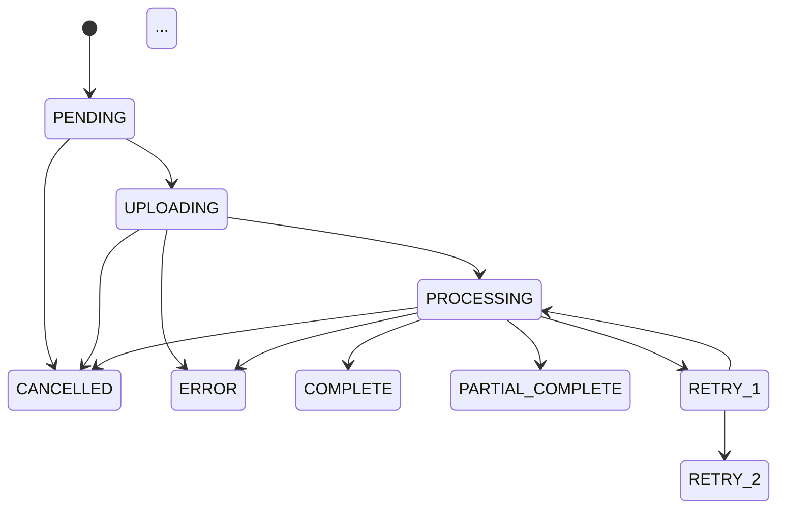

# Tasks: Agent Orchestration - State Machine & Workflow Testing (Sprint 1.8)

**Agent**: Sophia Martinez (@sophia) - LangGraph Agent Orchestration SME
**Sprint**: 1.8 - Testing & Documentation
**Duration**: Partial session (~2.0h of 6.0h total)
**Lead**: Julia (@julia)
**Support**: Neo (@neo), Trinity (@trinity), William (@william)
**Review**: Agent Zero (@agent-zero)

**Input**:
- `/home/agent0/hx-docling-application/project/0.3-specification/0.3.1-detailed-specification.md` (Section 5.1.2, 5.5, 10)
- `/home/agent0/hx-docling-application/project/0.1-plan/0.1.1-implementation-plan.md` (Section 4.8, Tasks 7-8)

**Prerequisites**:
- Sprint 1.7 complete (all workflows implemented)
- State machine from Sprint 1.5a
- Checkpoint manager from Sprint 1.5b
- Cancel/Resume workflows from Sprint 1.7
- Vitest configured with mocking support

---

## Context

Sprint 1.8 is the final testing and documentation sprint, led by Julia. Sophia contributes comprehensive testing for:
- State machine transition tests (all 10 states)
- Checkpoint save/restore cycle tests
- Workflow integration tests
- State machine documentation for CLAUDE.md

**Julia's Tasks** (not in this file):
- Unit tests for validation lib
- Unit tests for MCP client
- Component tests (UploadZone, UrlInput, ProgressCard, ResultsViewer)
- Store tests (documentStore, uiStore)
- API route tests (upload, process, history, health)
- E2E critical path test
- Security tests (SSRF, injection)
- Accessibility audit
- README documentation

---

## Phase 3.1: State Machine Comprehensive Tests

### SOP-1.8-001: Write State Machine Transition Tests - Valid Transitions

**Description**: Create comprehensive tests for all valid state transitions in the job status state machine.

**File**: `test/state-machine/valid-transitions.test.ts`

**Acceptance Criteria**:
- [ ] Test all 10 states defined in JobStatus enum
- [ ] Test all valid transitions per VALID_TRANSITIONS map:
  - PENDING -> UPLOADING (1 test)
  - PENDING -> CANCELLED (1 test)
  - UPLOADING -> PROCESSING (1 test)
  - UPLOADING -> ERROR (1 test)
  - UPLOADING -> CANCELLED (1 test)
  - PROCESSING -> COMPLETE (1 test)
  - PROCESSING -> PARTIAL_COMPLETE (1 test)
  - PROCESSING -> ERROR (1 test)
  - PROCESSING -> RETRY_1 (1 test)
  - PROCESSING -> CANCELLED (1 test)
  - RETRY_1 -> PROCESSING (1 test)
  - RETRY_1 -> RETRY_2 (1 test)
  - RETRY_1 -> ERROR (1 test)
  - RETRY_1 -> CANCELLED (1 test)
  - RETRY_2 -> PROCESSING (1 test)
  - RETRY_2 -> RETRY_3 (1 test)
  - RETRY_2 -> ERROR (1 test)
  - RETRY_2 -> CANCELLED (1 test)
  - RETRY_3 -> PROCESSING (1 test)
  - RETRY_3 -> ERROR (1 test)
  - RETRY_3 -> CANCELLED (1 test)
- [ ] Verify `isValidTransition()` returns true for all above
- [ ] Verify `transitionJobStatus()` succeeds for all above
- [ ] Verify database state updated correctly
- [ ] Verify `completedAt` set for terminal states

**Dependencies**: Sprint 1.5a state machine implementation

**Effort**: 45 minutes

**Deliverables**:
- `/home/agent0/hx-docling-application/test/state-machine/valid-transitions.test.ts`

**Technical Notes**:
- Reference Plan Section 4.8 Task 7: "Write state machine transition tests"
- Reference Specification Section 5.1.2 for state diagram
- 21 valid transitions total
- Use Vitest with Prisma mocking
- Each test should be isolated with fresh database state

```typescript
// Test structure example
describe('Job State Machine - Valid Transitions', () => {
  describe('PENDING state', () => {
    it('allows transition to UPLOADING', async () => {
      const job = await createJob({ status: 'PENDING' });
      await transitionJobStatus(job.id, 'UPLOADING');
      const updated = await getJob(job.id);
      expect(updated.status).toBe('UPLOADING');
    });

    it('allows transition to CANCELLED', async () => {
      const job = await createJob({ status: 'PENDING' });
      await transitionJobStatus(job.id, 'CANCELLED');
      const updated = await getJob(job.id);
      expect(updated.status).toBe('CANCELLED');
      expect(updated.completedAt).toBeDefined();
    });
  });

  // ... more describe blocks for each state
});
```

---

### SOP-1.8-002: Write State Machine Transition Tests - Invalid Transitions

**Description**: Create comprehensive tests for all invalid state transitions to verify rejection.

**File**: `test/state-machine/invalid-transitions.test.ts`

**Acceptance Criteria**:
- [ ] Test terminal states reject all transitions:
  - COMPLETE -> * (4 tests: PENDING, PROCESSING, ERROR, CANCELLED)
  - PARTIAL_COMPLETE -> * (4 tests)
  - CANCELLED -> * (4 tests)
  - ERROR -> * (4 tests)
- [ ] Test invalid forward transitions:
  - PENDING -> PROCESSING (skip UPLOADING)
  - PENDING -> COMPLETE (skip intermediate)
  - UPLOADING -> COMPLETE (skip PROCESSING)
  - PROCESSING -> PENDING (backwards)
  - PROCESSING -> UPLOADING (backwards)
  - RETRY_1 -> RETRY_3 (skip RETRY_2)
  - RETRY_2 -> RETRY_1 (backwards)
  - RETRY_3 -> RETRY_1 (backwards)
- [ ] Verify `isValidTransition()` returns false for all above
- [ ] Verify `transitionJobStatus()` throws `InvalidStateTransitionError`
- [ ] Verify error includes from/to states and valid alternatives
- [ ] Verify database state unchanged after failed transition

**Dependencies**: Sprint 1.5a state machine implementation

**Effort**: 40 minutes

**Deliverables**:
- `/home/agent0/hx-docling-application/test/state-machine/invalid-transitions.test.ts`

**Technical Notes**:
- Reference Plan Section 4.8 Task 7: "All 10 states, valid/invalid transitions"
- Terminal states should never transition
- Error message should be helpful for debugging
- Database should be unchanged after rejection (rollback)

```typescript
// Test structure example
describe('Job State Machine - Invalid Transitions', () => {
  describe('Terminal states', () => {
    it.each(['COMPLETE', 'PARTIAL_COMPLETE', 'CANCELLED', 'ERROR'])(
      '%s rejects all transitions',
      async (terminalState) => {
        const job = await createJob({ status: terminalState });

        for (const targetState of ALL_STATES) {
          await expect(
            transitionJobStatus(job.id, targetState)
          ).rejects.toThrow(InvalidStateTransitionError);
        }
      }
    );
  });

  describe('Invalid forward transitions', () => {
    it('PENDING cannot transition directly to PROCESSING', async () => {
      const job = await createJob({ status: 'PENDING' });
      await expect(
        transitionJobStatus(job.id, 'PROCESSING')
      ).rejects.toThrow(InvalidStateTransitionError);

      // Verify state unchanged
      const unchanged = await getJob(job.id);
      expect(unchanged.status).toBe('PENDING');
    });
  });
});
```

---

### SOP-1.8-003: Write State Machine Type Guard Tests

**Description**: Test all type guards for correct runtime behavior.

**File**: `test/state-machine/type-guards.test.ts`

**Acceptance Criteria**:
- [ ] Test `isTerminalStatus()`:
  - Returns true for COMPLETE, PARTIAL_COMPLETE, CANCELLED, ERROR
  - Returns false for PENDING, UPLOADING, PROCESSING, RETRY_1, RETRY_2, RETRY_3
- [ ] Test `isRetryStatus()`:
  - Returns true for RETRY_1, RETRY_2, RETRY_3
  - Returns false for all others
- [ ] Test `isTransientStatus()`:
  - Returns true for PENDING, UPLOADING, PROCESSING, RETRY_*
  - Returns false for terminal states
- [ ] Test `isCancellable()`:
  - Returns true for non-terminal states
  - Returns false for terminal states
- [ ] Verify type narrowing works correctly in TypeScript
- [ ] 100% coverage for type-guards module

**Dependencies**: Sprint 1.5a type definitions

**Effort**: 25 minutes

**Deliverables**:
- `/home/agent0/hx-docling-application/test/state-machine/type-guards.test.ts`

**Technical Notes**:
- Type guards must work at runtime, not just compile time
- Test with all 10 status values
- These tests ensure type-safe conditional logic

```typescript
// Test structure example
describe('Job Status Type Guards', () => {
  describe('isTerminalStatus', () => {
    const terminalStatuses: JobStatus[] = [
      'COMPLETE', 'PARTIAL_COMPLETE', 'CANCELLED', 'ERROR'
    ];
    const transientStatuses: JobStatus[] = [
      'PENDING', 'UPLOADING', 'PROCESSING', 'RETRY_1', 'RETRY_2', 'RETRY_3'
    ];

    it.each(terminalStatuses)('%s is terminal', (status) => {
      expect(isTerminalStatus(status)).toBe(true);
    });

    it.each(transientStatuses)('%s is not terminal', (status) => {
      expect(isTerminalStatus(status)).toBe(false);
    });
  });
});
```

---

## Phase 3.2: Checkpoint Comprehensive Tests

### SOP-1.8-004: Write Checkpoint Save/Restore Cycle Tests

**Description**: Create comprehensive tests for checkpoint serialization and deserialization.

**File**: `test/checkpoint/save-restore.test.ts`

**Acceptance Criteria**:
- [ ] Test complete checkpoint lifecycle:
  - Create job
  - Save checkpoint at each stage
  - Load checkpoint and verify all fields
  - Clear checkpoint and verify null
- [ ] Test checkpoint data integrity:
  - All fields serialized correctly (JSON)
  - Checksum calculated correctly
  - Timestamps in ISO 8601 format
  - Version field populated
- [ ] Test checkpoint expiry:
  - Checkpoint within TTL: loads successfully
  - Checkpoint at TTL boundary: loads successfully
  - Checkpoint past TTL: returns null, auto-clears
- [ ] Test checkpoint corruption:
  - Modified data: throws CheckpointCorruptedError
  - Invalid JSON: throws CheckpointCorruptedError
  - Missing required fields: throws error
- [ ] Test incremental checkpoint updates:
  - Save 'uploaded' stage
  - Save 'converted' stage (merges with existing)
  - Save export results one at a time
- [ ] >= 95% coverage for checkpoint module

**Dependencies**: Sprint 1.5b checkpoint manager

**Effort**: 45 minutes

**Deliverables**:
- `/home/agent0/hx-docling-application/test/checkpoint/save-restore.test.ts`

**Technical Notes**:
- Reference Plan Section 4.8 Task 8: "Write checkpoint save/restore tests"
- Mock time for TTL tests (vi.useFakeTimers)
- Test with realistic checkpoint sizes (1-50KB)
- Verify checksum validation catches modifications

```typescript
// Test structure example
describe('Checkpoint Save/Restore Cycle', () => {
  describe('complete lifecycle', () => {
    it('saves and restores checkpoint through all stages', async () => {
      const job = await createJob({ status: 'PROCESSING' });

      // Save at 'uploaded' stage
      await saveCheckpoint(job.id, 'uploaded', {
        uploadedFilePath: '/data/uploads/test.pdf',
      });

      let checkpoint = await loadCheckpoint(job.id);
      expect(checkpoint?.stage).toBe('uploaded');
      expect(checkpoint?.uploadedFilePath).toBe('/data/uploads/test.pdf');

      // Save at 'converted' stage
      await saveCheckpoint(job.id, 'converted', {
        doclingDocument: mockDoclingDocument,
      });

      checkpoint = await loadCheckpoint(job.id);
      expect(checkpoint?.stage).toBe('converted');
      expect(checkpoint?.doclingDocument).toEqual(mockDoclingDocument);
      // Previous data preserved
      expect(checkpoint?.uploadedFilePath).toBe('/data/uploads/test.pdf');

      // Clear checkpoint
      await clearCheckpoint(job.id);
      checkpoint = await loadCheckpoint(job.id);
      expect(checkpoint).toBeNull();
    });
  });

  describe('expiry handling', () => {
    it('returns null and clears expired checkpoint', async () => {
      vi.useFakeTimers();
      const job = await createJob({ status: 'PROCESSING' });

      await saveCheckpoint(job.id, 'uploaded', {});

      // Advance time past TTL (24 hours + 1 minute)
      vi.advanceTimersByTime(24 * 60 * 60 * 1000 + 60000);

      const checkpoint = await loadCheckpoint(job.id);
      expect(checkpoint).toBeNull();

      // Verify cleared from database
      const jobRecord = await prisma.job.findUnique({
        where: { id: job.id },
        select: { checkpointData: true },
      });
      expect(jobRecord?.checkpointData).toBeNull();

      vi.useRealTimers();
    });
  });
});
```

---

### SOP-1.8-005: Write Checkpoint Stage Progression Tests

**Description**: Test that checkpoints progress through stages correctly and maintain integrity.

**File**: `test/checkpoint/stage-progression.test.ts`

**Acceptance Criteria**:
- [ ] Test normal stage progression:
  - uploaded -> converted -> export_markdown -> export_html -> export_json -> completed
- [ ] Test partial export completion:
  - converted -> export_markdown (markdown only)
  - converted -> export_html (html only)
  - Mixed: markdown + json, no html
- [ ] Test stage skipping warnings:
  - Going backwards logs warning but saves
  - Documentation of expected behavior
- [ ] Test export result accumulation:
  - Each export adds to exportResults
  - Previous exports preserved
  - Final state has all three exports
- [ ] Verify progress mapping:
  - 'uploaded' -> 10%
  - 'converted' -> 30%
  - 'export_markdown' -> 60%
  - 'export_html' -> 80%
  - 'export_json' -> 95%
  - 'completed' -> 100%

**Dependencies**: Sprint 1.5b checkpoint and progress modules

**Effort**: 30 minutes

**Deliverables**:
- `/home/agent0/hx-docling-application/test/checkpoint/stage-progression.test.ts`

**Technical Notes**:
- Stage order is fixed: validates workflow correctness
- Export results are cumulative
- Progress mapping used by UI components
- Test all combinations for partial completion

---

## Phase 3.3: Workflow Integration Tests

### SOP-1.8-006: Write End-to-End Workflow Tests

**Description**: Create integration tests that exercise complete job processing workflows.

**File**: `test/workflow/e2e-processing.test.ts`

**Acceptance Criteria**:
- [ ] Test happy path workflow:
  - Upload file
  - Process through all stages
  - Verify checkpoints at each stage
  - Verify state transitions
  - Verify final COMPLETE status
- [ ] Test error recovery workflow:
  - Process until PROCESSING
  - Simulate error -> RETRY_1
  - Simulate success -> back to PROCESSING
  - Complete successfully
- [ ] Test max retry workflow:
  - Process until PROCESSING
  - Simulate 3 failures
  - Verify ERROR state reached
- [ ] Test cancellation workflow:
  - Process until PROCESSING
  - Cancel job
  - Verify CANCELLED state
  - Verify cleanup behavior
- [ ] Test resume workflow:
  - Process until export_markdown
  - Save checkpoint
  - Simulate failure
  - Resume from checkpoint
  - Complete remaining exports
- [ ] All tests isolated with database cleanup

**Dependencies**: All Sprint 1.5a, 1.5b, 1.7 implementations

**Effort**: 60 minutes

**Deliverables**:
- `/home/agent0/hx-docling-application/test/workflow/e2e-processing.test.ts`

**Technical Notes**:
- Integration tests: use real database (test instance)
- Mock MCP server responses
- Mock SSE publisher
- Each test creates fresh job and cleans up
- Tests full state machine behavior

```typescript
// Test structure example
describe('End-to-End Processing Workflow', () => {
  describe('happy path', () => {
    it('completes full processing lifecycle', async () => {
      // Create job
      const job = await createTestJob({
        status: 'PENDING',
        inputType: 'FILE',
        filePath: '/data/test/sample.pdf',
      });

      // Transition: PENDING -> UPLOADING
      await transitionJobStatus(job.id, 'UPLOADING');
      let currentJob = await getJob(job.id);
      expect(currentJob.status).toBe('UPLOADING');

      // Save upload checkpoint
      await saveCheckpoint(job.id, 'uploaded', {
        uploadedFilePath: '/data/test/sample.pdf',
      });

      // Transition: UPLOADING -> PROCESSING
      await transitionJobStatus(job.id, 'PROCESSING');

      // Simulate MCP conversion
      await saveCheckpoint(job.id, 'converted', {
        doclingDocument: mockDoclingDocument,
      });

      // Simulate exports
      await saveCheckpoint(job.id, 'export_markdown', {
        exportResults: { markdown: { format: 'markdown', content: '# Test' } },
      });

      await saveCheckpoint(job.id, 'export_html', {
        exportResults: {
          markdown: { format: 'markdown', content: '# Test' },
          html: { format: 'html', content: '<h1>Test</h1>' },
        },
      });

      await saveCheckpoint(job.id, 'export_json', {
        exportResults: {
          markdown: { format: 'markdown', content: '# Test' },
          html: { format: 'html', content: '<h1>Test</h1>' },
          json: { format: 'json', content: '{"heading":"Test"}' },
        },
      });

      // Transition: PROCESSING -> COMPLETE
      await transitionJobStatus(job.id, 'COMPLETE');

      // Verify final state
      currentJob = await getJob(job.id);
      expect(currentJob.status).toBe('COMPLETE');
      expect(currentJob.completedAt).toBeDefined();

      // Verify checkpoint cleared
      const checkpoint = await loadCheckpoint(job.id);
      expect(checkpoint).toBeNull(); // Or verify completed state
    });
  });

  describe('resume after failure', () => {
    it('continues from checkpoint after failure', async () => {
      // Setup: job at export_markdown stage
      const job = await createTestJob({ status: 'PROCESSING' });
      await saveCheckpoint(job.id, 'export_markdown', {
        uploadedFilePath: '/data/test/sample.pdf',
        doclingDocument: mockDoclingDocument,
        exportResults: { markdown: { format: 'markdown', content: '# Test' } },
      });

      // Simulate failure (e.g., ERROR state)
      await transitionJobStatus(job.id, 'ERROR');

      // Create new job to resume (or reset status - depends on impl)
      // ... resume logic ...

      // Load checkpoint
      const checkpoint = await loadCheckpoint(job.id);
      expect(checkpoint?.stage).toBe('export_markdown');
      expect(checkpoint?.exportResults.markdown).toBeDefined();
      expect(checkpoint?.exportResults.html).toBeUndefined();
      expect(checkpoint?.exportResults.json).toBeUndefined();

      // Resume would continue from export_html
      const remaining = getRemainingStages(checkpoint!);
      expect(remaining).toEqual(['export_html', 'export_json', 'completed']);
    });
  });
});
```

---

## Phase 3.4: Documentation Updates

### SOP-1.8-007: Document State Machine in CLAUDE.md

**Description**: Add comprehensive state machine documentation to CLAUDE.md for developer reference.

**File**: `CLAUDE.md` (update existing)

**Acceptance Criteria**:
- [ ] State machine section with Mermaid diagram
- [ ] State definitions table:
  - State name
  - Description
  - Terminal? (yes/no)
  - Valid next states
- [ ] Transition validation code example
- [ ] Error handling patterns
- [ ] Checkpoint integration explanation
- [ ] Troubleshooting guide:
  - "Job stuck in PROCESSING" -> Check MCP health, retry count
  - "Cannot cancel job" -> Check if terminal state
  - "Resume fails" -> Check checkpoint expiry, corruption
- [ ] Link to detailed specification section

**Dependencies**: All state machine and checkpoint implementations

**Effort**: 30 minutes

**Deliverables**:
- Updated `/home/agent0/hx-docling-application/CLAUDE.md`

**Technical Notes**:
- Reference Plan Section 4.8 Task 17f: "Document checkpoint serialization format"
- Per HX-Infrastructure documentation-requirements.md
- Mermaid diagram should match Specification Section 5.1.2
- Include common troubleshooting scenarios

```markdown
## Job State Machine

### State Diagram



### State Definitions

| State | Description | Terminal | Valid Next States |
|-------|-------------|----------|-------------------|
| PENDING | Job created, awaiting upload | No | UPLOADING, CANCELLED |
| UPLOADING | File being uploaded | No | PROCESSING, ERROR, CANCELLED |
| ... | ... | ... | ... |

### Troubleshooting

#### Job stuck in PROCESSING
1. Check MCP server health: `curl http://hx-docling-server:8000/health`
2. Check retry count: Should not exceed 3
3. Review error logs for timeout or connection issues
```

---

### SOP-1.8-008: Document Progress Interpolation Algorithm

**Description**: Document the progress interpolation algorithm with monotonic guarantee.

**File**: `CLAUDE.md` (update existing)

**Acceptance Criteria**:
- [ ] Progress interpolation section
- [ ] Monotonic guarantee explanation
- [ ] Algorithm pseudocode
- [ ] Stage-to-progress mapping table
- [ ] Edge case handling documentation
- [ ] Code example for using progressTracker

**Dependencies**: Sprint 1.5b progress module

**Effort**: 15 minutes

**Deliverables**:
- Updated `/home/agent0/hx-docling-application/CLAUDE.md`

**Technical Notes**:
- Reference Plan Section 4.8 Task 17e: "Document progress interpolation algorithm"
- Monotonic guarantee is critical for UX
- Document why progress should never decrease

```markdown
## Progress Tracking

### Monotonic Guarantee

Progress values MUST never decrease during a job's lifecycle. This ensures:
- Consistent user experience (no confusing "backwards" progress)
- Reliable progress estimation
- Smooth UI animations

### Algorithm

```typescript
function smoothProgress(current, target, lastReported) {
  // 1. Enforce minimum (monotonic)
  const minProgress = lastReported;

  // 2. Limit jump size (smooth)
  const maxJump = 5;
  const smoothed = Math.min(current, lastReported + maxJump);

  // 3. Apply bounds
  return Math.max(minProgress, Math.min(100, smoothed));
}
```

### Stage Progress Mapping

| Stage | Progress % | Message |
|-------|-----------|---------|
| uploaded | 10 | "Uploading document..." |
| converted | 30 | "Analyzing document structure..." |
| export_markdown | 60 | "Generating Markdown..." |
| export_html | 80 | "Generating HTML..." |
| export_json | 95 | "Generating JSON..." |
| completed | 100 | "Complete!" |
```

---

## Dependencies

| Task ID | Depends On | Reason |
|---------|------------|--------|
| SOP-1.8-001 | Sprint 1.5a | State machine implementation |
| SOP-1.8-002 | Sprint 1.5a | State machine implementation |
| SOP-1.8-003 | Sprint 1.5a | Type guard implementations |
| SOP-1.8-004 | Sprint 1.5b | Checkpoint manager |
| SOP-1.8-005 | Sprint 1.5b | Checkpoint and progress modules |
| SOP-1.8-006 | All sprints | Full implementation complete |
| SOP-1.8-007 | SOP-1.8-001 through SOP-1.8-005 | Tests inform documentation |
| SOP-1.8-008 | Sprint 1.5b | Progress module implementation |

---

## Parallel Execution

```
# Tests can run in parallel (different test files):
[SOP-1.8-001] [SOP-1.8-002] [SOP-1.8-003] [SOP-1.8-004] [SOP-1.8-005]

# Integration tests after unit tests:
[SOP-1.8-006] (after 001-005)

# Documentation after tests:
[SOP-1.8-007] [SOP-1.8-008] (parallel, after tests)
```

---

## Summary

| Task ID | Description | Effort | File |
|---------|-------------|--------|------|
| SOP-1.8-001 | State Machine Tests - Valid Transitions | 45m | `test/state-machine/valid-transitions.test.ts` |
| SOP-1.8-002 | State Machine Tests - Invalid Transitions | 40m | `test/state-machine/invalid-transitions.test.ts` |
| SOP-1.8-003 | State Machine Type Guard Tests | 25m | `test/state-machine/type-guards.test.ts` |
| SOP-1.8-004 | Checkpoint Save/Restore Cycle Tests | 45m | `test/checkpoint/save-restore.test.ts` |
| SOP-1.8-005 | Checkpoint Stage Progression Tests | 30m | `test/checkpoint/stage-progression.test.ts` |
| SOP-1.8-006 | End-to-End Workflow Tests | 60m | `test/workflow/e2e-processing.test.ts` |
| SOP-1.8-007 | Document State Machine in CLAUDE.md | 30m | `CLAUDE.md` |
| SOP-1.8-008 | Document Progress Interpolation | 15m | `CLAUDE.md` |

**Total Effort**: 4h 50m (290 minutes)

---

## Quality Checklist

Before marking tasks complete:
- [ ] All 21 valid state transitions tested
- [ ] All invalid transitions properly rejected
- [ ] Type guards work correctly at runtime
- [ ] Checkpoint save/restore cycle verified
- [ ] Checkpoint expiry and corruption handling tested
- [ ] End-to-end workflows pass
- [ ] Test coverage >= 90% for orchestration modules
- [ ] CLAUDE.md state machine section complete
- [ ] Mermaid diagrams render correctly
- [ ] All tests pass: `npm run test`
- [ ] No TypeScript errors
- [ ] Documentation follows HX-Infrastructure standards

---

## Test Coverage Requirements

Per Implementation Plan quality gates:
- **Line coverage**: >= 80%
- **Branch coverage**: >= 75%
- **State machine modules**: >= 95% (critical path)
- **Checkpoint modules**: >= 90%

```bash
# Run coverage report
npm run test:coverage

# Expected output includes:
# src/lib/job/state-machine.ts | 95% | 90% | ...
# src/lib/checkpoint/manager.ts | 90% | 85% | ...
# src/types/job-status.ts | 100% | 100% | ...
```
