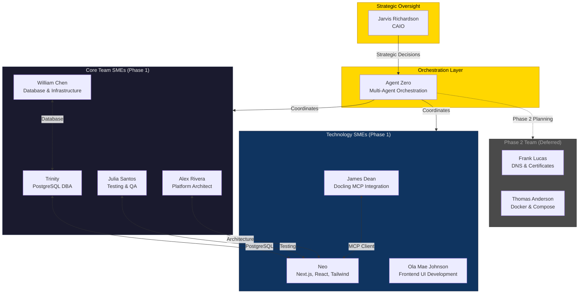
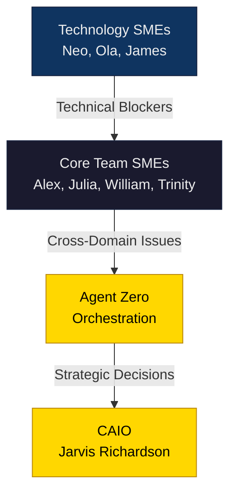

# HX Docling UI - Project Team Roster

**Project:** hx-docling-ui  
**Document Type:** Team Roster  
**Version:** 2.1.0  
**Created:** 2025-12-11  
**Last Updated:** 2025-12-12
**Charter Reference:** hx-docling-ui-charter-v0.7.0.md
**Status:** APPROVED

---

## Document Change Summary (v2.0.0)

| Change | Description |
|--------|-------------|
| Persistent Storage | Added PostgreSQL & Redis responsibilities |
| MCP Tools | Updated from 6 → 8 tools (added Excel, PowerPoint) |
| Sprint Plan | Updated from 7-8 → 9-10 sessions |
| Phase Separation | Phase 1 (Dev) vs Phase 2 (Deploy) clearly separated |
| Deferred Work | Docker, DNS, SSL moved to Phase 2 |
| New Components | History view, Prisma schema added |

---

## Team Structure

---

## Project Phases Overview

| Phase | Scope | Environment | Team Focus |
|-------|-------|-------------|------------|
| **Phase 1** | Development | hx-cc-server (bare metal Node.js) | Core Team + Tech SMEs |
| **Phase 2** | Deployment | hx-dev-server (Docker) | Frank, Thomas, William |

> **Important**: This roster focuses on **Phase 1**. Phase 2 agents (Frank, Thomas) are documented but their work is deferred until Phase 1 completion.

---

## Team Roster

### Strategic Oversight

| Role | Name | Responsibility | Escalation Point |
|------|------|----------------|------------------|
| CAIO | Jarvis Richardson (Agent Zero) | Strategic decisions, final approval, governance | N/A (Top level) |

---

### Orchestration Layer

#### Agent Zero
| Attribute | Value |
|-----------|-------|
| **Agent Name** | Agent Zero |
| **Role** | Multi-Agent Orchestration & Synthesis Specialist |
| **Invocation** | `@agent-zero` |
| **Model** | `claude-sonnet-4` |
| **Color** | `gold` |
| **Profile** | `/home/agent0/HX-Infrastructure/x-agents/agent-zero.md` |

**Project Responsibilities:**
- Orchestrate multi-agent workflows across all project phases
- Coordinate parallel execution of frontend and database work
- Synthesize outputs from Core Team and Technology SMEs
- Enforce quality gates across all agent deliverables
- Escalate architectural conflicts and resource decisions to CAIO

**Key Deliverables:**
- [ ] Multi-agent coordination plan
- [ ] Cross-domain integration validation
- [ ] Final quality gate sign-off

---

### Core Team SMEs (Phase 1 Active)

#### Alex Rivera - Platform Architect
| Attribute | Value |
|-----------|-------|
| **Agent Name** | Alex Rivera |
| **Role** | Platform Architect & Orchestration Coordinator |
| **Invocation** | `@alex` |
| **Model** | `claude-sonnet-4` |
| **Color** | `blue` |
| **Profile** | `/home/agent0/HX-Infrastructure/x-agents/alex.md` |

**Project Responsibilities:**
- Create Architecture Decision Record (ADR) for hx-docling-ui
- Validate Next.js 16 technology selection and trade-offs
- Define MCP client integration patterns
- **Review Prisma schema design for jobs/results persistence**
- Ensure architecture aligns with HX-Infrastructure 7-layer model
- Review extensibility framework design (plugin architecture)

**Key Deliverables:**
- [ ] ADR-XXX: hx-docling-ui Architecture Decision
- [ ] Component architecture validation
- [ ] MCP integration pattern approval
- [ ] **Database schema review (Prisma)**
- [ ] Extensibility framework review

**Coordinates With:** Trinity (architecture implementation), James (MCP patterns), William (database)

---

#### Julia Santos - Testing & QA
| Attribute | Value |
|-----------|-------|
| **Agent Name** | Julia Santos |
| **Role** | Testing & Quality Assurance Specialist |
| **Invocation** | `@julia` |
| **Model** | `claude-sonnet-4` |
| **Color** | `green` |
| **Profile** | `/home/agent0/HX-Infrastructure/x-agents/julia.md` |

**Project Responsibilities:**
- Design comprehensive test strategy for Next.js 16 application
- Define unit test coverage requirements (100% mandatory)
- Create component testing plan (React Testing Library)
- Design E2E test scenarios (Playwright)
- **Test database integration (Prisma + PostgreSQL)**
- **Test Redis session management**
- Validate all quality gates before Phase 1 completion

**Key Deliverables:**
- [ ] Test strategy document
- [ ] Unit test suite (Vitest)
- [ ] Component test suite (React Testing Library)
- [ ] E2E test suite (Playwright)
- [ ] **Database integration tests**
- [ ] Quality gate validation report

**Coordinates With:** Trinity (test implementation), William (database testing), Agent Zero (quality gates)

---

#### William Chen - Database & Infrastructure
| Attribute | Value |
|-----------|-------|
| **Agent Name** | William Chen |
| **Role** | Infrastructure & Operations Specialist |
| **Invocation** | `@william` |
| **Model** | `claude-sonnet-4` |
| **Color** | `blue` |
| **Profile** | `/home/agent0/HX-Infrastructure/x-agents/william.md` |

**Phase 1 Responsibilities (Development Environment):**
- **Configure PostgreSQL database on hx-postgres-server**
- **Create database user and schema for docling_db**
- **Configure Redis on hx-redis-server for session management**
- **Set up persistent file storage at `/data/docling-uploads/`**
- Verify network connectivity from hx-cc-server to database servers
- Create operational documentation for development environment

**Phase 2 Responsibilities (Deferred):**
- Deploy Docker container on hx-dev-server
- Configure reverse proxy routing on hx-ssl-server
- Create operational runbook for production

**Key Deliverables (Phase 1):**
- [ ] PostgreSQL database setup (hx-postgres-server)
- [ ] Database user: `docling_user` with appropriate permissions
- [ ] Database: `docling_db` created
- [ ] Redis configuration (hx-redis-server)
- [ ] Persistent storage directory: `/data/docling-uploads/`
- [ ] Network connectivity validation
- [ ] Development environment documentation

**Coordinates With:** Trinity (PostgreSQL expertise), Julia (database testing), Alex (data architecture)

---

#### Trinity - PostgreSQL Database SME
| Attribute | Value |
|-----------|-------|
| **Agent Name** | Trinity |
| **Role** | PostgreSQL Database Administration Specialist |
| **Invocation** | `@trinity` |
| **Model** | `claude-sonnet-4` |
| **Color** | `purple` |
| **Profile** | `/home/agent0/HX-Infrastructure/x-agents/trinity.md` |

**Project Responsibilities:**
- PostgreSQL database administration and optimization
- Database schema design review and validation
- Query performance tuning and optimization
- pgvector configuration for AI/ML embeddings (if needed)
- Backup and recovery strategy
- Database security hardening
- Support William Chen with PostgreSQL expertise

**Key Deliverables:**
- [ ] Database schema review and optimization recommendations
- [ ] Query performance analysis
- [ ] Index optimization strategy
- [ ] Database security audit
- [ ] Backup/recovery procedure validation

**Coordinates With:** William (infrastructure), Neo (Prisma integration), Julia (database testing), Alex (data architecture)

---

### Technology SMEs (Phase 1 Active)

#### Neo - Next.js, React & Tailwind SME (PRIMARY DEVELOPER)
| Attribute | Value |
|-----------|-------|
| **Agent Name** | Neo |
| **Role** | Next.js, React & Tailwind SME |
| **Invocation** | `@neo` |
| **Model** | `claude-sonnet-4` |
| **Color** | `green` |
| **Profile** | `/home/agent0/HX-Infrastructure/x-agents/neo.md` |

**Project Responsibilities:**
- **PRIMARY DEVELOPER** for hx-docling-ui application
- Implement Next.js 16 application with App Router
- Configure Turbopack build system
- Implement shadcn/ui component integration
- Build Zustand state management
- Implement SSE streaming for progress updates
- Create responsive Tailwind CSS layouts
- **Implement Prisma client and database queries**
- **Implement Redis session management**
- **Build history view for past jobs**

**Key Deliverables:**
- [ ] Next.js 16 project scaffold
- [ ] shadcn/ui component setup
- [ ] **Prisma schema and client setup**
- [ ] **Redis client integration**
- [ ] Upload zone component (PDF, Word, Excel, PowerPoint)
- [ ] URL input component
- [ ] Results viewer (tabbed)
- [ ] **History view component**
- [ ] MCP client integration
- [ ] Zustand stores
- [ ] API routes (upload, process, history, health)

**Coordinates With:** Alex (architecture), Ola (UI components), James (MCP), Julia (testing), Trinity (database)

---

#### Ola Mae Johnson - Frontend UI Development SME
| Attribute | Value |
|-----------|-------|
| **Agent Name** | Ola Mae Johnson |
| **Role** | Frontend UI Development SME |
| **Invocation** | `@ola` |
| **Model** | `claude-sonnet-4` |
| **Color** | `teal` |
| **Profile** | `/home/agent0/HX-Infrastructure/x-agents/ola.md` |

**Project Responsibilities:**
- Design UI/UX for document upload experience
- Implement shadcn/ui component customization
- Create accessible, responsive layouts
- Design empty states and loading indicators
- Implement toast notifications and error states
- **Design history view table and job detail modal**

**Key Deliverables:**
- [ ] UI/UX design review
- [ ] shadcn/ui theme customization
- [ ] Accessibility compliance (WCAG 2.1 AA)
- [ ] Responsive layout implementation
- [ ] Animation and transition design
- [ ] **History view UI design**

**Coordinates With:** Trinity (implementation), Julia (accessibility testing)

---

#### James Dean - Docling MCP Integration SME
| Attribute | Value |
|-----------|-------|
| **Agent Name** | James Dean |
| **Role** | Docling MCP Integration SME |
| **Invocation** | `@james` |
| **Model** | `sonnet` |
| **Color** | `brown` |
| **Profile** | `/home/agent0/HX-Infrastructure/x-agents/james.md` |

**Project Responsibilities:**
- Design MCP client abstraction layer
- Implement JSON-RPC 2.0 protocol handling
- Configure SSE transport for progress streaming
- **Map all 8 MCP tools to UI actions** (expanded from 6)
- Handle MCP error responses

**Phase 1 MCP Tools (8 Total):**

| Tool | File Types | Category |
|------|------------|----------|
| `convert_pdf` | .pdf | Conversion |
| `convert_docx` | .doc, .docx | Conversion |
| `convert_xlsx` | .xls, .xlsx | Conversion |
| `convert_pptx` | .ppt, .pptx | Conversion |
| `convert_url` | URLs | Conversion |
| `export_markdown` | - | Export |
| `export_html` | - | Export |
| `export_json` | - | Export |

**Key Deliverables:**
- [ ] MCP client library (`lib/mcp/client.ts`)
- [ ] MCP type definitions (`lib/mcp/types.ts`)
- [ ] Tool registry (`lib/mcp/tools.ts`) - **8 tools**
- [ ] SSE streaming implementation
- [ ] Error handling patterns

**Coordinates With:** Trinity (integration), Alex (patterns), Julia (MCP testing)

---

### Phase 2 Team (Deferred Until Phase 1 Complete)

> **Note**: These agents will be activated after Phase 1 acceptance criteria are met.

#### Frank Lucas - Identity & Certificates (Phase 2)
| Attribute | Value |
|-----------|-------|
| **Agent Name** | Frank Lucas |
| **Role** | Identity, DNS & Certificate Management Specialist |
| **Invocation** | `@frank` |
| **Model** | `claude-sonnet-4` |
| **Color** | `red` |
| **Profile** | `/home/agent0/HX-Infrastructure/x-agents/frank.md` |

**Phase 2 Responsibilities (Deferred):**
- Create DNS A record for `docling-ui.dev.hx.dev.local`
- Generate SSL certificate for HTTPS access
- Configure reverse proxy SSL termination on hx-ssl-server

**Phase 2 Deliverables:**
- [ ] DNS record: `docling-ui.dev.hx.dev.local` → hx-dev-server
- [ ] SSL certificate for `docling-ui.dev.hx.dev.local`
- [ ] Nginx reverse proxy configuration (hx-ssl-server)

**Coordinates With:** William (certificate deployment), Thomas (Docker)

---

#### Thomas Anderson - Docker & Compose SME (Phase 2)
| Attribute | Value |
|-----------|-------|
| **Agent Name** | Thomas Anderson |
| **Role** | Docker CLI & Docker Compose SME |
| **Invocation** | `@thomas` |
| **Model** | `sonnet` |
| **Color** | `cyan` |
| **Profile** | `/home/agent0/HX-Infrastructure/x-agents/thomas.md` |

**Phase 2 Responsibilities (Deferred):**
- Create optimized Dockerfile for Next.js 16
- Configure multi-stage build for production
- Implement Docker Compose for local development
- Optimize container image size
- Configure container health checks

**Phase 2 Deliverables:**
- [ ] Production Dockerfile (multi-stage)
- [ ] docker-compose.yml
- [ ] .dockerignore optimization
- [ ] Container health check configuration
- [ ] Image size optimization (< 200MB)

**Coordinates With:** William (deployment), Trinity (build config)

---

## Responsibility Matrix (RACI) - Phase 1

| Deliverable | Agent Zero | Alex | Julia | William | Trinity | Neo | Ola | James |
|-------------|:----------:|:----:|:-----:|:-------:|:-------:|:---:|:---:|:-----:|
| **Architecture ADR** | A | R | C | C | I | C | I | C |
| **Next.js Scaffold** | A | C | C | I | I | R | C | I |
| **Prisma Schema** | A | R | C | C | R | R | I | I |
| **Database Setup** | A | C | C | R | R | C | I | I |
| **Redis Setup** | A | C | C | R | C | C | I | I |
| **UI Components** | A | C | C | I | I | R | R | I |
| **MCP Client (8 tools)** | A | C | C | I | I | R | I | R |
| **History View** | A | C | C | I | I | R | R | I |
| **Test Suite** | A | C | R | C | C | C | I | C |
| **Quality Gates** | R | C | R | C | C | C | I | C |

**Legend:** R = Responsible, A = Accountable, C = Consulted, I = Informed

---

## Infrastructure Dependencies (Phase 1)

| Server | IP | Port | Purpose | Owner |
|--------|-----|------|---------|-------|
| hx-cc-server | 192.168.10.224 | 3000 | Development server | Neo |
| hx-docling-mcp-server | 192.168.10.217 | 8000 | MCP document processing | James |
| hx-postgres-server | 192.168.10.208 | 5432 | Job & results persistence | William / Trinity |
| hx-redis-server | 192.168.10.209 | 6379 | Session tracking | William |

---

## Phase 1 Sprint Assignments (9-10 Sessions)

### Sprint 1.1: Project Scaffold & Prisma Setup
| Agent | Role | Deliverables |
|-------|------|--------------|
| Neo | Lead | Next.js 16 scaffold, Tailwind, shadcn, Prisma setup |
| Alex | Review | Architecture validation |
| William | Support | Verify database connectivity |
| Trinity | Support | Prisma schema review |

### Sprint 1.2: Database & Redis Integration
| Agent | Role | Deliverables |
|-------|------|--------------|
| William | Lead | PostgreSQL setup, Redis setup, permissions |
| Trinity | Support | PostgreSQL optimization, schema validation |
| Neo | Support | Prisma client, Redis client integration |
| Alex | Review | Data architecture validation |

### Sprint 1.3: Upload Component & Persistent Storage
| Agent | Role | Deliverables |
|-------|------|--------------|
| Neo | Lead | UploadZone.tsx, FilePreview.tsx, /api/upload |
| Ola | Support | UI/UX design, accessibility |
| Julia | Review | Component test coverage |
| William | Support | File storage setup (`/data/docling-uploads/`) |

### Sprint 1.4: URL Input Component
| Agent | Role | Deliverables |
|-------|------|--------------|
| Neo | Lead | UrlInput.tsx, validation |
| Ola | Support | Input styling, error states |
| Julia | Review | Validation test coverage |

### Sprint 1.5: MCP Client Integration (8 Tools)
| Agent | Role | Deliverables |
|-------|------|--------------|
| James | Lead | MCP client library (8 tools) |
| Neo | Support | API route integration |
| Alex | Review | Integration pattern validation |

### **INTEGRATION CHECKPOINT**
| Agent | Role | Validation |
|-------|------|------------|
| Julia | Lead | End-to-end test with real MCP server |
| Neo | Support | Fix integration issues |
| William | Support | Database persistence validation |
| Trinity | Support | Database query optimization |

### Sprint 1.6: Results Viewer
| Agent | Role | Deliverables |
|-------|------|--------------|
| Neo | Lead | ResultsViewer.tsx, tabs, renderers |
| Ola | Support | Markdown/HTML rendering |
| Julia | Review | E2E test scenarios |

### Sprint 1.7: History View
| Agent | Role | Deliverables |
|-------|------|--------------|
| Neo | Lead | HistoryView.tsx, JobRow.tsx, /api/history |
| Ola | Support | Table design, job detail modal |
| Julia | Review | History functionality tests |
| Trinity | Support | History query optimization |

### Sprint 1.8: Polish, Testing & Documentation
| Agent | Role | Deliverables |
|-------|------|--------------|
| Julia | Lead | Full test suite execution |
| Neo | Support | Bug fixes, performance optimization |
| Trinity | Support | Database performance validation |
| William | Support | Database cleanup scripts |
| Agent Zero | Review | Final quality gate approval |

---

## Phase Handoff Criteria (Updated for v0.5.0)

### Sprint 1.1 → 1.2 Handoff
- [ ] Next.js 16 scaffold builds successfully
- [ ] Prisma schema defined (`prisma/schema.prisma`)
- [ ] TypeScript compiles without errors
- [ ] Architecture validation by Alex approved
- [ ] **Ready for database setup**

### Sprint 1.2 → 1.3 Handoff
- [ ] PostgreSQL database created (`docling_db`)
- [ ] Database user configured (`docling_user`)
- [ ] Redis accessible from hx-cc-server
- [ ] Prisma migrations run successfully
- [ ] **Ready for upload component**

### Sprint 1.3 → 1.4 Handoff
- [ ] UploadZone.tsx supports: PDF, Word, Excel, PowerPoint, Images
- [ ] File validation working (Zod)
- [ ] Files persist to `/data/docling-uploads/`
- [ ] Job record created in PostgreSQL
- [ ] **Ready for URL input**

### Sprint 1.4 → 1.5 Handoff
- [ ] UrlInput.tsx complete
- [ ] URL validation working
- [ ] Job record created for URL inputs
- [ ] **Ready for MCP integration**

### Sprint 1.5 → Checkpoint Handoff
- [ ] MCP client library complete (8 tools)
- [ ] SSE streaming working
- [ ] Error handling implemented
- [ ] **Ready for integration checkpoint**

### Checkpoint → 1.6 Handoff
- [ ] End-to-end flow tested with real MCP server
- [ ] Database persistence verified
- [ ] All 8 MCP tools working
- [ ] **Ready for results viewer**

### Sprint 1.6 → 1.7 Handoff
- [ ] ResultsViewer working (Markdown, HTML, JSON tabs)
- [ ] Results persisted to database
- [ ] Download functionality working
- [ ] **Ready for history view**

### Sprint 1.7 → 1.8 Handoff
- [ ] History view displays past jobs
- [ ] User can re-download past results
- [ ] Session tracking working
- [ ] **Ready for final polish**

### Sprint 1.8 Final Completion (Phase 1 Done)
- [ ] All 20 acceptance criteria met
- [ ] 100% test coverage
- [ ] `npm run build` succeeds
- [ ] No console errors
- [ ] **Phase 1 complete - ready for Phase 2 charter**

---

## Success Metrics by Agent (Phase 1)

| Agent | Success Metric | Target |
|-------|----------------|--------|
| Agent Zero | All quality gates passed | 100% |
| Alex Rivera | ADR approved, architecture compliant | Approved |
| Julia Santos | Test coverage | 100% |
| William Chen | Database operational, storage configured | Working |
| Trinity | Database optimized, queries performant | < 100ms queries |
| Neo | All components functional | 20 AC criteria |
| Ola Mae Johnson | Accessibility score | >= 90 |
| James Dean | MCP integration working | **All 8 tools** |

---

## Escalation Path

| Issue Type | First Escalation | Second Escalation | Final Authority |
|------------|------------------|-------------------|-----------------|
| Technical blocker | Core Team SME | Agent Zero | CAIO |
| Architecture conflict | Alex Rivera | Agent Zero | CAIO |
| Database issue | William Chen | Agent Zero | CAIO |
| Quality gate failure | Julia Santos | Agent Zero | CAIO |
| Resource allocation | Agent Zero | CAIO | CAIO |

---

## Agent Quick Reference (Phase 1)

| Agent | Invocation | Primary Focus | Phase |
|-------|------------|---------------|-------|
| Agent Zero | `@agent-zero` | Orchestration, quality gates | 1 |
| Alex Rivera | `@alex` | Architecture, ADRs | 1 |
| Julia Santos | `@julia` | Testing, QA | 1 |
| William Chen | `@william` | Infrastructure, operations | 1 |
| Trinity | `@trinity` | PostgreSQL DBA | 1 |
| Neo | `@neo` | Next.js, React, Tailwind | 1 |
| Ola Mae Johnson | `@ola` | Frontend UI, accessibility | 1 |
| James Dean | `@james` | Docling MCP integration | 1 |
| Frank Lucas | `@frank` | DNS, SSL, certificates | **2** |
| Thomas Anderson | `@thomas` | Docker, containers | **2** |

---

## Backlog Reference

The following MCP tools are documented in the charter backlog (Section 18) and are **NOT in scope for Phase 1**:

| Tool | Description | Status |
|------|-------------|--------|
| `generate_title` | Auto-generate document title | Backlog |
| `generate_toc` | Generate table of contents | Backlog |
| `generate_sections` | Extract document sections | Backlog |
| `generate_headings` | Extract heading hierarchy | Backlog |
| `generate_paragraphs` | Extract paragraphs | Backlog |
| `generate_lists` | Extract lists | Backlog |
| `generate_tables` | Extract tables | Backlog |
| `generate_images` | Extract embedded images | Backlog |
| `generate_code_blocks` | Extract code blocks | Backlog |
| `generate_references` | Extract references | Backlog |
| `generate_knowledge_graph` | Entity extraction graph | Backlog |
| `split_document` | Split into sections | Backlog |
| `merge_documents` | Merge multiple documents | Backlog |

---

## Approval

| Role | Name | Date | Signature |
|------|------|------|-----------|
| CAIO | Jarvis Richardson (Agent Zero) | 2025-12-11 | ✅ APPROVED |

### Change Log

| Version | Date | Author | Changes |
|---------|------|--------|---------|
| 1.0.0 | 2025-12-11 | Agent Zero | Initial draft |
| 2.0.0 | 2025-12-11 | Agent Zero | **Major Update for Charter v0.5.0** |
| | | | - Added persistent storage responsibilities (PostgreSQL, Redis) |
| | | | - Updated MCP tools: 6 → 8 (added Excel, PowerPoint) |
| | | | - Updated sprint plan: 7-8 → 9-10 sessions |
| | | | - Separated Phase 1 (Dev) from Phase 2 (Deploy) |
| | | | - Deferred Frank (DNS/SSL) and Thomas (Docker) to Phase 2 |
| | | | - Added William's database responsibilities |
| | | | - Added history view assignments |
| | | | - Updated RACI matrix |
| | | | - Updated phase handoff criteria |
| | | | - Added backlog reference section |
| 2.1.0 | 2025-12-11 | Agent Zero | **Agent Alignment Update** |
| | | | - Renamed "Trinity" (Next.js SME) to "Neo" (`@neo`) |
| | | | - Added "Trinity" (`@trinity`) as PostgreSQL DBA SME |
| | | | - Trinity added to Core Team SMEs |
| | | | - Updated RACI matrix with new Neo/Trinity columns |
| | | | - Updated all sprint assignments |
| | | | - Updated mermaid diagrams |
| | | | - Updated escalation path |
| | | | - Updated quick reference table |
| 2.1.1 | 2025-12-12 | Agent Zero | **CodeRabbit Defect Assignments** |
| | | | - 29 defects assigned across 9 owners |
| | | | - William Chen: 11 defects (Sprint 1.5b SSE) |
| | | | - James Chen: 3 defects (MCP client) |
| | | | - All defects logged in 0.6.6-defect-log.md |

---

**Document Status:** ✅ APPROVED

*This team roster defines the agent assignments for hx-docling-ui Phase 1 (Development). Phase 2 (Deployment) agents will be activated after Phase 1 acceptance criteria are met.*
